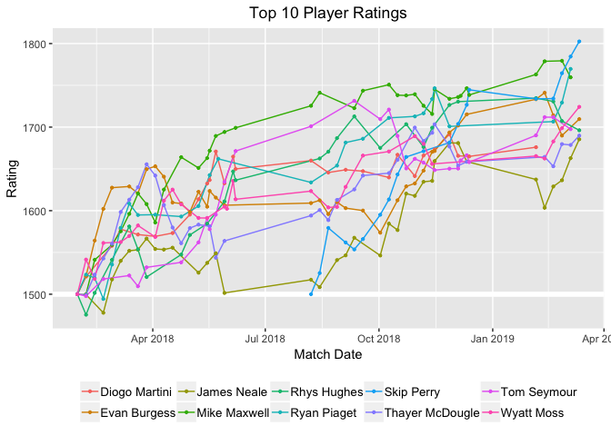
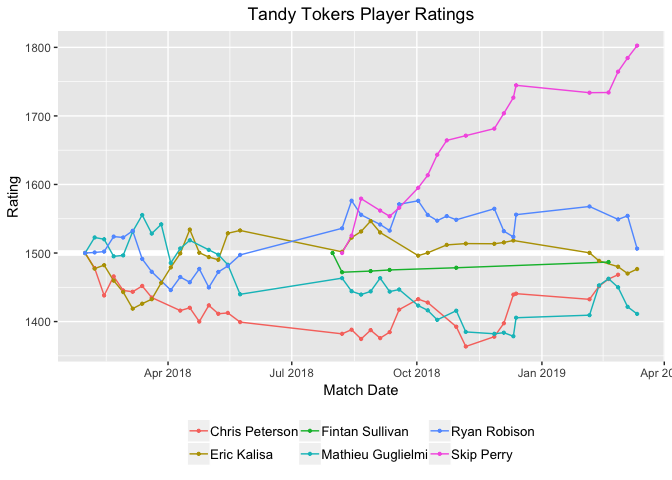
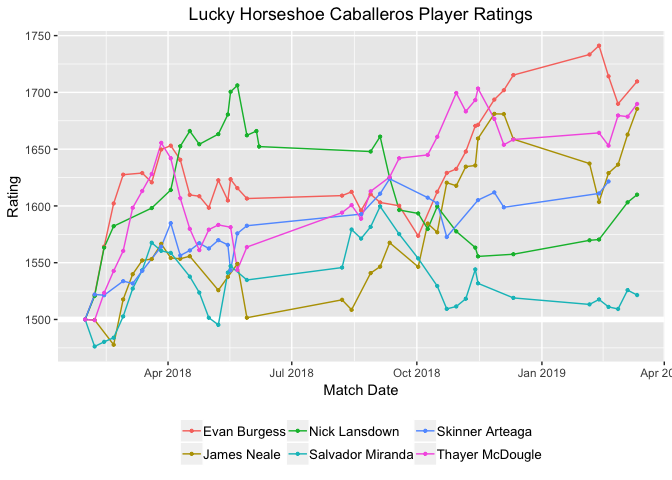
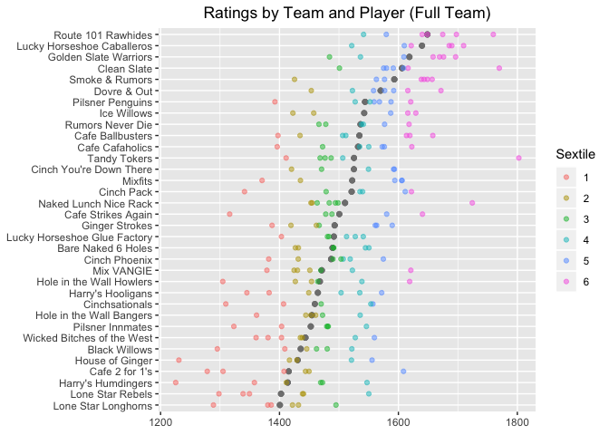
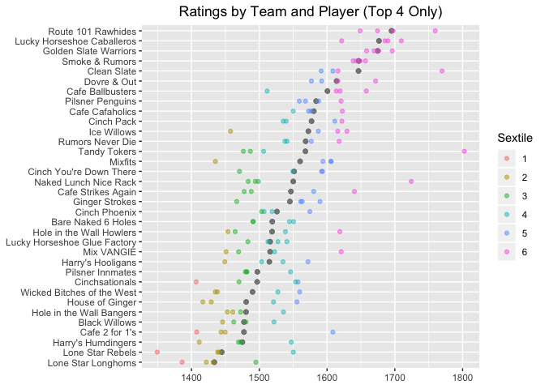
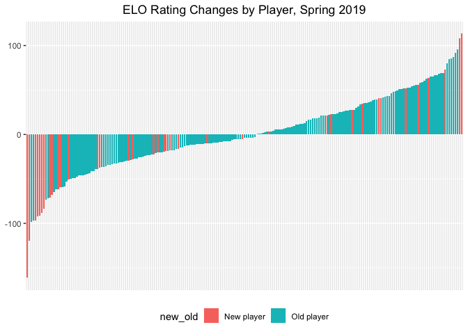

SFPA Ratings
================
Skip Perry
March 2019

``` r
# Set K based on optimization worksheet
K <- 23

# Data frame of players and team names in Spring 2019 - helper for next helper function
players_by_team_19 <- 
  bind_rows(
    results_19_no_forfeits %>% transmute(player = home, team = home_team),
    results_19_no_forfeits %>% transmute(player = away, team = away_team)
  ) %>% 
    distinct() %>% 
    arrange(team, player)

# Helper function to add team names to a data frame containing a column for player
append_team_names <- function(df) {
  df %>% 
    full_join(players_by_team_19, by = "player")
}

# Helper function to get a player's rating
get_rating <- function(player_name, ratings_df) {
  ratings_df %>% 
    filter(player == player_name) %>% 
    pull(rating)
}

# Helper function to get player list
full_player_list <- function(df) {
  bind_rows(
    df %>% transmute(player = home), 
    df %>% transmute(player = away)
  ) %>% 
    distinct(player) %>% 
    arrange(player)
}

# Helper function for ELO match win probability
match_win_probability <- function(player_of_interest, home_rating, away_rating, home_advantage) {
  if (player_of_interest == "home") {
    prob <- 1 / (1 + 10 ^ ((away_rating - (home_rating + home_advantage)) / 400))
  } else {
    prob <- 1 / (1 + 10 ^ (((home_rating + home_advantage) - away_rating) / 400))
  }
  prob
}

# Construct summary data frame of base 1500 ratings using the distinct players seen in the time period
elo_ratings <-
  full_player_list(results_no_forfeits) %>% 
  mutate(rating = 1500)

# Update the ratings table
for (i in 1:nrow(results_no_forfeits)) {
  player1 <- results_no_forfeits$home[i]
  player2 <- results_no_forfeits$away[i]
  player1_rating <- get_rating(player1, elo_ratings)
  player2_rating <- get_rating(player2, elo_ratings)
  results_no_forfeits$p1_start_rating[i] <- player1_rating
  results_no_forfeits$p2_start_rating[i] <- player2_rating
  player1_expected <-
    match_win_probability(
      player_of_interest = "home", home_rating = player1_rating, away_rating = player2_rating,
      home_advantage = home_advantage
    )
  player2_expected <-
    match_win_probability(
      player_of_interest = "away", home_rating = player1_rating, away_rating = player2_rating,
      home_advantage = home_advantage
    )
  winner <- results_no_forfeits$game_winner[i]
  S1 <- ifelse(winner == "home", 1, 0)
  S2 <- ifelse(winner == "home", 0, 1)
  player1_rating_new = player1_rating + K * (S1 - player1_expected)
  player2_rating_new = player2_rating + K * (S2 - player2_expected)
  elo_ratings$rating[elo_ratings$player == player1] <- player1_rating_new
  elo_ratings$rating[elo_ratings$player == player2] <- player2_rating_new
  results_no_forfeits$p1_end_rating[i] <- player1_rating_new
  results_no_forfeits$p2_end_rating[i] <- player2_rating_new
}

elo_ratings %>% 
  mutate(rating = round(rating)) %>% 
  arrange(-rating) %>% 
  append_team_names()
```

    ## # A tibble: 327 x 3
    ##    player          rating team                      
    ##    <chr>            <dbl> <chr>                     
    ##  1 Skip Perry        1803 Tandy Tokers              
    ##  2 Hector Ortega     1789 <NA>                      
    ##  3 Ryan Piaget       1770 Clean Slate               
    ##  4 Mike Maxwell      1760 Route 101 Rawhides        
    ##  5 Wyatt Moss        1724 Naked Lunch Nice Rack     
    ##  6 Evan Burgess      1710 Lucky Horseshoe Caballeros
    ##  7 Tom Seymour       1698 Route 101 Rawhides        
    ##  8 Andy Luong        1697 <NA>                      
    ##  9 Rhys Hughes       1696 Golden Slate Warriors     
    ## 10 Thayer McDougle   1690 Lucky Horseshoe Caballeros
    ## # … with 317 more rows

``` r
# Function to get a data frame of matches and real-time ratings for a particular player
player_matches_and_ratings <- function(player_of_interest) {
  df <- 
    results_no_forfeits %>% 
    filter(away == player_of_interest | home == player_of_interest) %>% 
    mutate(
      player = player_of_interest,
      opponent = case_when(
        away == player_of_interest ~ home,
        TRUE ~ away
      ),
      opponent_rating = case_when(
        away == player_of_interest ~ p1_start_rating,
        TRUE ~ p2_start_rating
      ),
      result = case_when(
        away == player_of_interest & game_winner == "away" ~ "W",
        home == player_of_interest & game_winner == "home" ~ "W",
        TRUE ~ "L"
      ),
      new_rating = case_when(
        away == player_of_interest ~ p2_end_rating,
        TRUE ~ p1_end_rating
      )
    ) %>% 
    select(match_date, player, opponent, opponent_rating, result, new_rating)
  
  row1_start_date <- df %>% pull(match_date) %>% min() - 7
  
  new_row1 <- 
    tribble(
      ~match_date, ~player, ~opponent, ~opponent_rating, ~result, ~new_rating,
      row1_start_date, player_of_interest, NA, NA, NA, 1500
    )
  
  bind_rows(new_row1, df)
}

win_loss_record <- function(player_of_interest) {
  player_matches_and_ratings(player_of_interest = player_of_interest) %>% 
    slice(-1) %>% 
    group_by(result) %>% 
    count() %>% 
    arrange(desc(result))
}

#win_loss_record(player_of_interest = "Mike Maxwell")
#player_matches_and_ratings(player_of_interest = "Mike Maxwell")
```

``` r
# Helper functions to get a list of all the players in a team (ever, or just now)
get_team_players <- function(team_name) {
  home_players <- 
    results_no_forfeits %>% 
    filter(home_team == team_name) %>% 
    select(home) %>% 
    distinct() %>% 
    pull()
  
  away_players <- 
    results_no_forfeits %>% 
    filter(away_team == team_name) %>% 
    select(away) %>% 
    distinct() %>% 
    pull()
  
  unique(c(home_players, away_players))
}

get_current_team_players <- function(team_name) {
  home_players <- 
    results_19_no_forfeits %>% 
    filter(home_team == team_name) %>% 
    select(home) %>% 
    distinct() %>% 
    pull()
  
  away_players <- 
    results_19_no_forfeits %>% 
    filter(away_team == team_name) %>% 
    select(away) %>% 
    distinct() %>% 
    pull()
  
  unique(c(home_players, away_players))
}

# List of the top 10 players active in Spring 2019
top_players <-
  elo_ratings %>% 
  arrange(desc(rating)) %>% 
  append_team_names() %>% 
  filter(!is.na(team)) %>% 
  slice(1:10) %>% 
  pull(player)

# Plot player ratings over time
plot_player_ratings_by_group <- function(player_list, list_name) {
  map_dfr(player_list, player_matches_and_ratings) %>% 
    group_by(match_date, player) %>% 
    slice(n()) %>% 
    ggplot(aes(x = match_date, y = new_rating, group = player, color = player)) +
    geom_hline(yintercept = 1500, color = "white", size = 2) +
    geom_line() +
    geom_point(size = 0.8) +
    labs(
      x = "Match Date", y = "Rating",
      title = str_c(list_name, " Player Ratings")
    ) +
    theme(
      legend.title = element_blank(),
      plot.title = element_text(hjust = 0.5),
      legend.position = "bottom",
      legend.text = element_text(size = 10)
  )
}

plot_player_ratings_by_group(
  player_list = top_players,
  list_name = "Top 10"
)
```



``` r
plot_player_ratings_by_group(
  player_list = get_current_team_players("Tandy Tokers"),
  list_name = "Tandy Tokers"
)
```



``` r
plot_player_ratings_by_group(
  player_list = get_current_team_players("Lucky Horseshoe Caballeros"),
  list_name = "Lucky Horseshoe Caballeros"
)
```



``` r
# Show plot with ratings by team and player to see best teams 
# Includes column for the best 4 players on the team 
elo_player_team_ratings <- 
  elo_ratings %>% 
  append_team_names() %>% 
  filter(!is.na(team)) %>% 
  group_by(team) %>% 
  arrange(team, desc(rating)) %>% 
  mutate(
    team_rank = row_number(),
    top4 = team_rank < 5
  ) %>% 
  ungroup() %>% 
  mutate(qtile = as.factor(ntile(rating, 6)))

elo_player_team_ratings %>% 
  group_by(team) %>% 
  mutate(team_mean = mean(rating)) %>% 
  ggplot(aes(x = reorder(team, team_mean))) +
  geom_point(aes(y = team_mean), color = "gray50", size = 1.7, alpha = 0.5) +
  geom_point(aes(y = rating, color = qtile), alpha = 0.5) +
  coord_flip() +
  theme(
    axis.title = element_blank(),
    plot.title = element_text(hjust = 0.5)
  ) +
  labs(
    title = "Ratings by Team and Player (Full Team)",
    color = "Sextile"
  )
```



``` r
elo_player_team_ratings %>% 
  filter(top4 == TRUE) %>% 
  group_by(team) %>% 
  mutate(team_mean = mean(rating)) %>% 
  ggplot(aes(x = reorder(team, team_mean))) +
  geom_point(aes(y = team_mean), color = "gray50", size = 1.7, alpha = 0.5) +
  geom_point(aes(y = rating, color = qtile), alpha = 0.5) +
  coord_flip() +
  theme(
    axis.title = element_blank(),
    plot.title = element_text(hjust = 0.5)
  ) +
  labs(
    title = "Ratings by Team and Player (Top 4 Only)",
    color = "Sextile"
  )
```



``` r
# Player improvement in the 2019 season 
player_names_2019 <- 
  bind_rows(
    results_19_no_forfeits %>% select(home) %>% transmute(player = home),
    results_19_no_forfeits %>% select(away) %>% transmute(player = away)
  ) %>% 
    distinct() %>% 
    arrange(player)

current_players_elo_history <-
  map_dfr(player_names_2019 %>% pull(), player_matches_and_ratings)

matches_current_season <- 
  current_players_elo_history %>% 
  filter(str_detect(match_date, "2019"))

final_pre_2019_matches <-
  current_players_elo_history %>% 
  filter(str_detect(match_date, "2018")) %>% 
  group_by(player) %>% 
  slice(n())

df <- 
  bind_rows(matches_current_season, final_pre_2019_matches) %>% 
  arrange(player, match_date)

ratings_changes <- 
  df %>% 
    group_by(player) %>% 
    slice(1, n()) %>% 
    select(player, new_rating) %>% 
    mutate(key = c("initial", "final")) %>% 
    spread(key = "key", value = "new_rating") %>% 
    mutate(diff = final - initial) %>% 
    arrange(desc(diff)) %>% 
    mutate(new_old = if_else(initial == 1500, "New player", "Old player")) %>% 
    append_team_names() %>% 
    select(player, initial, final, diff, new_old, team)

ratings_changes
```

    ## # A tibble: 211 x 6
    ## # Groups:   player [211]
    ##    player         initial final  diff new_old    team                    
    ##    <chr>            <dbl> <dbl> <dbl> <chr>      <chr>                   
    ##  1 Jon Williams     1500  1614. 114.  New player Cafe Ballbusters        
    ##  2 Tae Yim          1500  1609. 109.  New player Cafe 2 for 1's          
    ##  3 Erik Proctor     1377. 1473.  95.4 Old player Cafe Cafaholics         
    ##  4 Troy Brunet      1361. 1453.  91.8 Old player Hole in the Wall Bangers
    ##  5 Darrell Haslip   1570. 1657.  87.0 Old player Smoke & Rumors          
    ##  6 Justin Taylor    1508. 1594.  85.6 Old player Mixfits                 
    ##  7 Rene Denis       1564. 1649.  84.7 Old player Smoke & Rumors          
    ##  8 Jason Rogers     1511. 1591.  79.9 Old player Clean Slate             
    ##  9 Bob Rice         1500  1573.  72.8 New player Cafe Cafaholics         
    ## 10 David Norris     1452. 1521.  68.9 Old player House of Ginger         
    ## # … with 201 more rows

``` r
ratings_changes %>% 
  #filter(new_old == "New player") %>% 
  ggplot(aes(x = reorder(player, diff), y = diff, fill = new_old)) +
  geom_col() +
  theme(
    axis.text.x = element_blank(),
    axis.ticks.x = element_blank(),
    axis.title = element_blank(),
    legend.position = "bottom",
    plot.title = element_text(hjust = 0.5)
  ) +
  labs(
    title = "ELO Rating Changes by Player, Spring 2019"
  )
```


