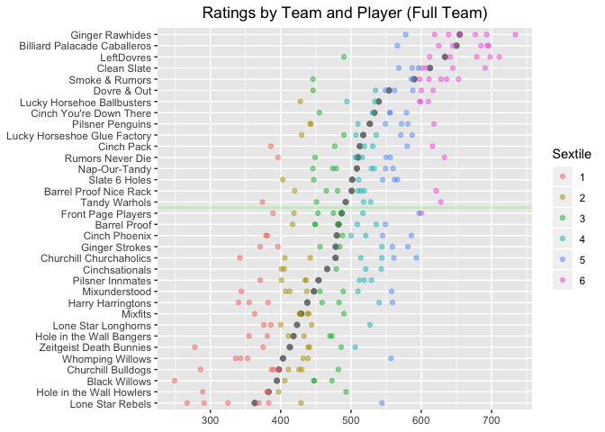
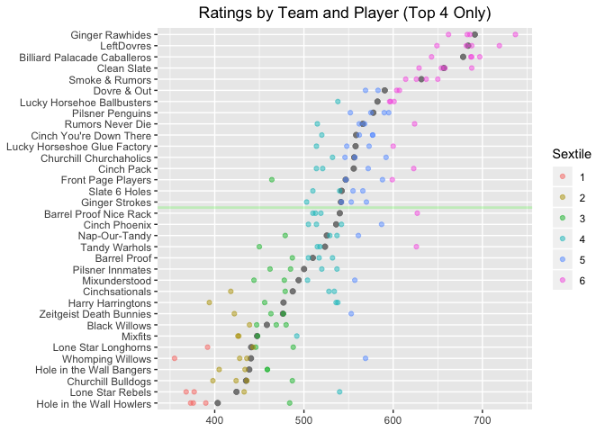
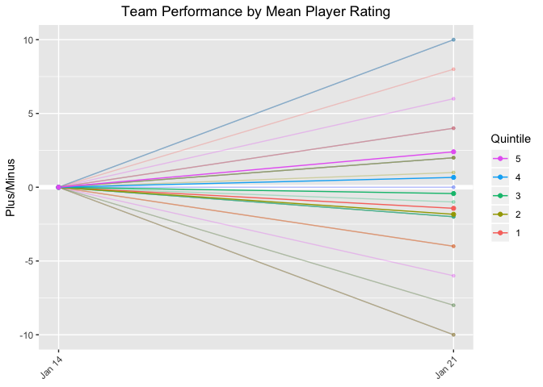
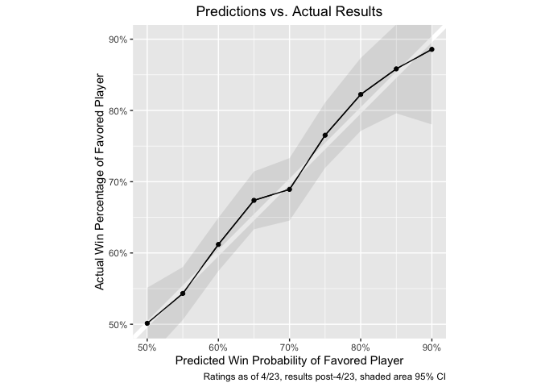

SFPA Player Ratings, v.1
================
Skip Perry
August 2019

### Ratings as of 2019-09-14:

| rank | player                 | current\_team                | rating | sfpa\_games | other\_games | total |
| ---: | :--------------------- | :--------------------------- | -----: | ----------: | -----------: | ----: |
|    1 | Mike Maxwell           | Ginger Rawhides              |    737 |         199 |           30 |   229 |
|    2 | Hector Ortega          | –                            |    734 |          46 |          148 |   194 |
|    3 | Skip Perry             | LeftDovres                   |    702 |         116 |           18 |   134 |
|    4 | Ryan Piaget            | Clean Slate                  |    700 |         140 |            0 |   140 |
|    5 | Evan Burgess           | Billiard Palacade Caballeros |    698 |         218 |            0 |   218 |
|    6 | Bob Simon              | Ginger Rawhides              |    695 |         187 |            0 |   187 |
|    7 | Nick Lansdown          | Billiard Palacade Caballeros |    691 |         166 |           63 |   229 |
|    8 | Alvin Ho               | LeftDovres                   |    687 |          20 |           14 |    34 |
|    9 | Diogo Martini          | LeftDovres                   |    686 |         138 |           41 |   179 |
|   10 | Rhys Hughes            | –                            |    686 |         112 |            0 |   112 |
|   11 | Stefano Lopez          | –                            |    682 |          48 |            0 |    48 |
|   12 | Thayer McDougle        | Billiard Palacade Caballeros |    681 |         199 |           32 |   231 |
|   13 | Matt Frisbie           | –                            |    681 |          62 |           17 |    79 |
|   14 | Tom Seymour            | Ginger Rawhides              |    677 |         171 |            0 |   171 |
|   15 | Andy Luong             | –                            |    666 |          83 |            0 |    83 |
|   16 | Chris DuCoing          | Smoke & Rumors               |    659 |         162 |            0 |   162 |
|   17 | Rudy Guzman            | –                            |    653 |          47 |            0 |    47 |
|   18 | Hugo Valseca           | –                            |    652 |          51 |            0 |    51 |
|   19 | Ben Green              | Clean Slate                  |    648 |         137 |            1 |   138 |
|   20 | Patty West             | LeftDovres                   |    647 |         141 |           78 |   219 |
|   21 | Joshua Maldonado       | Ginger Rawhides              |    647 |         122 |            0 |   122 |
|   22 | Alonza Bear Davis      | –                            |    645 |          12 |            0 |    12 |
|   23 | Leon Waki              | –                            |    644 |          81 |            6 |    87 |
|   24 | Danny Mullan           | Ginger Rawhides              |    642 |         155 |            6 |   161 |
|   25 | Tae Yim                | –                            |    642 |          29 |            0 |    29 |
|   26 | James Neale            | Billiard Palacade Caballeros |    641 |         185 |            0 |   185 |
|   27 | Rene Denis             | Smoke & Rumors               |    637 |         183 |            0 |   183 |
|   28 | Buddy Giguere          | Smoke & Rumors               |    634 |         127 |            0 |   127 |
|   29 | Eugene Fan             | Rumors Never Die             |    633 |         129 |            0 |   129 |
|   30 | Todd Emmel             | Pilsner Penguins             |    631 |          23 |           24 |    47 |
|   31 | Skinner Arteaga        | Billiard Palacade Caballeros |    627 |         147 |            0 |   147 |
|   32 | Wyatt Moss             | Barrel Proof Nice Rack       |    625 |         145 |            0 |   145 |
|   33 | Rick Mariani           | Ginger Rawhides              |    623 |         135 |            0 |   135 |
|   34 | Pancho Palma           | –                            |    621 |          47 |            0 |    47 |
|   35 | Dave Ward              | Dovre & Out                  |    619 |         175 |            0 |   175 |
|   36 | Crystal Kelem          | Tandy Warhols                |    618 |         169 |            0 |   169 |
|   37 | Hugh Fountain          | –                            |    609 |         111 |            0 |   111 |
|   38 | Isaac Wong             | Smoke & Rumors               |    609 |         109 |            0 |   109 |
|   39 | Joel Talevi            | Clean Slate                  |    609 |         142 |           23 |   165 |
|   40 | Martin Smidak          | LeftDovres                   |    609 |         139 |            8 |   147 |
|   41 | Bob Schnatterly        | Cinch Pack                   |    608 |         179 |            0 |   179 |
|   42 | Rajat Kansal           | Lucky Horsehoe Ballbusters   |    608 |         122 |            0 |   122 |
|   43 | Joina Liao             | Front Page Players           |    605 |          83 |            6 |    89 |
|   44 | Wade Hargrove          | Front Page Players           |    604 |          17 |           91 |   108 |
|   45 | Paul Martinez          | Lone Star Longhorns          |    604 |          19 |            0 |    19 |
|   46 | Tommy Mudd             | –                            |    600 |          39 |            5 |    44 |
|   47 | Ari Cowen              | Dovre & Out                  |    600 |         195 |           14 |   209 |
|   48 | Darrell Haslip         | Smoke & Rumors               |    600 |         136 |            0 |   136 |
|   49 | Jon Williams           | Lucky Horsehoe Ballbusters   |    599 |          84 |           18 |   102 |
|   50 | Paul Krohn             | Clean Slate                  |    599 |         152 |           23 |   175 |
|   51 | Preston Hudson         | –                            |    598 |          94 |            3 |    97 |
|   52 | Alan Lowe              | –                            |    598 |         139 |            0 |   139 |
|   53 | Adam Moore             | Dovre & Out                  |    597 |         104 |            0 |   104 |
|   54 | Gilbert Morales        | –                            |    595 |          44 |            0 |    44 |
|   55 | Tony Tully             | –                            |    594 |         113 |            0 |   113 |
|   56 | Adam Simpson           | Churchill Churchaholics      |    593 |          54 |            0 |    54 |
|   57 | Humberto HJ Gonzalez   | Pilsner Penguins             |    588 |         112 |            0 |   112 |
|   58 | Andrew Creech          | –                            |    588 |         118 |            0 |   118 |
|   59 | Chris Beal             | –                            |    587 |          34 |            0 |    34 |
|   60 | Robert Hoo             | –                            |    586 |          46 |            0 |    46 |
|   61 | Will Chadwick          | Lucky Horsehoe Ballbusters   |    585 |         188 |            2 |   190 |
|   62 | Thom Moyer             | Cinch Phoenix                |    584 |         159 |            0 |   159 |
|   63 | James Horsfall         | Lucky Horseshoe Glue Factory |    583 |          65 |           28 |    93 |
|   64 | Jason Rogers           | –                            |    583 |          88 |            4 |    92 |
|   65 | Polo Black Golde       | Clean Slate                  |    582 |         146 |            3 |   149 |
|   66 | Nima Gaadadsuren       | Cinch You’re Down There      |    582 |         186 |            0 |   186 |
|   67 | Victor Ramos           | –                            |    580 |          78 |           28 |   106 |
|   68 | Amy Peterson           | –                            |    580 |          34 |            0 |    34 |
|   69 | Ben Napili             | Cinch Pack                   |    579 |         119 |            0 |   119 |
|   70 | Jerry Ball             | Ginger Rawhides              |    578 |          84 |            0 |    84 |
|   71 | Rodney Zarnegar        | Pilsner Penguins             |    578 |         162 |            0 |   162 |
|   72 | Cuong Vuong            | –                            |    577 |          98 |            0 |    98 |
|   73 | Mark Butler            | –                            |    575 |          86 |           23 |   109 |
|   74 | Rene Loria             | –                            |    573 |          28 |            0 |    28 |
|   75 | Sam Khozindar          | Ginger Strokes               |    573 |         127 |            0 |   127 |
|   76 | Roberto Aguilar        | –                            |    571 |          40 |            0 |    40 |
|   77 | Juan Chicho            | Dovre & Out                  |    569 |          66 |            0 |    66 |
|   78 | Salvador Miranda       | Billiard Palacade Caballeros |    568 |         154 |            8 |   162 |
|   79 | Rich Hatcher           | –                            |    566 |           3 |            5 |     8 |
|   80 | Marcelo Aviles         | Clean Slate                  |    566 |         122 |           37 |   159 |
|   81 | Colton Callahan        | Slate 6 Holes                |    563 |          24 |            0 |    24 |
|   82 | Brian Paris            | Mixunderstood                |    561 |         151 |            0 |   151 |
|   83 | Noah Snyder            | Clean Slate                  |    561 |          12 |            0 |    12 |
|   84 | Roy Luo                | Churchill Churchaholics      |    560 |         172 |            0 |   172 |
|   85 | Mark Thomas            | –                            |    560 |          48 |            2 |    50 |
|   86 | Nick Radford           | Harry Harringtons            |    560 |          40 |            0 |    40 |
|   87 | Max Schroeder          | –                            |    559 |         110 |            0 |   110 |
|   88 | Robin McAloon          | Barrel Proof                 |    559 |          20 |            0 |    20 |
|   89 | Chris Doornbos         | Rumors Never Die             |    559 |          22 |            0 |    22 |
|   90 | Nithin Tharakan        | Slate 6 Holes                |    558 |         147 |           24 |   171 |
|   91 | Travis Yallup          | Churchill Churchaholics      |    558 |         164 |            0 |   164 |
|   92 | Ryan Robison           | Nap-Our-Tandy                |    557 |         181 |            0 |   181 |
|   93 | Chris Forester         | –                            |    557 |         101 |            0 |   101 |
|   94 | Dan Sorge              | Dovre & Out                  |    556 |         179 |           12 |   191 |
|   95 | Eric Babaki            | Ginger Strokes               |    555 |          62 |            0 |    62 |
|   96 | Miguel Chimas          | Cinch You’re Down There      |    555 |          68 |            2 |    70 |
|   97 | Rick Bradford          | Lucky Horseshoe Glue Factory |    555 |          91 |            0 |    91 |
|   98 | Nick Wells             | –                            |    554 |          88 |            0 |    88 |
|   99 | Brian Bolitho          | –                            |    553 |         108 |            0 |   108 |
|  100 | Niecy Sorrell          | –                            |    553 |           8 |            0 |     8 |
|  101 | Alex Mendes da Costa   | Rumors Never Die             |    552 |          71 |            0 |    71 |
|  102 | Bob Rice               | –                            |    552 |          45 |            0 |    45 |
|  103 | Ian Montbrun           | Cinch You’re Down There      |    552 |         175 |            0 |   175 |
|  104 | Matt Kwong             | –                            |    551 |          76 |            0 |    76 |
|  105 | Isaac Lopez            | Ginger Strokes               |    550 |         117 |            0 |   117 |
|  106 | Matt Raine             | –                            |    547 |          20 |            0 |    20 |
|  107 | Nick Giangreco         | Lone Star Rebels             |    547 |         142 |            0 |   142 |
|  108 | Michael Romano         | Lucky Horseshoe Glue Factory |    547 |         167 |            0 |   167 |
|  109 | Sam Flores             | Barrel Proof                 |    545 |           6 |            0 |     6 |
|  110 | Perry Logan            | Tandy Warhols                |    545 |         161 |            0 |   161 |
|  111 | Justin Taylor          | –                            |    545 |          84 |            0 |    84 |
|  112 | Leif Smith             | Harry Harringtons            |    543 |         184 |            0 |   184 |
|  113 | Fran Herman            | Pilsner Penguins             |    542 |         148 |            0 |   148 |
|  114 | Hakim Boukhaloua       | Barrel Proof                 |    541 |          76 |            0 |    76 |
|  115 | Mikki Paull            | –                            |    541 |         135 |            0 |   135 |
|  116 | Arthur Patterson       | Slate 6 Holes                |    540 |         170 |           22 |   192 |
|  117 | Eric Gruttemeyer       | Cinchsationals               |    538 |         168 |            0 |   168 |
|  118 | Chris Kline            | Cinch Phoenix                |    537 |         134 |            0 |   134 |
|  119 | Tom Golden             | Nap-Our-Tandy                |    534 |          10 |            0 |    10 |
|  120 | Quinn Reilly           | –                            |    533 |          74 |            7 |    81 |
|  121 | Ell Jackson            | –                            |    533 |         130 |            0 |   130 |
|  122 | Dylan Scandalios       | –                            |    533 |         153 |            5 |   158 |
|  123 | Dylan Pulliam          | Nap-Our-Tandy                |    532 |          12 |            0 |    12 |
|  124 | Chris Logan            | Lucky Horsehoe Ballbusters   |    530 |         161 |            0 |   161 |
|  125 | John Frakes            | Cinch Pack                   |    530 |         102 |            0 |   102 |
|  126 | Sebastian Jellema      | Pilsner Innmates             |    530 |          12 |            0 |    12 |
|  127 | James Bavuso           | Cinch Pack                   |    528 |         142 |            0 |   142 |
|  128 | Alex Gilbert           | –                            |    526 |          26 |            0 |    26 |
|  129 | Jerz Zuluaga           | –                            |    526 |          80 |            0 |    80 |
|  130 | Emily Adams            | Pilsner Innmates             |    525 |         103 |            0 |   103 |
|  131 | Casey O’Neill          | Cinch You’re Down There      |    524 |         189 |            0 |   189 |
|  132 | Carlos Gonzalez        | Rumors Never Die             |    524 |         153 |            0 |   153 |
|  133 | Spencer Branson        | –                            |    523 |          34 |            0 |    34 |
|  134 | Mika Kerr              | Cinchsationals               |    523 |         180 |            0 |   180 |
|  135 | Sheree Taft            | Churchill Churchaholics      |    523 |          93 |            0 |    93 |
|  136 | Huu Nguyen             | Barrel Proof Nice Rack       |    521 |         140 |            0 |   140 |
|  137 | Jonathan Addy          | –                            |    520 |          78 |            0 |    78 |
|  138 | Rohan Kurane           | –                            |    517 |          46 |            0 |    46 |
|  139 | Alex Peralta           | Rumors Never Die             |    517 |          91 |            0 |    91 |
|  140 | Fearghal McEleney      | –                            |    516 |           4 |           13 |    17 |
|  141 | Gerlie Mendoza         | Pilsner Penguins             |    515 |         143 |            0 |   143 |
|  142 | Brendan McCarthy       | Zeitgeist Death Bunnies      |    515 |          18 |            0 |    18 |
|  143 | Rob Cosgriff           | Barrel Proof Nice Rack       |    515 |          89 |            0 |    89 |
|  144 | Priscilla Shiells      | Front Page Players           |    515 |          12 |            0 |    12 |
|  145 | Simone Manganelli      | Mixunderstood                |    513 |         134 |            0 |   134 |
|  146 | Greg Morgan            | Tandy Warhols                |    513 |         165 |            0 |   165 |
|  147 | Jonathan Garcia        | –                            |    513 |          45 |            0 |    45 |
|  148 | Ben Becker             | –                            |    508 |          95 |            0 |    95 |
|  149 | Anthony Hydron         | Lucky Horseshoe Glue Factory |    507 |         104 |            0 |   104 |
|  150 | Patrick Hyde           | Dovre & Out                  |    506 |           8 |            0 |     8 |
|  151 | Paul McCue             | Cinch Phoenix                |    505 |         126 |            0 |   126 |
|  152 | Steven Pease           | Barrel Proof Nice Rack       |    505 |         120 |            0 |   120 |
|  153 | Clarke Curtis          | –                            |    505 |          62 |            0 |    62 |
|  154 | Yassine Laassel        | –                            |    505 |          66 |            0 |    66 |
|  155 | Justin Dayton          | Slate 6 Holes                |    504 |         174 |            5 |   179 |
|  156 | Fintan Sullivan        | –                            |    502 |          20 |            0 |    20 |
|  157 | Monica Kicklighter     | –                            |    500 |          73 |            0 |    73 |
|  158 | Steven Park            | –                            |    500 |          23 |            0 |    23 |
|  159 | Thomas Messer          | Hole in the Wall Howlers     |    499 |         102 |            0 |   102 |
|  160 | Kirby Aho              | Whomping Willows             |    498 |          13 |            0 |    13 |
|  161 | Doug Johnston          | Barrel Proof Nice Rack       |    496 |         104 |            0 |   104 |
|  162 | Mark Deal              | Cinch Phoenix                |    496 |         133 |            0 |   133 |
|  163 | Scott Marfield         | Mixunderstood                |    496 |         111 |            0 |   111 |
|  164 | Chad Horohoe           | Mixfits                      |    494 |          13 |            0 |    13 |
|  165 | Cloaky Jones           | –                            |    493 |         146 |            0 |   146 |
|  166 | Brendan Payne          | Lucky Horsehoe Ballbusters   |    493 |          19 |            0 |    19 |
|  167 | Julie Le               | –                            |    493 |          29 |            0 |    29 |
|  168 | Charles Carr           | –                            |    493 |           1 |            0 |     1 |
|  169 | Julia Landholt         | –                            |    492 |          47 |            0 |    47 |
|  170 | Patrick Picard         | Pilsner Innmates             |    492 |          74 |            0 |    74 |
|  171 | Sandra Davis           | Cinch Phoenix                |    492 |         117 |            0 |   117 |
|  172 | Andrew Keller          | –                            |    492 |          48 |            2 |    50 |
|  173 | Adam Usmani            | Harry Harringtons            |    490 |           7 |            0 |     7 |
|  174 | Alex Yeagle            | Mixfits                      |    490 |          22 |            0 |    22 |
|  175 | Julien Roeser          | Lucky Horseshoe Glue Factory |    489 |         162 |            8 |   170 |
|  176 | Eric Kalisa            | Nap-Our-Tandy                |    486 |         161 |            0 |   161 |
|  177 | Annabelle Cabuhat      | Front Page Players           |    484 |          13 |           15 |    28 |
|  178 | Walt Bartas            | Cinchsationals               |    483 |         135 |            0 |   135 |
|  179 | Jimmy Fails            | Barrel Proof                 |    483 |           4 |            0 |     4 |
|  180 | Adam Lucero            | –                            |    482 |           2 |            0 |     2 |
|  181 | Greg Weed              | Hole in the Wall Bangers     |    482 |          99 |            0 |    99 |
|  182 | Cindy Kim              | Front Page Players           |    482 |          16 |            0 |    16 |
|  183 | Jaime Dizon            | LeftDovres                   |    480 |          60 |           16 |    76 |
|  184 | Stern Montoya          | Churchill Bulldogs           |    478 |         166 |            4 |   170 |
|  185 | Mark Sorensen          | Lucky Horsehoe Ballbusters   |    478 |         150 |            0 |   150 |
|  186 | Ali Rad                | –                            |    477 |          23 |            0 |    23 |
|  187 | Vijay Alexander        | Ginger Strokes               |    477 |         106 |            0 |   106 |
|  188 | Joan Pettijohn         | Cinch Pack                   |    477 |         138 |            0 |   138 |
|  189 | John Kiltinen          | Hole in the Wall Bangers     |    475 |         172 |            0 |   172 |
|  190 | Lisa Filippini         | –                            |    475 |          57 |            0 |    57 |
|  191 | Bob Ponze              | –                            |    474 |           4 |            0 |     4 |
|  192 | Mathieu Guglielmi      | Nap-Our-Tandy                |    474 |         198 |            0 |   198 |
|  193 | LanAnh Kerr            | Mixfits                      |    473 |          26 |            0 |    26 |
|  194 | Fernando Reyes         | –                            |    471 |          69 |            0 |    69 |
|  195 | Yuko Takahashi         | Front Page Players           |    470 |          13 |           12 |    25 |
|  196 | Keith Deming           | Barrel Proof Nice Rack       |    470 |         170 |            0 |   170 |
|  197 | Jenny Lee              | –                            |    470 |           8 |            0 |     8 |
|  198 | Elvis McElhatton       | –                            |    468 |          33 |            0 |    33 |
|  199 | Ana Stewart            | –                            |    467 |          78 |            0 |    78 |
|  200 | Anthony Vasquez        | –                            |    463 |          44 |            0 |    44 |
|  201 | Peter Lee              | Ginger Strokes               |    461 |         158 |            0 |   158 |
|  202 | Bryant Labitag         | Mixunderstood                |    460 |           2 |            0 |     2 |
|  203 | Henry Vazquez          | Barrel Proof                 |    459 |          21 |            0 |    21 |
|  204 | Erik Proctor           | Churchill Churchaholics      |    459 |         110 |            0 |   110 |
|  205 | David Norris           | Black Willows                |    459 |         122 |            0 |   122 |
|  206 | Keith Rubia            | Front Page Players           |    457 |          12 |            0 |    12 |
|  207 | Austin Kelso           | Mixfits                      |    457 |          22 |            0 |    22 |
|  208 | Jason XXX              | Churchill Bulldogs           |    454 |           6 |            0 |     6 |
|  209 | Cristina Urreaga       | Cinch You’re Down There      |    454 |         153 |            0 |   153 |
|  210 | Julian Ostrow          | Rumors Never Die             |    454 |         167 |            0 |   167 |
|  211 | Mike Britt             | –                            |    453 |         109 |            0 |   109 |
|  212 | Josh Buttram           | Barrel Proof                 |    453 |           7 |            0 |     7 |
|  213 | Juan Carlos Buenrostro | Harry Harringtons            |    452 |          73 |            0 |    73 |
|  214 | Ninad Desai            | Pilsner Penguins             |    452 |         120 |            0 |   120 |
|  215 | Jocelyn Angeles        | Tandy Warhols                |    451 |         148 |            0 |   148 |
|  216 | Noel Alpin             | Churchill Bulldogs           |    451 |          24 |            0 |    24 |
|  217 | Bernie Herschbein      | Whomping Willows             |    451 |         109 |            0 |   109 |
|  218 | Robin Brun             | –                            |    451 |          18 |            2 |    20 |
|  219 | Max Sanchez            | Smoke & Rumors               |    450 |          88 |            0 |    88 |
|  220 | Lawrence Lee           | Barrel Proof                 |    449 |          23 |            0 |    23 |
|  221 | Shepard Gault          | –                            |    449 |          26 |            0 |    26 |
|  222 | Taylor Hobbs           | –                            |    447 |          67 |            0 |    67 |
|  223 | Douglas Cox            | –                            |    445 |          67 |            0 |    67 |
|  224 | Nick Chackel           | Black Willows                |    445 |          25 |            0 |    25 |
|  225 | Matt Paul              | Dovre & Out                  |    441 |         135 |            0 |   135 |
|  226 | John McNulty           | Lone Star Longhorns          |    440 |         150 |            0 |   150 |
|  227 | Matt Weyls             | Slate 6 Holes                |    440 |          61 |            0 |    61 |
|  228 | Mar Ronquillo          | Black Willows                |    440 |         185 |            0 |   185 |
|  229 | JM Reasonda            | Mixfits                      |    439 |         127 |            0 |   127 |
|  230 | Eric Marrujo           | –                            |    439 |         134 |            0 |   134 |
|  231 | Matt Morrish           | Whomping Willows             |    439 |         161 |            0 |   161 |
|  232 | Travis Santos          | Pilsner Innmates             |    439 |          52 |            0 |    52 |
|  233 | Adam Bowley            | Mixunderstood                |    438 |         111 |            0 |   111 |
|  234 | Chris Peterson         | Nap-Our-Tandy                |    437 |         132 |            0 |   132 |
|  235 | Rudy Torres            | –                            |    436 |          13 |            0 |    13 |
|  236 | Daniel Scrivano        | Zeitgeist Death Bunnies      |    434 |          18 |            0 |    18 |
|  237 | Brad Shewmake          | Zeitgeist Death Bunnies      |    434 |          15 |            0 |    15 |
|  238 | Vinny Valdez           | Lone Star Rebels             |    429 |           6 |            0 |     6 |
|  239 | Antonio Herrera        | Churchill Churchaholics      |    428 |          41 |            0 |    41 |
|  240 | Charles Montague       | –                            |    427 |          44 |            0 |    44 |
|  241 | Richard Oliva          | Hole in the Wall Bangers     |    426 |         102 |            0 |   102 |
|  242 | Danny Joseph           | –                            |    426 |          62 |            0 |    62 |
|  243 | John Thong             | –                            |    426 |          75 |            0 |    75 |
|  244 | Bryan Hoff             | Pilsner Innmates             |    422 |          60 |            0 |    60 |
|  245 | Kelvin Chung           | Black Willows                |    420 |          37 |            0 |    37 |
|  246 | Jason Quincy Bucy      | Lone Star Rebels             |    419 |           9 |            0 |     9 |
|  247 | Christine Concho       | –                            |    418 |          55 |            0 |    55 |
|  248 | Carlos Rodrigues       | Lucky Horseshoe Glue Factory |    417 |          38 |            0 |    38 |
|  249 | Nick Weyls             | –                            |    416 |           4 |            0 |     4 |
|  250 | Kunal Lakhan-Pa        | Barrel Proof Nice Rack       |    415 |          77 |            0 |    77 |
|  251 | Philip Romano          | Churchill Churchaholics      |    414 |           8 |            0 |     8 |
|  252 | Milan Plevnik          | Cinchsationals               |    411 |         141 |            0 |   141 |
|  253 | Michael Moreno         | Mixunderstood                |    410 |         131 |            0 |   131 |
|  254 | Troy Brunet            | Hole in the Wall Bangers     |    410 |         150 |            0 |   150 |
|  255 | Ozzie Orozco           | Mixunderstood                |    407 |          22 |            0 |    22 |
|  256 | Hajime Miyazaki        | –                            |    405 |          42 |            0 |    42 |
|  257 | Steven Chamberlin      | Cinchsationals               |    405 |         162 |            0 |   162 |
|  258 | Les Mullin             | –                            |    404 |          72 |            0 |    72 |
|  259 | Ari Fehrenkamp         | –                            |    404 |         105 |            0 |   105 |
|  260 | Lawrence Mortensen     | Pilsner Innmates             |    403 |         132 |            0 |   132 |
|  261 | Patrick Hunt           | Hole in the Wall Howlers     |    402 |          56 |            0 |    56 |
|  262 | Jason Valdez           | –                            |    401 |           4 |            0 |     4 |
|  263 | Matt Myers             | Churchill Bulldogs           |    399 |          85 |            0 |    85 |
|  264 | Reza Wang-Lotfi        | Rumors Never Die             |    397 |           5 |            0 |     5 |
|  265 | Lasalete Sousa         | –                            |    397 |          61 |            0 |    61 |
|  266 | Rocel Lhai             | Ginger Strokes               |    396 |          94 |            0 |    94 |
|  267 | Tetyana Swann          | Lone Star Longhorns          |    396 |          26 |            0 |    26 |
|  268 | Tim Doyle              | Slate 6 Holes                |    394 |         113 |            0 |   113 |
|  269 | Nathan Davis           | Zeitgeist Death Bunnies      |    392 |          19 |            0 |    19 |
|  270 | Radley Roberts         | Cinch Pack                   |    391 |         117 |            0 |   117 |
|  271 | Josalyn Rosen          | Churchill Bulldogs           |    389 |          47 |            0 |    47 |
|  272 | Frank Augustine        | Cinch Phoenix                |    387 |          69 |            0 |    69 |
|  273 | Michael Bouey          | Lone Star Longhorns          |    386 |         155 |            0 |   155 |
|  274 | Ian Jolly              | Hole in the Wall Howlers     |    385 |         116 |            0 |   116 |
|  275 | Jill Cheviron          | –                            |    385 |          57 |            0 |    57 |
|  276 | Brandi Alexandra       | –                            |    384 |           5 |            0 |     5 |
|  277 | Malcolm King           | Harry Harringtons            |    382 |         103 |            0 |   103 |
|  278 | Chad Sloane            | –                            |    381 |          14 |            0 |    14 |
|  279 | Rick Potts             | Cinch Phoenix                |    380 |         116 |            0 |   116 |
|  280 | Gerald Borjas          | Hole in the Wall Howlers     |    380 |         133 |            0 |   133 |
|  281 | Tetyana Swan           | –                            |    379 |          51 |            0 |    51 |
|  282 | Katrina Ariola         | Mixfits                      |    379 |          20 |            0 |    20 |
|  283 | Charles Hancock        | –                            |    376 |          74 |            0 |    74 |
|  284 | Tommy Torstenson       | –                            |    373 |          69 |            0 |    69 |
|  285 | Keith Neal             | –                            |    373 |          66 |            0 |    66 |
|  286 | Buddy Jacques          | Hole in the Wall Bangers     |    373 |         143 |            0 |   143 |
|  287 | Roy Perkel             | Pilsner Innmates             |    371 |         100 |            0 |   100 |
|  288 | Andy Cunningham        | Lone Star Longhorns          |    370 |         175 |            0 |   175 |
|  289 | Sharon Yencharis       | Lone Star Rebels             |    368 |          39 |            0 |    39 |
|  290 | Jen Pearson            | –                            |    367 |          72 |            0 |    72 |
|  291 | Brenden Chadwick       | –                            |    365 |          49 |            0 |    49 |
|  292 | Austin Day             | Whomping Willows             |    362 |          58 |            0 |    58 |
|  293 | Caleb Christian        | Hole in the Wall Bangers     |    361 |          38 |            0 |    38 |
|  294 | Jukers Tanseco         | Zeitgeist Death Bunnies      |    359 |          55 |            0 |    55 |
|  295 | Pujan Desei            | –                            |    358 |          32 |            0 |    32 |
|  296 | Jerry Ervin            | Tandy Warhols                |    357 |         135 |            0 |   135 |
|  297 | Greg Micklas           | Zeitgeist Death Bunnies      |    356 |          18 |            0 |    18 |
|  298 | John Larkin            | Harry Harringtons            |    355 |          71 |            0 |    71 |
|  299 | Jonathen Diego         | –                            |    354 |          46 |            0 |    46 |
|  300 | John Putnam            | Whomping Willows             |    351 |         153 |            0 |   153 |
|  301 | Savonna Hasson         | Harry Harringtons            |    351 |         120 |            0 |   120 |
|  302 | David Evans            | –                            |    347 |          34 |            0 |    34 |
|  303 | Laura Wiggins          | Front Page Players           |    347 |           8 |            0 |     8 |
|  304 | JD David               | Churchill Bulldogs           |    347 |          16 |            0 |    16 |
|  305 | Tamara Herring         | Mixunderstood                |    344 |          17 |            0 |    17 |
|  306 | Robbie Connelly        | –                            |    344 |          90 |            0 |    90 |
|  307 | Trish Gardner          | Whomping Willows             |    340 |         153 |            0 |   153 |
|  308 | Brian Martin           | –                            |    340 |          29 |            0 |    29 |
|  309 | Killer K               | –                            |    324 |          94 |            0 |    94 |
|  310 | Brian Johnson          | –                            |    322 |          75 |            0 |    75 |
|  311 | Brandon Blackmon       | –                            |    318 |          10 |            0 |    10 |
|  312 | Dorien Lezinski        | –                            |    315 |          52 |            0 |    52 |
|  313 | Lorax                  | Lone Star Rebels             |    308 |         129 |            0 |   129 |
|  314 | Stefani Furness        | –                            |    300 |          39 |            0 |    39 |
|  315 | Zeon Kitchiner         | Hole in the Wall Howlers     |    300 |         128 |            0 |   128 |
|  316 | Ashley Miller          | –                            |    296 |          10 |            0 |    10 |
|  317 | Mike Myers             | –                            |    291 |          33 |            0 |    33 |
|  318 | Siedra Loeffler        | –                            |    290 |          59 |            0 |    59 |
|  319 | Keelin Ingoldsby       | –                            |    289 |          36 |            0 |    36 |
|  320 | Brady Ralston          | –                            |    273 |          30 |            0 |    30 |
|  321 | Kurt Weitzmann         | Black Willows                |    270 |          63 |            0 |    63 |
|  322 | Levon Sanossian        | Lone Star Rebels             |    260 |          65 |            0 |    65 |
|  323 | Alice Davis            | Lone Star Rebels             |    259 |          26 |            0 |    26 |
|  324 | Aja Cayetano           | –                            |    213 |          83 |            0 |    83 |
|  325 | Patrick Phillips       | –                            |    172 |          82 |            0 |    82 |

 

<!-- --><!-- -->

<!-- -->

<!-- -->

 

#### This week’s biggest movers:

| player            | team                       | previous | current | change | games\_in\_system |
| :---------------- | :------------------------- | -------: | ------: | -----: | ----------------: |
| Alvin Ho          | LeftDovres                 |      661 |     687 |     27 |                34 |
| James Thielfoldt  | NA                         |      528 |     541 |     14 |                11 |
| Josh Williams     | NA                         |      473 |     459 |   \-14 |                 3 |
| Ryan Thomas       | NA                         |      463 |     475 |     13 |                 5 |
| Pascal Kalou      | NA                         |      561 |     573 |     12 |                33 |
| Michael Franklin  | NA                         |      483 |     476 |    \-7 |                11 |
| Joel Talevi       | Clean Slate                |      614 |     609 |    \-5 |               165 |
| Will Chadwick     | Lucky Horsehoe Ballbusters |      588 |     585 |    \-4 |               190 |
| Hector Ortega     | NA                         |      736 |     734 |    \-2 |               194 |
| Alex Yeagle       | Mixfits                    |      489 |     490 |      1 |                22 |
| Austin Kelso      | Mixfits                    |      456 |     457 |      1 |                22 |
| Caleb Arrivillaga | NA                         |      525 |     526 |      1 |                13 |
| Chad Horohoe      | Mixfits                    |      493 |     494 |      1 |                13 |
| Cristian Rubi     | NA                         |      493 |     493 |    \-1 |                 3 |
| Gabriela Benuto   | NA                         |      495 |     496 |      1 |                26 |
| Maik Fahie        | NA                         |      535 |     534 |    \-1 |                 7 |
| Patrick Hyde      | Dovre & Out                |      505 |     506 |      1 |                 8 |
| Patty West        | LeftDovres                 |      646 |     647 |      1 |               219 |
| Tea Randrup       | NA                         |      406 |     407 |      1 |                 4 |
| Aaron Woodworth   | NA                         |      373 |     373 |      0 |                59 |
| Adam Bowley       | Mixunderstood              |      438 |     438 |      0 |               111 |
| Adam Lucero       | NA                         |      482 |     482 |      0 |                 2 |
| Adam Moore        | Dovre & Out                |      597 |     597 |      0 |               104 |
| Adam Simpson      | Churchill Churchaholics    |      593 |     593 |      0 |                54 |
| Adam Usmani       | Harry Harringtons          |      490 |     490 |      0 |                 7 |
| Adela Genochio    | NA                         |      500 |     500 |      0 |                 1 |
| Aja Cayetano      | NA                         |      214 |     213 |      0 |                83 |
| Alan Fung         | NA                         |      519 |     519 |      0 |                15 |
| Alan Lowe         | NA                         |      598 |     598 |      0 |               139 |
| Alan Uchicha      | NA                         |      540 |     540 |      0 |                 8 |

 

Data sources: Spring 2018-Fall 2019 SFPA seasons, Spring 2019 SFPA
8-ball tournament, Spring 2019 Slate 8-ball tournament, 2016-2019 Slate
Saturday night tournaments, 2016-2019 Happy singles tournaments
