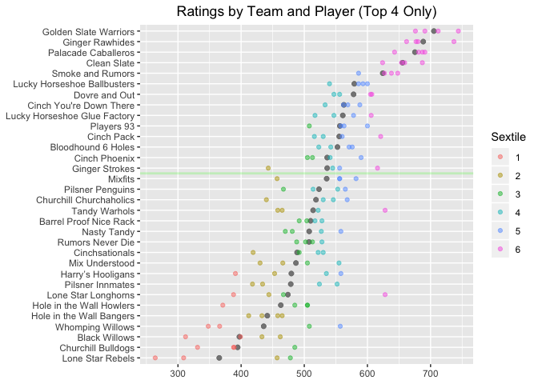

SFPA Player Ratings, v.1
================
Skip Perry
August 2019

### Ratings as of 2019-10-01:

| rank | player                 | current\_team                | rating | sfpa\_games | other\_games | total |
| ---: | :--------------------- | :--------------------------- | -----: | ----------: | -----------: | ----: |
|    1 | Mike Maxwell           | Ginger Rawhides              |    737 |         207 |           30 |   237 |
|    2 | Hector Ortega          | –                            |    729 |          46 |          170 |   216 |
|    3 | Skip Perry             | LeftDovres                   |    709 |         128 |           18 |   146 |
|    4 | Alvin Ho               | LeftDovres                   |    699 |          28 |           14 |    42 |
|    5 | Evan Burgess           | Billiard Palacade Caballeros |    698 |         226 |            0 |   226 |
|    6 | Bob Simon              | Ginger Rawhides              |    696 |         199 |            0 |   199 |
|    7 | Nick Lansdown          | Billiard Palacade Caballeros |    693 |         174 |           63 |   237 |
|    8 | Ryan Piaget            | Clean Slate                  |    692 |         152 |            0 |   152 |
|    9 | Rhys Hughes            | –                            |    685 |         112 |            0 |   112 |
|   10 | Thayer McDougle        | Billiard Palacade Caballeros |    684 |         209 |           32 |   241 |
|   11 | Stefano Lopez          | –                            |    681 |          48 |            0 |    48 |
|   12 | Matt Frisbie           | –                            |    681 |          62 |           17 |    79 |
|   13 | Tom Seymour            | Ginger Rawhides              |    679 |         175 |            0 |   175 |
|   14 | Diogo Martini          | LeftDovres                   |    679 |         146 |           42 |   188 |
|   15 | Nick Callado           | –                            |    677 |          39 |            4 |    43 |
|   16 | Andy Luong             | –                            |    666 |          83 |            0 |    83 |
|   17 | Chris DuCoing          | Smoke & Rumors               |    653 |         171 |            0 |   171 |
|   18 | Rudy Guzman            | –                            |    653 |          47 |            0 |    47 |
|   19 | Joshua Maldonado       | Ginger Rawhides              |    651 |         126 |            0 |   126 |
|   20 | Hugo Valseca           | –                            |    651 |          51 |            0 |    51 |
|   21 | James Neale            | Billiard Palacade Caballeros |    646 |         197 |            0 |   197 |
|   22 | Ben Green              | Clean Slate                  |    646 |         145 |            1 |   146 |
|   23 | Patty West             | LeftDovres                   |    646 |         149 |           78 |   227 |
|   24 | Alonza Bear Davis      | –                            |    644 |          12 |            0 |    12 |
|   25 | Leon Waki              | –                            |    643 |          81 |            6 |    87 |
|   26 | Tae Yim                | –                            |    642 |          29 |            0 |    29 |
|   27 | Danny Mullan           | Ginger Rawhides              |    639 |         167 |           11 |   178 |
|   28 | Buddy Giguere          | Smoke & Rumors               |    634 |         128 |            0 |   128 |
|   29 | Eugene Fan             | Rumors Never Die             |    633 |         129 |            0 |   129 |
|   30 | Rene Denis             | Smoke & Rumors               |    628 |         193 |            0 |   193 |
|   31 | Skinner Arteaga        | Billiard Palacade Caballeros |    626 |         151 |            0 |   151 |
|   32 | Wyatt Moss             | Barrel Proof Nice Rack       |    625 |         145 |            0 |   145 |
|   33 | Crystal Kelem          | Tandy Warhols                |    624 |         176 |            0 |   176 |
|   34 | Pancho Palma           | –                            |    621 |          47 |            0 |    47 |
|   35 | Dave Ward              | Dovre & Out                  |    621 |         187 |            0 |   187 |
|   36 | Rick Mariani           | Ginger Rawhides              |    620 |         143 |            0 |   143 |
|   37 | Bob Schnatterly        | Cinch Pack                   |    615 |         188 |            0 |   188 |
|   38 | Todd Emmel             | Pilsner Penguins             |    613 |          31 |           24 |    55 |
|   39 | Isaac Wong             | Smoke & Rumors               |    613 |         121 |            0 |   121 |
|   40 | Martin Smidak          | LeftDovres                   |    611 |         147 |            8 |   155 |
|   41 | Hugh Fountain          | –                            |    609 |         111 |            0 |   111 |
|   42 | Rajat Kansal           | Lucky Horsehoe Ballbusters   |    609 |         126 |            0 |   126 |
|   43 | Joel Talevi            | Clean Slate                  |    609 |         142 |           23 |   165 |
|   44 | Joina Liao             | Front Page Players           |    607 |          95 |           12 |   107 |
|   45 | Jon Williams           | Lucky Horsehoe Ballbusters   |    604 |          92 |           18 |   110 |
|   46 | Tommy Mudd             | –                            |    599 |          39 |            5 |    44 |
|   47 | Ari Cowen              | Dovre & Out                  |    599 |         203 |           14 |   217 |
|   48 | Will Chadwick          | Lucky Horsehoe Ballbusters   |    598 |         200 |            2 |   202 |
|   49 | Alan Lowe              | –                            |    598 |         139 |            0 |   139 |
|   50 | Darrell Haslip         | Smoke & Rumors               |    598 |         138 |            0 |   138 |
|   51 | Preston Hudson         | –                            |    598 |          94 |            3 |    97 |
|   52 | Wade Hargrove          | Front Page Players           |    597 |          21 |          105 |   126 |
|   53 | Paul Krohn             | Clean Slate                  |    596 |         156 |           23 |   179 |
|   54 | Gilbert Morales        | –                            |    596 |          44 |            0 |    44 |
|   55 | Tony Tully             | –                            |    593 |         113 |            0 |   113 |
|   56 | Adam Simpson           | Churchill Churchaholics      |    593 |          54 |            0 |    54 |
|   57 | Noah Snyder            | Clean Slate                  |    592 |          24 |            0 |    24 |
|   58 | Adam Moore             | Dovre & Out                  |    588 |         108 |            0 |   108 |
|   59 | Andrew Creech          | –                            |    588 |         118 |            0 |   118 |
|   60 | Polo Black Golde       | Clean Slate                  |    587 |         150 |            3 |   153 |
|   61 | Robert Hoo             | –                            |    587 |          46 |            0 |    46 |
|   62 | Chris Beal             | –                            |    586 |          34 |            0 |    34 |
|   63 | Thom Moyer             | Cinch Phoenix                |    586 |         166 |            0 |   166 |
|   64 | Jason Rogers           | –                            |    582 |          88 |            4 |    92 |
|   65 | Humberto HJ Gonzalez   | Pilsner Penguins             |    582 |         120 |            0 |   120 |
|   66 | Nima Gaadadsuren       | Cinch You’re Down There      |    581 |         196 |            0 |   196 |
|   67 | Ben Napili             | Cinch Pack                   |    580 |         123 |            0 |   123 |
|   68 | Amy Peterson           | –                            |    580 |          34 |            0 |    34 |
|   69 | James Horsfall         | Lucky Horseshoe Glue Factory |    578 |          71 |           28 |    99 |
|   70 | Jerry Ball             | Ginger Rawhides              |    578 |          84 |            0 |    84 |
|   71 | Victor Ramos           | Smoke & Rumors               |    577 |          89 |           47 |   136 |
|   72 | Cuong Vuong            | –                            |    576 |          98 |            0 |    98 |
|   73 | Mark Butler            | –                            |    575 |          86 |           23 |   109 |
|   74 | Sam Khozindar          | Ginger Strokes               |    575 |         139 |            0 |   139 |
|   75 | Rene Loria             | –                            |    572 |          28 |            0 |    28 |
|   76 | Rodney Zarnegar        | Pilsner Penguins             |    572 |         166 |            0 |   166 |
|   77 | Roberto Aguilar        | –                            |    572 |          40 |            0 |    40 |
|   78 | Colton Callahan        | Slate 6 Holes                |    571 |          36 |            0 |    36 |
|   79 | Rick Bradford          | Lucky Horseshoe Glue Factory |    568 |         101 |            0 |   101 |
|   80 | Salvador Miranda       | Billiard Palacade Caballeros |    566 |         160 |            8 |   168 |
|   81 | Juan Chicho            | Dovre & Out                  |    566 |          65 |            0 |    65 |
|   82 | Marcelo Aviles         | Clean Slate                  |    565 |         130 |           37 |   167 |
|   83 | Rich Hatcher           | –                            |    564 |           3 |            5 |     8 |
|   84 | Eric Babaki            | Ginger Strokes               |    562 |          66 |            3 |    69 |
|   85 | Ryan Robison           | Nap-Our-Tandy                |    561 |         193 |            0 |   193 |
|   86 | Max Schroeder          | –                            |    560 |         110 |            0 |   110 |
|   87 | Brian Paris            | Mixunderstood                |    560 |         151 |            0 |   151 |
|   88 | Kirby Aho              | Whomping Willows             |    560 |          20 |            0 |    20 |
|   89 | Nithin Tharakan        | Slate 6 Holes                |    560 |         155 |           24 |   179 |
|   90 | Mark Thomas            | –                            |    559 |          48 |            2 |    50 |
|   91 | Nick Radford           | Harry Harringtons            |    559 |          44 |            0 |    44 |
|   92 | Ian Montbrun           | Cinch You’re Down There      |    557 |         185 |            0 |   185 |
|   93 | Chris Forester         | –                            |    557 |         101 |            0 |   101 |
|   94 | Roy Luo                | Churchill Churchaholics      |    557 |         181 |            0 |   181 |
|   95 | Miguel Chimas          | Cinch You’re Down There      |    555 |          76 |            2 |    78 |
|   96 | Nick Wells             | –                            |    554 |          88 |            0 |    88 |
|   97 | Brian Bolitho          | –                            |    553 |         108 |            0 |   108 |
|   98 | Niecy Sorrell          | –                            |    552 |           8 |            0 |     8 |
|   99 | Bob Rice               | –                            |    551 |          45 |            0 |    45 |
|  100 | Matt Kwong             | –                            |    550 |          76 |            0 |    76 |
|  101 | Hakim Boukhaloua       | Barrel Proof                 |    550 |          84 |            0 |    84 |
|  102 | Fran Herman            | Pilsner Penguins             |    549 |         154 |            0 |   154 |
|  103 | Dan Sorge              | Dovre & Out                  |    549 |         192 |           14 |   206 |
|  104 | Chris Doornbos         | Rumors Never Die             |    547 |          30 |            0 |    30 |
|  105 | Alex Mendes da Costa   | Rumors Never Die             |    546 |          83 |            0 |    83 |
|  106 | Matt Raine             | –                            |    546 |          20 |            0 |    20 |
|  107 | Chris Kline            | Cinch Phoenix                |    546 |         141 |            0 |   141 |
|  108 | Travis Yallup          | Churchill Churchaholics      |    546 |         172 |            0 |   172 |
|  109 | Eric Gruttemeyer       | Cinchsationals               |    545 |         180 |            0 |   180 |
|  110 | Justin Taylor          | –                            |    544 |          84 |            0 |    84 |
|  111 | Michael Romano         | Lucky Horseshoe Glue Factory |    544 |         175 |            0 |   175 |
|  112 | Nick Giangreco         | Lone Star Rebels             |    543 |         152 |            0 |   152 |
|  113 | Leif Smith             | Harry Harringtons            |    543 |         191 |            0 |   191 |
|  114 | Isaac Lopez            | Ginger Strokes               |    542 |         129 |            0 |   129 |
|  115 | Arthur Patterson       | Slate 6 Holes                |    542 |         170 |           23 |   193 |
|  116 | Mikki Paull            | –                            |    541 |         135 |            0 |   135 |
|  117 | Tom Golden             | Nap-Our-Tandy                |    533 |          10 |            0 |    10 |
|  118 | Perry Logan            | Tandy Warhols                |    533 |         173 |            0 |   173 |
|  119 | Dylan Scandalios       | –                            |    533 |         153 |            5 |   158 |
|  120 | Ell Jackson            | –                            |    533 |         130 |            0 |   130 |
|  121 | Paul Martinez          | Lone Star Longhorns          |    533 |          31 |            0 |    31 |
|  122 | Chris Logan            | Lucky Horsehoe Ballbusters   |    533 |         167 |            0 |   167 |
|  123 | Quinn Reilly           | –                            |    533 |          74 |            7 |    81 |
|  124 | James Bavuso           | Cinch Pack                   |    531 |         145 |            0 |   145 |
|  125 | Casey O’Neill          | Cinch You’re Down There      |    530 |         201 |            0 |   201 |
|  126 | Sebastian Jellema      | Pilsner Innmates             |    529 |          14 |            0 |    14 |
|  127 | Alex Gilbert           | –                            |    528 |          26 |            0 |    26 |
|  128 | Yuko Takahashi         | Front Page Players           |    526 |          21 |           20 |    41 |
|  129 | Jerz Zuluaga           | –                            |    525 |          80 |            0 |    80 |
|  130 | Mika Kerr              | Cinchsationals               |    522 |         190 |            0 |   190 |
|  131 | Spencer Branson        | –                            |    522 |          34 |            0 |    34 |
|  132 | Robin McAloon          | Barrel Proof                 |    522 |          30 |            0 |    30 |
|  133 | Paul McCue             | Cinch Phoenix                |    520 |         133 |            0 |   133 |
|  134 | Jonathan Addy          | –                            |    520 |          78 |            0 |    78 |
|  135 | Huu Nguyen             | Barrel Proof Nice Rack       |    520 |         144 |            0 |   144 |
|  136 | Greg Morgan            | Tandy Warhols                |    519 |         176 |            0 |   176 |
|  137 | Steven Pease           | Barrel Proof Nice Rack       |    519 |         132 |            0 |   132 |
|  138 | John Frakes            | Cinch Pack                   |    518 |         113 |            0 |   113 |
|  139 | Fearghal McEleney      | –                            |    517 |           4 |           13 |    17 |
|  140 | Rohan Kurane           | –                            |    517 |          46 |            0 |    46 |
|  141 | Carlos Gonzalez        | Rumors Never Die             |    516 |         161 |            0 |   161 |
|  142 | Patrick Hyde           | Dovre & Out                  |    515 |          12 |            3 |    15 |
|  143 | Sheree Taft            | Churchill Churchaholics      |    514 |          96 |            0 |    96 |
|  144 | Dylan Pulliam          | Nap-Our-Tandy                |    513 |          21 |            0 |    21 |
|  145 | Jonathan Garcia        | –                            |    513 |          45 |            0 |    45 |
|  146 | Emily Adams            | Pilsner Innmates             |    512 |         113 |            0 |   113 |
|  147 | Patrick Picard         | Pilsner Innmates             |    511 |          82 |            0 |    82 |
|  148 | Justin Dayton          | Slate 6 Holes                |    511 |         186 |            5 |   191 |
|  149 | Rob Cosgriff           | Barrel Proof Nice Rack       |    510 |          95 |            0 |    95 |
|  150 | Gerlie Mendoza         | Pilsner Penguins             |    510 |         151 |            0 |   151 |
|  151 | Sam Flores             | Barrel Proof                 |    510 |           7 |            0 |     7 |
|  152 | Alex Peralta           | Rumors Never Die             |    507 |          99 |            0 |    99 |
|  153 | Simone Manganelli      | Mixunderstood                |    507 |         138 |            0 |   138 |
|  154 | Yassine Laassel        | –                            |    506 |          66 |            0 |    66 |
|  155 | Clarke Curtis          | –                            |    504 |          62 |            0 |    62 |
|  156 | Fintan Sullivan        | –                            |    502 |          20 |            0 |    20 |
|  157 | Ben Becker             | –                            |    501 |          95 |            2 |    97 |
|  158 | Steven Park            | –                            |    501 |          23 |            0 |    23 |
|  159 | Monica Kicklighter     | –                            |    499 |          73 |            0 |    73 |
|  160 | Mark Deal              | Cinch Phoenix                |    499 |         141 |            0 |   141 |
|  161 | Thomas Messer          | Hole in the Wall Howlers     |    498 |         114 |            0 |   114 |
|  162 | Cindy Kim              | Front Page Players           |    497 |          24 |            0 |    24 |
|  163 | Bryant Labitag         | Mixunderstood                |    496 |          10 |            0 |    10 |
|  164 | Anthony Hydron         | Lucky Horseshoe Glue Factory |    496 |         110 |            0 |   110 |
|  165 | Julia Landholt         | –                            |    493 |          47 |            0 |    47 |
|  166 | Cloaky Jones           | –                            |    493 |         146 |            0 |   146 |
|  167 | Julie Le               | –                            |    493 |          29 |            0 |    29 |
|  168 | Charles Carr           | –                            |    492 |           1 |            0 |     1 |
|  169 | Mark Sorensen          | Lucky Horsehoe Ballbusters   |    491 |         162 |            0 |   162 |
|  170 | Sandra Davis           | Cinch Phoenix                |    491 |         117 |            0 |   117 |
|  171 | Andrew Keller          | –                            |    491 |          48 |            2 |    50 |
|  172 | Brendan McCarthy       | Zeitgeist Death Bunnies      |    490 |          22 |            0 |    22 |
|  173 | Alex Yeagle            | Mixfits                      |    490 |          22 |            0 |    22 |
|  174 | Scott Marfield         | Mixunderstood                |    489 |         119 |            0 |   119 |
|  175 | Julien Roeser          | Lucky Horseshoe Glue Factory |    489 |         168 |            8 |   176 |
|  176 | Jaime Dizon            | LeftDovres                   |    489 |          64 |           16 |    80 |
|  177 | Doug Johnston          | Barrel Proof Nice Rack       |    486 |         114 |            0 |   114 |
|  178 | Adam Lucero            | –                            |    483 |           2 |            0 |     2 |
|  179 | Vijay Alexander        | Ginger Strokes               |    482 |         110 |            0 |   110 |
|  180 | Adam Usmani            | Harry Harringtons            |    482 |          12 |            0 |    12 |
|  181 | Stern Montoya          | Churchill Bulldogs           |    481 |         178 |            4 |   182 |
|  182 | Mathieu Guglielmi      | Nap-Our-Tandy                |    479 |         210 |            0 |   210 |
|  183 | Jimmy Fails            | Barrel Proof                 |    479 |           4 |            0 |     4 |
|  184 | Ali Rad                | –                            |    477 |          23 |            0 |    23 |
|  185 | Joan Pettijohn         | Cinch Pack                   |    476 |         149 |            0 |   149 |
|  186 | Priscilla Shiells      | Front Page Players           |    475 |          16 |            1 |    17 |
|  187 | John Kiltinen          | Hole in the Wall Bangers     |    475 |         180 |            0 |   180 |
|  188 | Lisa Filippini         | –                            |    475 |          57 |            0 |    57 |
|  189 | Walt Bartas            | Cinchsationals               |    475 |         143 |            0 |   143 |
|  190 | Bob Ponze              | –                            |    474 |           4 |            0 |     4 |
|  191 | Daniel Scrivano        | Zeitgeist Death Bunnies      |    474 |          26 |            0 |    26 |
|  192 | Eric Kalisa            | Nap-Our-Tandy                |    473 |         171 |            0 |   171 |
|  193 | Fernando Reyes         | –                            |    471 |          69 |            0 |    69 |
|  194 | Jenny Lee              | –                            |    470 |           8 |            0 |     8 |
|  195 | Greg Weed              | Hole in the Wall Bangers     |    470 |         109 |            0 |   109 |
|  196 | David Norris           | Black Willows                |    470 |         130 |            0 |   130 |
|  197 | Nick Chackel           | Black Willows                |    468 |          37 |            0 |    37 |
|  198 | Elvis McElhatton       | –                            |    467 |          33 |            0 |    33 |
|  199 | Ana Stewart            | –                            |    466 |          78 |            0 |    78 |
|  200 | Keith Deming           | Barrel Proof Nice Rack       |    465 |         182 |            0 |   182 |
|  201 | LanAnh Kerr            | Mixfits                      |    464 |          36 |            0 |    36 |
|  202 | Anthony Vasquez        | –                            |    463 |          44 |            0 |    44 |
|  203 | Malav Shah             | Pilsner Penguins             |    459 |           8 |            0 |     8 |
|  204 | Lawrence Lee           | Barrel Proof                 |    459 |          33 |            0 |    33 |
|  205 | Julian Ostrow          | Rumors Never Die             |    455 |         175 |            0 |   175 |
|  206 | Cristina Urreaga       | Cinch You’re Down There      |    455 |         161 |            0 |   161 |
|  207 | Annabelle Cabuhat      | Front Page Players           |    454 |          21 |           19 |    40 |
|  208 | Peter Lee              | Ginger Strokes               |    454 |         170 |            0 |   170 |
|  209 | Mike Britt             | –                            |    453 |         109 |            0 |   109 |
|  210 | Juan Carlos Buenrostro | Harry Harringtons            |    452 |          79 |            0 |    79 |
|  211 | Jocelyn Angeles        | Tandy Warhols                |    451 |         156 |            0 |   156 |
|  212 | Josh Buttram           | Barrel Proof                 |    451 |           7 |            0 |     7 |
|  213 | Shepard Gault          | –                            |    451 |          26 |            0 |    26 |
|  214 | Robin Brun             | –                            |    449 |          18 |            2 |    20 |
|  215 | Ninad Desai            | Pilsner Penguins             |    449 |         126 |            3 |   129 |
|  216 | JM Reasonda            | Mixfits                      |    448 |         137 |            0 |   137 |
|  217 | Erik Proctor           | Churchill Churchaholics      |    447 |         118 |            0 |   118 |
|  218 | Matt Weyls             | Slate 6 Holes                |    447 |          69 |            0 |    69 |
|  219 | Taylor Hobbs           | –                            |    446 |          67 |            0 |    67 |
|  220 | John McNulty           | Lone Star Longhorns          |    445 |         156 |            0 |   156 |
|  221 | Mar Ronquillo          | Black Willows                |    445 |         197 |            0 |   197 |
|  222 | Douglas Cox            | –                            |    444 |          67 |            0 |    67 |
|  223 | Matt Paul              | Dovre & Out                  |    444 |         143 |            0 |   143 |
|  224 | Max Sanchez            | Smoke & Rumors               |    442 |          91 |            0 |    91 |
|  225 | Adam Bowley            | Mixunderstood                |    442 |         121 |            0 |   121 |
|  226 | Bernie Herschbein      | Whomping Willows             |    440 |         121 |            0 |   121 |
|  227 | Nathan Davis           | Zeitgeist Death Bunnies      |    440 |          27 |            0 |    27 |
|  228 | Chris Peterson         | Nap-Our-Tandy                |    440 |         137 |            0 |   137 |
|  229 | Eric Marrujo           | –                            |    439 |         134 |            0 |   134 |
|  230 | Richard Oliva          | Hole in the Wall Bangers     |    438 |         110 |            0 |   110 |
|  231 | Rudy Torres            | –                            |    436 |          13 |            0 |    13 |
|  232 | Brad Shewmake          | Zeitgeist Death Bunnies      |    436 |          23 |            0 |    23 |
|  233 | Travis Santos          | Pilsner Innmates             |    435 |          58 |            0 |    58 |
|  234 | Bryan Hoff             | Pilsner Innmates             |    432 |          70 |            0 |    70 |
|  235 | Matt Morrish           | Whomping Willows             |    432 |         164 |            0 |   164 |
|  236 | Carlos Rodrigues       | Lucky Horseshoe Glue Factory |    429 |          50 |            0 |    50 |
|  237 | Chad Horohoe           | Mixfits                      |    428 |          17 |            0 |    17 |
|  238 | Brendan Payne          | Lucky Horsehoe Ballbusters   |    428 |          25 |            0 |    25 |
|  239 | Vinny Valdez           | Lone Star Rebels             |    427 |           6 |            0 |     6 |
|  240 | Noel Alpin             | Churchill Bulldogs           |    427 |          28 |            0 |    28 |
|  241 | Danny Joseph           | –                            |    426 |          62 |            0 |    62 |
|  242 | John Thong             | –                            |    425 |          75 |            0 |    75 |
|  243 | Charles Montague       | –                            |    425 |          44 |            0 |    44 |
|  244 | Kunal Lakhan-Pa        | Barrel Proof Nice Rack       |    421 |          81 |            0 |    81 |
|  245 | Keith Rubia            | Front Page Players           |    420 |          16 |            2 |    18 |
|  246 | Austin Kelso           | Mixfits                      |    419 |          31 |            0 |    31 |
|  247 | Christine Concho       | –                            |    417 |          55 |            0 |    55 |
|  248 | Nick Weyls             | –                            |    414 |           4 |            0 |     4 |
|  249 | Troy Brunet            | Hole in the Wall Bangers     |    411 |         158 |            0 |   158 |
|  250 | Michael Moreno         | Mixunderstood                |    411 |         133 |            0 |   133 |
|  251 | Milan Plevnik          | Cinchsationals               |    410 |         145 |            0 |   145 |
|  252 | Ozzie Orozco           | Mixunderstood                |    408 |          31 |            0 |    31 |
|  253 | Lawrence Mortensen     | Pilsner Innmates             |    406 |         136 |            0 |   136 |
|  254 | Hajime Miyazaki        | –                            |    405 |          42 |            0 |    42 |
|  255 | Henry Vazquez          | Barrel Proof                 |    405 |          30 |            0 |    30 |
|  256 | Les Mullin             | –                            |    404 |          72 |            0 |    72 |
|  257 | Ari Fehrenkamp         | –                            |    404 |         105 |            0 |   105 |
|  258 | Steven Chamberlin      | Cinchsationals               |    404 |         172 |            0 |   172 |
|  259 | Antonio Herrera        | Churchill Churchaholics      |    403 |          49 |            0 |    49 |
|  260 | Kelvin Chung           | Black Willows                |    403 |          46 |            0 |    46 |
|  261 | Tim Doyle              | Slate 6 Holes                |    403 |         121 |            0 |   121 |
|  262 | Patrick Hunt           | Hole in the Wall Howlers     |    400 |          64 |            0 |    64 |
|  263 | Jason Valdez           | –                            |    398 |           4 |            0 |     4 |
|  264 | Matt Myers             | Churchill Bulldogs           |    397 |          85 |            0 |    85 |
|  265 | Rocel Lhai             | Ginger Strokes               |    396 |          94 |            0 |    94 |
|  266 | Reza Wang-Lotfi        | Rumors Never Die             |    395 |           5 |            0 |     5 |
|  267 | Lasalete Sousa         | –                            |    395 |          61 |            0 |    61 |
|  268 | Radley Roberts         | Cinch Pack                   |    393 |         121 |            0 |   121 |
|  269 | JD David               | Churchill Bulldogs           |    391 |          20 |            0 |    20 |
|  270 | Josalyn Rosen          | Churchill Bulldogs           |    387 |          58 |            0 |    58 |
|  271 | Rick Potts             | Cinch Phoenix                |    385 |         124 |            0 |   124 |
|  272 | Brandi Alexandra       | –                            |    385 |           5 |            0 |     5 |
|  273 | Jill Cheviron          | –                            |    384 |          57 |            0 |    57 |
|  274 | Sharon Yencharis       | Lone Star Rebels             |    383 |          41 |            0 |    41 |
|  275 | Malcolm King           | Harry Harringtons            |    382 |         115 |            0 |   115 |
|  276 | Frank Augustine        | Cinch Phoenix                |    381 |          76 |            0 |    76 |
|  277 | Michael Bouey          | Lone Star Longhorns          |    381 |         167 |            0 |   167 |
|  278 | Chad Sloane            | –                            |    380 |          14 |            0 |    14 |
|  279 | Ian Jolly              | Hole in the Wall Howlers     |    380 |         128 |            0 |   128 |
|  280 | Tetyana Swan           | –                            |    380 |          51 |            0 |    51 |
|  281 | Tetyana Swann          | Lone Star Longhorns          |    380 |          34 |            0 |    34 |
|  282 | Andy Cunningham        | Lone Star Longhorns          |    377 |         179 |            0 |   179 |
|  283 | Gerald Borjas          | Hole in the Wall Howlers     |    376 |         141 |            0 |   141 |
|  284 | Charles Hancock        | –                            |    376 |          74 |            0 |    74 |
|  285 | Roy Perkel             | Pilsner Innmates             |    373 |         108 |            0 |   108 |
|  286 | Tommy Torstenson       | –                            |    372 |          69 |            0 |    69 |
|  287 | Jerry Ervin            | Tandy Warhols                |    371 |         143 |            0 |   143 |
|  288 | John Larkin            | Harry Harringtons            |    368 |          79 |            0 |    79 |
|  289 | Jason Quincy Bucy      | Lone Star Rebels             |    368 |          14 |            0 |    14 |
|  290 | Jen Pearson            | –                            |    366 |          72 |            0 |    72 |
|  291 | Jukers Tanseco         | Zeitgeist Death Bunnies      |    366 |          59 |            0 |    59 |
|  292 | Keith Neal             | Ginger Strokes               |    365 |          70 |            0 |    70 |
|  293 | Katrina Ariola         | Mixfits                      |    365 |          26 |            0 |    26 |
|  294 | Brenden Chadwick       | –                            |    363 |          49 |            0 |    49 |
|  295 | Buddy Jacques          | Hole in the Wall Bangers     |    361 |         151 |            0 |   151 |
|  296 | Caleb Christian        | Hole in the Wall Bangers     |    360 |          44 |            0 |    44 |
|  297 | Pujan Desei            | –                            |    359 |          32 |            0 |    32 |
|  298 | Jonathen Diego         | –                            |    357 |          46 |            0 |    46 |
|  299 | John Putnam            | Whomping Willows             |    353 |         162 |            0 |   162 |
|  300 | David Evans            | –                            |    346 |          34 |            0 |    34 |
|  301 | Tamara Herring         | Mixunderstood                |    345 |          24 |            0 |    24 |
|  302 | Robbie Connelly        | –                            |    344 |          90 |            0 |    90 |
|  303 | Brian Martin           | –                            |    341 |          29 |            0 |    29 |
|  304 | Trish Gardner          | Whomping Willows             |    339 |         161 |            0 |   161 |
|  305 | Austin Day             | Whomping Willows             |    337 |          67 |            0 |    67 |
|  306 | Savonna Hasson         | Harry Harringtons            |    337 |         126 |            0 |   126 |
|  307 | Laura Wiggins          | Front Page Players           |    328 |           8 |            2 |    10 |
|  308 | Killer K               | –                            |    323 |          94 |            0 |    94 |
|  309 | Lorax                  | Lone Star Rebels             |    322 |         140 |            0 |   140 |
|  310 | Brian Johnson          | –                            |    322 |          75 |            0 |    75 |
|  311 | Brandon Blackmon       | –                            |    320 |          10 |            0 |    10 |
|  312 | Dorien Lezinski        | –                            |    317 |          52 |            0 |    52 |
|  313 | Philip Romano          | Churchill Churchaholics      |    311 |          19 |            0 |    19 |
|  314 | Stefani Furness        | –                            |    300 |          39 |            0 |    39 |
|  315 | Ashley Miller          | –                            |    296 |          10 |            0 |    10 |
|  316 | Alice Davis            | Lone Star Rebels             |    294 |          32 |            0 |    32 |
|  317 | Mike Myers             | –                            |    292 |          33 |            0 |    33 |
|  318 | Siedra Loeffler        | –                            |    290 |          59 |            0 |    59 |
|  319 | Keelin Ingoldsby       | –                            |    288 |          36 |            0 |    36 |
|  320 | Zeon Kitchiner         | Hole in the Wall Howlers     |    287 |         136 |            0 |   136 |
|  321 | Jason Gilliland        | Churchill Bulldogs           |    283 |           5 |            0 |     5 |
|  322 | Greg Micklas           | Zeitgeist Death Bunnies      |    279 |          25 |            0 |    25 |
|  323 | Brady Ralston          | –                            |    272 |          30 |            0 |    30 |
|  324 | Levon Sanossian        | Lone Star Rebels             |    269 |          74 |            0 |    74 |
|  325 | Kurt Weitzmann         | Black Willows                |    246 |          70 |            0 |    70 |
|  326 | Aja Cayetano           | –                            |    214 |          83 |            0 |    83 |
|  327 | Patrick Phillips       | –                            |    173 |          82 |            0 |    82 |

 

<!-- --><!-- -->

<!-- -->

<!-- -->

 

#### This week’s biggest movers:

| player            | team                         | previous | current | change | games\_in\_system |
| :---------------- | :--------------------------- | -------: | ------: | -----: | ----------------: |
| Robin McAloon     | Barrel Proof                 |      563 |     522 |   \-41 |                30 |
| Philip Romano     | Churchill Churchaholics      |      349 |     311 |   \-38 |                19 |
| Brad Shewmake     | Zeitgeist Death Bunnies      |      403 |     436 |     33 |                23 |
| Henry Vazquez     | Barrel Proof                 |      435 |     405 |   \-30 |                30 |
| Patrick Hyde      | Dovre & Out                  |      486 |     515 |     30 |                15 |
| Tetyana Swann     | Lone Star Longhorns          |      410 |     380 |   \-30 |                34 |
| Alice Davis       | Lone Star Rebels             |      268 |     294 |     25 |                32 |
| Nathan Davis      | Zeitgeist Death Bunnies      |      417 |     440 |     23 |                27 |
| Brendan Payne     | Lucky Horsehoe Ballbusters   |      450 |     428 |   \-22 |                25 |
| Katrina Ariola    | Mixfits                      |      387 |     365 |   \-22 |                26 |
| Priscilla Shiells | Front Page Players           |      496 |     475 |   \-21 |                17 |
| Cindy Kim         | Front Page Players           |      512 |     497 |   \-15 |                24 |
| Greg Micklas      | Zeitgeist Death Bunnies      |      293 |     279 |   \-14 |                25 |
| Malcolm King      | Harry Harringtons            |      368 |     382 |     14 |               115 |
| Paul Martinez     | Lone Star Longhorns          |      546 |     533 |   \-13 |                31 |
| Levon Sanossian   | Lone Star Rebels             |      257 |     269 |     11 |                74 |
| Patrick Picard    | Pilsner Innmates             |      500 |     511 |     11 |                82 |
| Bryan Hoff        | Pilsner Innmates             |      422 |     432 |     10 |                70 |
| Dylan Pulliam     | Nap-Our-Tandy                |      523 |     513 |   \-10 |                21 |
| Kurt Weitzmann    | Black Willows                |      256 |     246 |   \-10 |                70 |
| Noah Snyder       | Clean Slate                  |      581 |     592 |     10 |                24 |
| Tamara Herring    | Mixunderstood                |      335 |     345 |     10 |                24 |
| Erik Proctor      | Churchill Churchaholics      |      456 |     447 |    \-9 |               118 |
| Keith Neal        | Ginger Strokes               |      374 |     365 |    \-9 |                70 |
| Malav Shah        | Pilsner Penguins             |      450 |     459 |      9 |                 8 |
| Rick Bradford     | Lucky Horseshoe Glue Factory |      559 |     568 |      9 |               101 |
| Sheree Taft       | Churchill Churchaholics      |      523 |     514 |    \-9 |                96 |
| Walt Bartas       | Cinchsationals               |      484 |     475 |    \-9 |               143 |
| Colton Callahan   | Slate 6 Holes                |      563 |     571 |      8 |                36 |
| Kelvin Chung      | Black Willows                |      411 |     403 |    \-8 |                46 |

 

Data sources: Spring 2018-Fall 2019 SFPA seasons, Spring 2019 SFPA
8-ball tournament, Spring 2019 Slate 8-ball tournament, 2016-2019 Slate
Saturday night tournaments, 2016-2019 Happy singles tournaments
