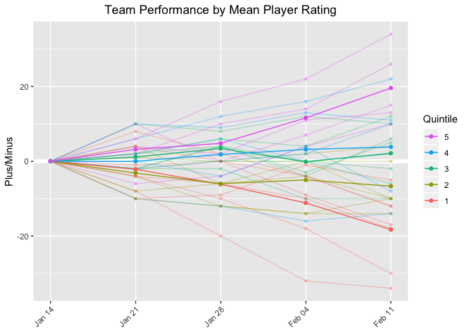

SFPA Player Ratings, v.1
================
Skip Perry
August 2019

### Ratings as of 2019-08-27:

| rank | player                 | current\_team                | rating | sfpa\_games | other\_games | total |
| ---: | :--------------------- | :--------------------------- | -----: | ----------: | -----------: | ----: |
|    1 | Mike Maxwell           | Ginger Rawhides              |    736 |         195 |           30 |   225 |
|    2 | Hector Ortega          | –                            |    734 |          46 |          144 |   190 |
|    3 | Skip Perry             | LeftDovres                   |    701 |         112 |           18 |   130 |
|    4 | Ryan Piaget            | Clean Slate                  |    699 |         140 |            0 |   140 |
|    5 | Evan Burgess           | Billiard Palacade Caballeros |    698 |         210 |            0 |   210 |
|    6 | Bob Simon              | Ginger Rawhides              |    691 |         180 |            0 |   180 |
|    7 | Nick Lansdown          | Billiard Palacade Caballeros |    690 |         162 |           63 |   225 |
|    8 | Diogo Martini          | LeftDovres                   |    687 |         130 |           41 |   171 |
|    9 | Rhys Hughes            | –                            |    684 |         112 |            0 |   112 |
|   10 | Stefano Lopez          | –                            |    681 |          48 |            0 |    48 |
|   11 | Matt Frisbie           | –                            |    680 |          62 |           17 |    79 |
|   12 | Thayer McDougle        | Billiard Palacade Caballeros |    677 |         193 |           32 |   225 |
|   13 | Tom Seymour            | Ginger Rawhides              |    673 |         164 |            0 |   164 |
|   14 | Andy Luong             | –                            |    665 |          83 |            0 |    83 |
|   15 | Chris DuCoing          | Smoke & Rumors               |    654 |         154 |            0 |   154 |
|   16 | Alvin Ho               | LeftDovres                   |    653 |          12 |            6 |    18 |
|   17 | Rudy Guzman            | –                            |    652 |          47 |            0 |    47 |
|   18 | Hugo Valseca           | –                            |    650 |          51 |            0 |    51 |
|   19 | Ben Green              | Clean Slate                  |    647 |         137 |            1 |   138 |
|   20 | Alonza Bear Davis      | –                            |    645 |          12 |            0 |    12 |
|   21 | Patty West             | LeftDovres                   |    643 |         137 |           74 |   211 |
|   22 | Leon Waki              | –                            |    642 |          81 |            6 |    87 |
|   23 | Joshua Maldonado       | Ginger Rawhides              |    642 |         118 |            0 |   118 |
|   24 | Tae Yim                | –                            |    640 |          29 |            0 |    29 |
|   25 | Danny Mullan           | Ginger Rawhides              |    640 |         155 |            6 |   161 |
|   26 | Buddy Giguere          | Smoke & Rumors               |    638 |         119 |            0 |   119 |
|   27 | Todd Emmel             | Pilsner Penguins             |    636 |          17 |           24 |    41 |
|   28 | James Neale            | Billiard Palacade Caballeros |    635 |         181 |            0 |   181 |
|   29 | Eugene Fan             | Rumors Never Die             |    631 |         125 |            0 |   125 |
|   30 | Skinner Arteaga        | Billiard Palacade Caballeros |    631 |         143 |            0 |   143 |
|   31 | Rene Denis             | Smoke & Rumors               |    628 |         177 |            0 |   177 |
|   32 | Rick Mariani           | Ginger Rawhides              |    624 |         132 |            0 |   132 |
|   33 | Pancho Palma           | –                            |    620 |          47 |            0 |    47 |
|   34 | Dave Ward              | Dovre & Out                  |    618 |         171 |            0 |   171 |
|   35 | Wyatt Moss             | Barrel Proof Nice Rack       |    617 |         141 |            0 |   141 |
|   36 | Crystal Kelem          | Tandy Warhols                |    617 |         161 |            0 |   161 |
|   37 | Paul Martinez          | Lone Star Longhorns          |    611 |          17 |            0 |    17 |
|   38 | Hugh Fountain          | –                            |    609 |         111 |            0 |   111 |
|   39 | Rajat Kansal           | Lucky Horsehoe Ballbusters   |    607 |         122 |            0 |   122 |
|   40 | Joel Talevi            | Clean Slate                  |    607 |         134 |           21 |   155 |
|   41 | Bob Schnatterly        | Cinch Pack                   |    606 |         175 |            0 |   175 |
|   42 | Isaac Wong             | Smoke & Rumors               |    606 |         101 |            0 |   101 |
|   43 | Joina Liao             | Front Page Players           |    605 |          80 |            6 |    86 |
|   44 | Darrell Haslip         | Smoke & Rumors               |    603 |         134 |            0 |   134 |
|   45 | Martin Smidak          | LeftDovres                   |    600 |         135 |            8 |   143 |
|   46 | Tommy Mudd             | –                            |    599 |          39 |            5 |    44 |
|   47 | Ari Cowen              | Dovre & Out                  |    599 |         191 |           14 |   205 |
|   48 | Robin McAloon          | Barrel Proof                 |    598 |          12 |            0 |    12 |
|   49 | Jon Williams           | Lucky Horsehoe Ballbusters   |    598 |          76 |           18 |    94 |
|   50 | Wade Hargrove          | Front Page Players           |    597 |          10 |           91 |   101 |
|   51 | Preston Hudson         | –                            |    597 |          94 |            3 |    97 |
|   52 | Alan Lowe              | –                            |    597 |         139 |            0 |   139 |
|   53 | Paul Krohn             | Clean Slate                  |    595 |         144 |           23 |   167 |
|   54 | Gilbert Morales        | –                            |    594 |          44 |            0 |    44 |
|   55 | Adam Moore             | Dovre & Out                  |    593 |         102 |            0 |   102 |
|   56 | Tony Tully             | –                            |    593 |         113 |            0 |   113 |
|   57 | Adam Simpson           | Churchill Churchaholics      |    592 |          54 |            0 |    54 |
|   58 | Polo Black Golde       | Clean Slate                  |    587 |         142 |            3 |   145 |
|   59 | Andrew Creech          | –                            |    587 |         118 |            0 |   118 |
|   60 | Humberto HJ Gonzalez   | Pilsner Penguins             |    586 |         104 |            0 |   104 |
|   61 | Chris Beal             | –                            |    586 |          34 |            0 |    34 |
|   62 | Robert Hoo             | –                            |    586 |          46 |            0 |    46 |
|   63 | Will Chadwick          | Lucky Horsehoe Ballbusters   |    583 |         180 |            0 |   180 |
|   64 | Jason Rogers           | –                            |    581 |          88 |            4 |    92 |
|   65 | Thom Moyer             | Cinch Phoenix                |    580 |         155 |            0 |   155 |
|   66 | Victor Ramos           | –                            |    579 |          78 |           28 |   106 |
|   67 | James Horsfall         | Lucky Horseshoe Glue Factory |    579 |          57 |           28 |    85 |
|   68 | Amy Peterson           | –                            |    579 |          34 |            0 |    34 |
|   69 | Jerry Ball             | Ginger Rawhides              |    578 |          81 |            0 |    81 |
|   70 | Nima Gaadadsuren       | Cinch You’re Down There      |    576 |         181 |            0 |   181 |
|   71 | Cuong Vuong            | –                            |    575 |          98 |            0 |    98 |
|   72 | Mark Butler            | –                            |    574 |          86 |           23 |   109 |
|   73 | Rodney Zarnegar        | Pilsner Penguins             |    573 |         158 |            0 |   158 |
|   74 | Ben Napili             | Cinch Pack                   |    572 |         111 |            0 |   111 |
|   75 | Rene Loria             | –                            |    572 |          28 |            0 |    28 |
|   76 | Roberto Aguilar        | –                            |    570 |          40 |            0 |    40 |
|   77 | Salvador Miranda       | Billiard Palacade Caballeros |    569 |         148 |            8 |   156 |
|   78 | Sam Khozindar          | Ginger Strokes               |    569 |         119 |            0 |   119 |
|   79 | Rich Hatcher           | –                            |    565 |           3 |            5 |     8 |
|   80 | Marcelo Aviles         | Clean Slate                  |    564 |         118 |           37 |   155 |
|   81 | Sam Flores             | Barrel Proof                 |    564 |           4 |            0 |     4 |
|   82 | Patrick Hyde           | Dovre & Out                  |    563 |           4 |            0 |     4 |
|   83 | Sebastian Jellema      | Pilsner Innmates             |    562 |           6 |            0 |     6 |
|   84 | Noah Snyder            | Clean Slate                  |    561 |           4 |            0 |     4 |
|   85 | Ian Montbrun           | Cinch You’re Down There      |    561 |         167 |            0 |   167 |
|   86 | Travis Yallup          | Churchill Churchaholics      |    561 |         156 |            0 |   156 |
|   87 | Max Schroeder          | –                            |    559 |         110 |            0 |   110 |
|   88 | Roy Luo                | Churchill Churchaholics      |    559 |         168 |            0 |   168 |
|   89 | Nick Radford           | Harry Harringtons            |    559 |          40 |            0 |    40 |
|   90 | Mark Thomas            | –                            |    559 |          48 |            2 |    50 |
|   91 | Alex Mendes da Costa   | Rumors Never Die             |    559 |          63 |            0 |    63 |
|   92 | Chris Forester         | –                            |    556 |         101 |            0 |   101 |
|   93 | Brian Paris            | Mixunderstood                |    556 |         147 |            0 |   147 |
|   94 | Nick Wells             | –                            |    553 |          88 |            0 |    88 |
|   95 | Juan Chicho            | Dovre & Out                  |    553 |          58 |            0 |    58 |
|   96 | Brian Bolitho          | –                            |    553 |         108 |            0 |   108 |
|   97 | Nithin Tharakan        | Slate 6 Holes                |    553 |         139 |           24 |   163 |
|   98 | Bob Rice               | –                            |    552 |          45 |            0 |    45 |
|   99 | Niecy Sorrell          | –                            |    552 |           8 |            0 |     8 |
|  100 | Ryan Robison           | Nap-Our-Tandy                |    552 |         173 |            0 |   173 |
|  101 | Matt Kwong             | –                            |    551 |          76 |            0 |    76 |
|  102 | Michael Romano         | Lucky Horseshoe Glue Factory |    551 |         161 |            0 |   161 |
|  103 | Dan Sorge              | Dovre & Out                  |    549 |         173 |           12 |   185 |
|  104 | Perry Logan            | Tandy Warhols                |    548 |         153 |            0 |   153 |
|  105 | Miguel Chimas          | Cinch You’re Down There      |    547 |          64 |            2 |    66 |
|  106 | Rick Bradford          | Lucky Horseshoe Glue Factory |    547 |          87 |            0 |    87 |
|  107 | Matt Raine             | –                            |    546 |          20 |            0 |    20 |
|  108 | Eric Babaki            | Ginger Strokes               |    545 |          54 |            0 |    54 |
|  109 | John Frakes            | Cinch Pack                   |    545 |          94 |            0 |    94 |
|  110 | Isaac Lopez            | Ginger Strokes               |    545 |         111 |            0 |   111 |
|  111 | Justin Taylor          | –                            |    544 |          84 |            0 |    84 |
|  112 | Colton Callahan        | Slate 6 Holes                |    544 |          16 |            0 |    16 |
|  113 | Fran Herman            | Pilsner Penguins             |    543 |         146 |            0 |   146 |
|  114 | Nick Giangreco         | Lone Star Rebels             |    542 |         134 |            0 |   134 |
|  115 | Jason XXX              | Churchill Bulldogs           |    542 |           4 |            0 |     4 |
|  116 | Mikki Paull            | –                            |    541 |         135 |            0 |   135 |
|  117 | Priscilla Shiells      | Front Page Players           |    538 |           8 |            0 |     8 |
|  118 | Chris Kline            | Cinch Phoenix                |    536 |         134 |            0 |   134 |
|  119 | Arthur Patterson       | Slate 6 Holes                |    535 |         162 |           22 |   184 |
|  120 | Eric Gruttemeyer       | Cinchsationals               |    534 |         164 |            0 |   164 |
|  121 | Leif Smith             | Harry Harringtons            |    533 |         176 |            0 |   176 |
|  122 | Hakim Boukhaloua       | Barrel Proof                 |    533 |          68 |            0 |    68 |
|  123 | Tom Golden             | Nap-Our-Tandy                |    533 |          10 |            0 |    10 |
|  124 | Alex Peralta           | Rumors Never Die             |    533 |          83 |            0 |    83 |
|  125 | Quinn Reilly           | –                            |    532 |          74 |            7 |    81 |
|  126 | Ell Jackson            | –                            |    532 |         130 |            0 |   130 |
|  127 | Dylan Scandalios       | –                            |    532 |         153 |            5 |   158 |
|  128 | Dylan Pulliam          | Nap-Our-Tandy                |    529 |           8 |            0 |     8 |
|  129 | Casey O’Neill          | Cinch You’re Down There      |    528 |         181 |            0 |   181 |
|  130 | Chris Logan            | Lucky Horsehoe Ballbusters   |    528 |         155 |            0 |   155 |
|  131 | Sheree Taft            | Churchill Churchaholics      |    525 |          92 |            0 |    92 |
|  132 | Alex Gilbert           | –                            |    525 |          26 |            0 |    26 |
|  133 | Mika Kerr              | Cinchsationals               |    525 |         172 |            0 |   172 |
|  134 | Jerz Zuluaga           | –                            |    524 |          80 |            0 |    80 |
|  135 | James Bavuso           | Cinch Pack                   |    524 |         138 |            0 |   138 |
|  136 | Carlos Gonzalez        | Rumors Never Die             |    523 |         153 |            0 |   153 |
|  137 | Spencer Branson        | –                            |    522 |          34 |            0 |    34 |
|  138 | Chris Doornbos         | Rumors Never Die             |    522 |          18 |            0 |    18 |
|  139 | Huu Nguyen             | Barrel Proof Nice Rack       |    520 |         140 |            0 |   140 |
|  140 | Jonathan Addy          | –                            |    520 |          78 |            0 |    78 |
|  141 | Gerlie Mendoza         | Pilsner Penguins             |    518 |         139 |            0 |   139 |
|  142 | Rohan Kurane           | –                            |    517 |          46 |            0 |    46 |
|  143 | Noel Alpin             | Churchill Bulldogs           |    515 |          16 |            0 |    16 |
|  144 | Chad Horohoe           | Mixfits                      |    515 |           9 |            0 |     9 |
|  145 | Fearghal McEleney      | –                            |    515 |           4 |           13 |    17 |
|  146 | Greg Morgan            | Tandy Warhols                |    513 |         161 |            0 |   161 |
|  147 | Emily Adams            | Pilsner Innmates             |    512 |          99 |            0 |    99 |
|  148 | Jonathan Garcia        | –                            |    511 |          45 |            0 |    45 |
|  149 | Scott Marfield         | Mixunderstood                |    510 |         105 |            0 |   105 |
|  150 | Anthony Hydron         | Lucky Horseshoe Glue Factory |    508 |          98 |            0 |    98 |
|  151 | Patrick Picard         | Pilsner Innmates             |    507 |          68 |            0 |    68 |
|  152 | Ben Becker             | –                            |    507 |          95 |            0 |    95 |
|  153 | Rob Cosgriff           | Barrel Proof Nice Rack       |    507 |          85 |            0 |    85 |
|  154 | Simone Manganelli      | Mixunderstood                |    505 |         130 |            0 |   130 |
|  155 | Yassine Laassel        | –                            |    504 |          66 |            0 |    66 |
|  156 | Clarke Curtis          | –                            |    503 |          62 |            0 |    62 |
|  157 | Justin Dayton          | Slate 6 Holes                |    502 |         166 |            5 |   171 |
|  158 | Fintan Sullivan        | –                            |    501 |          20 |            0 |    20 |
|  159 | Steven Park            | –                            |    500 |          23 |            0 |    23 |
|  160 | Monica Kicklighter     | –                            |    499 |          73 |            0 |    73 |
|  161 | Steven Pease           | Barrel Proof Nice Rack       |    498 |         116 |            0 |   116 |
|  162 | Kirby Aho              | Whomping Willows             |    495 |          10 |            0 |    10 |
|  163 | Sandra Davis           | Cinch Phoenix                |    494 |         109 |            0 |   109 |
|  164 | Cloaky Jones           | –                            |    493 |         146 |            0 |   146 |
|  165 | Charles Carr           | –                            |    493 |           1 |            0 |     1 |
|  166 | Paul McCue             | Cinch Phoenix                |    493 |         118 |            0 |   118 |
|  167 | Julia Landholt         | –                            |    493 |          47 |            0 |    47 |
|  168 | Julie Le               | –                            |    492 |          29 |            0 |    29 |
|  169 | Eric Kalisa            | Nap-Our-Tandy                |    492 |         153 |            0 |   153 |
|  170 | Mark Deal              | Cinch Phoenix                |    491 |         129 |            0 |   129 |
|  171 | Andrew Keller          | –                            |    491 |          48 |            2 |    50 |
|  172 | Doug Johnston          | Barrel Proof Nice Rack       |    489 |         100 |            0 |   100 |
|  173 | Julien Roeser          | Lucky Horseshoe Glue Factory |    489 |         156 |            8 |   164 |
|  174 | Alex Yeagle            | Mixfits                      |    489 |          22 |            0 |    22 |
|  175 | Henry Vazquez          | Barrel Proof                 |    488 |          13 |            0 |    13 |
|  176 | Thomas Messer          | Hole in the Wall Howlers     |    485 |          94 |            0 |    94 |
|  177 | Brendan McCarthy       | Zeitgeist Death Bunnies      |    485 |          10 |            0 |    10 |
|  178 | Mathieu Guglielmi      | Nap-Our-Tandy                |    485 |         190 |            0 |   190 |
|  179 | Jimmy Fails            | Barrel Proof                 |    484 |           4 |            0 |     4 |
|  180 | Walt Bartas            | Cinchsationals               |    484 |         127 |            0 |   127 |
|  181 | Adam Lucero            | –                            |    482 |           2 |            0 |     2 |
|  182 | Cindy Kim              | Front Page Players           |    482 |          16 |            0 |    16 |
|  183 | Daniel Scrivano        | Zeitgeist Death Bunnies      |    481 |          14 |            0 |    14 |
|  184 | Stern Montoya          | Churchill Bulldogs           |    480 |         158 |            4 |   162 |
|  185 | Adam Usmani            | Harry Harringtons            |    479 |           4 |            0 |     4 |
|  186 | Yuko Takahashi         | Front Page Players           |    479 |          10 |           12 |    22 |
|  187 | Greg Weed              | Hole in the Wall Bangers     |    477 |          93 |            0 |    93 |
|  188 | Ali Rad                | –                            |    477 |          23 |            0 |    23 |
|  189 | Jaime Dizon            | LeftDovres                   |    476 |          56 |           16 |    72 |
|  190 | Lawrence Lee           | Barrel Proof                 |    475 |          17 |            0 |    17 |
|  191 | Joan Pettijohn         | Cinch Pack                   |    475 |         134 |            0 |   134 |
|  192 | Keith Deming           | Barrel Proof Nice Rack       |    475 |         162 |            0 |   162 |
|  193 | John Kiltinen          | Hole in the Wall Bangers     |    474 |         166 |            0 |   166 |
|  194 | Lisa Filippini         | –                            |    474 |          57 |            0 |    57 |
|  195 | Bob Ponze              | –                            |    473 |           4 |            0 |     4 |
|  196 | Fernando Reyes         | –                            |    471 |          69 |            0 |    69 |
|  197 | Vijay Alexander        | Ginger Strokes               |    470 |         102 |            0 |   102 |
|  198 | Mark Sorensen          | Lucky Horsehoe Ballbusters   |    469 |         146 |            0 |   146 |
|  199 | Jenny Lee              | –                            |    468 |           8 |            0 |     8 |
|  200 | Elvis McElhatton       | –                            |    467 |          33 |            0 |    33 |
|  201 | Ana Stewart            | –                            |    466 |          78 |            0 |    78 |
|  202 | Austin Kelso           | Mixfits                      |    465 |          16 |            0 |    16 |
|  203 | Nathan Davis           | Zeitgeist Death Bunnies      |    465 |          13 |            0 |    13 |
|  204 | Peter Lee              | Ginger Strokes               |    463 |         152 |            0 |   152 |
|  205 | Anthony Vasquez        | –                            |    462 |          44 |            0 |    44 |
|  206 | Erik Proctor           | Churchill Churchaholics      |    459 |         107 |            0 |   107 |
|  207 | David Norris           | Black Willows                |    458 |         118 |            0 |   118 |
|  208 | Julian Ostrow          | Rumors Never Die             |    458 |         160 |            0 |   160 |
|  209 | Bernie Herschbein      | Whomping Willows             |    455 |         107 |            0 |   107 |
|  210 | Annabelle Cabuhat      | Front Page Players           |    455 |           6 |           15 |    21 |
|  211 | Cristina Urreaga       | Cinch You’re Down There      |    455 |         146 |            0 |   146 |
|  212 | Brendan Payne          | Lucky Horsehoe Ballbusters   |    454 |          13 |            0 |    13 |
|  213 | Juan Carlos Buenrostro | Harry Harringtons            |    453 |          70 |            0 |    70 |
|  214 | Mike Britt             | –                            |    452 |         109 |            0 |   109 |
|  215 | Josh Buttram           | Barrel Proof                 |    451 |           7 |            0 |     7 |
|  216 | Jocelyn Angeles        | Tandy Warhols                |    451 |         144 |            0 |   144 |
|  217 | Max Sanchez            | Smoke & Rumors               |    450 |          88 |            0 |    88 |
|  218 | Shepard Gault          | –                            |    450 |          26 |            0 |    26 |
|  219 | Robin Brun             | –                            |    450 |          18 |            2 |    20 |
|  220 | Matt Paul              | Dovre & Out                  |    448 |         131 |            0 |   131 |
|  221 | Taylor Hobbs           | –                            |    446 |          67 |            0 |    67 |
|  222 | JM Reasonda            | Mixfits                      |    445 |         119 |            0 |   119 |
|  223 | Ninad Desai            | Pilsner Penguins             |    445 |         112 |            0 |   112 |
|  224 | Douglas Cox            | –                            |    445 |          67 |            0 |    67 |
|  225 | LanAnh Kerr            | Mixfits                      |    444 |          18 |            0 |    18 |
|  226 | Nick Chackel           | Black Willows                |    442 |          17 |            0 |    17 |
|  227 | John McNulty           | Lone Star Longhorns          |    441 |         144 |            0 |   144 |
|  228 | Matt Weyls             | Slate 6 Holes                |    440 |          61 |            0 |    61 |
|  229 | Eric Marrujo           | –                            |    438 |         134 |            0 |   134 |
|  230 | Adam Bowley            | Mixunderstood                |    437 |         111 |            0 |   111 |
|  231 | Matt Morrish           | Whomping Willows             |    437 |         157 |            0 |   157 |
|  232 | Rudy Torres            | –                            |    436 |          13 |            0 |    13 |
|  233 | Richard Oliva          | Hole in the Wall Bangers     |    435 |          96 |            0 |    96 |
|  234 | Chris Peterson         | Nap-Our-Tandy                |    435 |         128 |            0 |   128 |
|  235 | Mar Ronquillo          | Black Willows                |    435 |         177 |            0 |   177 |
|  236 | Travis Santos          | –                            |    435 |          44 |            0 |    44 |
|  237 | Kelvin Chung           | Black Willows                |    432 |          31 |            0 |    31 |
|  238 | Vinny Valdez           | Lone Star Rebels             |    431 |           6 |            0 |     6 |
|  239 | Bryan Hoff             | Pilsner Innmates             |    428 |          58 |            0 |    58 |
|  240 | Charles Montague       | –                            |    427 |          44 |            0 |    44 |
|  241 | Patrick Hunt           | Hole in the Wall Howlers     |    425 |          48 |            0 |    48 |
|  242 | John Thong             | –                            |    425 |          75 |            0 |    75 |
|  243 | Danny Joseph           | –                            |    425 |          62 |            0 |    62 |
|  244 | Jason Quincy Bucy      | Lone Star Rebels             |    422 |           9 |            0 |     9 |
|  245 | Reza Wang-Lotfi        | Rumors Never Die             |    421 |           4 |            0 |     4 |
|  246 | Christine Concho       | –                            |    417 |          55 |            0 |    55 |
|  247 | Michael Moreno         | Mixunderstood                |    417 |         123 |            0 |   123 |
|  248 | Kunal Lakhan-Pa        | Barrel Proof Nice Rack       |    417 |          73 |            0 |    73 |
|  249 | Antonio Herrera        | Churchill Churchaholics      |    416 |          33 |            0 |    33 |
|  250 | Nick Weyls             | –                            |    415 |           4 |            0 |     4 |
|  251 | Keith Rubia            | Front Page Players           |    415 |           8 |            0 |     8 |
|  252 | Steven Chamberlin      | Cinchsationals               |    415 |         154 |            0 |   154 |
|  253 | Milan Plevnik          | Cinchsationals               |    411 |         137 |            0 |   137 |
|  254 | Josalyn Rosen          | Churchill Bulldogs           |    410 |          43 |            0 |    43 |
|  255 | Tetyana Swann          | Lone Star Longhorns          |    409 |          18 |            0 |    18 |
|  256 | Ozzie Orozco           | Mixunderstood                |    408 |          16 |            0 |    16 |
|  257 | Hajime Miyazaki        | –                            |    405 |          42 |            0 |    42 |
|  258 | Lawrence Mortensen     | Pilsner Innmates             |    405 |         130 |            0 |   130 |
|  259 | Les Mullin             | –                            |    405 |          72 |            0 |    72 |
|  260 | Ari Fehrenkamp         | –                            |    403 |         105 |            0 |   105 |
|  261 | Troy Brunet            | Hole in the Wall Bangers     |    401 |         142 |            0 |   142 |
|  262 | Jason Valdez           | –                            |    399 |           4 |            0 |     4 |
|  263 | Radley Roberts         | Cinch Pack                   |    399 |         113 |            0 |   113 |
|  264 | Brad Shewmake          | Zeitgeist Death Bunnies      |    399 |          11 |            0 |    11 |
|  265 | Carlos Rodrigues       | Lucky Horseshoe Glue Factory |    398 |          36 |            0 |    36 |
|  266 | Matt Myers             | Churchill Bulldogs           |    397 |          85 |            0 |    85 |
|  267 | Lasalete Sousa         | –                            |    396 |          61 |            0 |    61 |
|  268 | Rocel Lhai             | Ginger Strokes               |    396 |          94 |            0 |    94 |
|  269 | Michael Bouey          | Lone Star Longhorns          |    396 |         147 |            0 |   147 |
|  270 | Tim Doyle              | Slate 6 Holes                |    394 |         113 |            0 |   113 |
|  271 | Gerald Borjas          | Hole in the Wall Howlers     |    393 |         127 |            0 |   127 |
|  272 | Frank Augustine        | Cinch Phoenix                |    390 |          65 |            0 |    65 |
|  273 | Ian Jolly              | Hole in the Wall Howlers     |    388 |         108 |            0 |   108 |
|  274 | Jill Cheviron          | –                            |    384 |          57 |            0 |    57 |
|  275 | Brandi Alexandra       | –                            |    382 |           5 |            0 |     5 |
|  276 | Chad Sloane            | –                            |    379 |          14 |            0 |    14 |
|  277 | Tetyana Swan           | –                            |    379 |          51 |            0 |    51 |
|  278 | Rick Potts             | Cinch Phoenix                |    379 |         112 |            0 |   112 |
|  279 | Malcolm King           | Harry Harringtons            |    378 |          95 |            0 |    95 |
|  280 | Charles Hancock        | –                            |    375 |          74 |            0 |    74 |
|  281 | Andy Cunningham        | Lone Star Longhorns          |    374 |         167 |            0 |   167 |
|  282 | Tommy Torstenson       | –                            |    372 |          69 |            0 |    69 |
|  283 | Keith Neal             | –                            |    372 |          66 |            0 |    66 |
|  284 | Buddy Jacques          | Hole in the Wall Bangers     |    371 |         139 |            0 |   139 |
|  285 | Sharon Yencharis       | Lone Star Rebels             |    368 |          39 |            0 |    39 |
|  286 | John Larkin            | Harry Harringtons            |    366 |          69 |            0 |    69 |
|  287 | Jen Pearson            | –                            |    366 |          72 |            0 |    72 |
|  288 | Roy Perkel             | Pilsner Innmates             |    365 |          96 |            0 |    96 |
|  289 | Brenden Chadwick       | –                            |    363 |          49 |            0 |    49 |
|  290 | Jerry Ervin            | Tandy Warhols                |    361 |         127 |            0 |   127 |
|  291 | Tamara Herring         | Mixunderstood                |    360 |          15 |            0 |    15 |
|  292 | Katrina Ariola         | Mixfits                      |    359 |          14 |            0 |    14 |
|  293 | Jukers Tanseco         | Zeitgeist Death Bunnies      |    359 |          49 |            0 |    49 |
|  294 | Pujan Desei            | –                            |    357 |          32 |            0 |    32 |
|  295 | Greg Micklas           | Zeitgeist Death Bunnies      |    356 |          14 |            0 |    14 |
|  296 | Caleb Christian        | Hole in the Wall Bangers     |    356 |          36 |            0 |    36 |
|  297 | Jonathen Diego         | –                            |    354 |          46 |            0 |    46 |
|  298 | John Putnam            | Whomping Willows             |    349 |         148 |            0 |   148 |
|  299 | Laura Wiggins          | Front Page Players           |    348 |           8 |            0 |     8 |
|  300 | David Evans            | –                            |    346 |          34 |            0 |    34 |
|  301 | Robbie Connelly        | –                            |    345 |          90 |            0 |    90 |
|  302 | Trish Gardner          | Whomping Willows             |    342 |         145 |            0 |   145 |
|  303 | Brian Martin           | –                            |    340 |          29 |            0 |    29 |
|  304 | Savonna Hasson         | Harry Harringtons            |    339 |         112 |            0 |   112 |
|  305 | Austin Day             | Whomping Willows             |    329 |          50 |            0 |    50 |
|  306 | JD David               | Churchill Bulldogs           |    324 |           8 |            0 |     8 |
|  307 | Killer K               | –                            |    323 |          94 |            0 |    94 |
|  308 | Brian Johnson          | –                            |    321 |          75 |            0 |    75 |
|  309 | Brandon Blackmon       | –                            |    318 |          10 |            0 |    10 |
|  310 | Alice Davis            | Lone Star Rebels             |    315 |          18 |            0 |    18 |
|  311 | Dorien Lezinski        | –                            |    314 |          52 |            0 |    52 |
|  312 | Lorax                  | Lone Star Rebels             |    313 |         121 |            0 |   121 |
|  313 | Zeon Kitchiner         | Hole in the Wall Howlers     |    305 |         126 |            0 |   126 |
|  314 | Stefani Furness        | –                            |    300 |          39 |            0 |    39 |
|  315 | Ashley Miller          | –                            |    296 |          10 |            0 |    10 |
|  316 | Mike Myers             | –                            |    291 |          33 |            0 |    33 |
|  317 | Siedra Loeffler        | –                            |    290 |          59 |            0 |    59 |
|  318 | Keelin Ingoldsby       | –                            |    288 |          36 |            0 |    36 |
|  319 | Brady Ralston          | –                            |    272 |          30 |            0 |    30 |
|  320 | Levon Sanossian        | Lone Star Rebels             |    263 |          61 |            0 |    61 |
|  321 | Kurt Weitzmann         | Black Willows                |    257 |          57 |            0 |    57 |
|  322 | Aja Cayetano           | –                            |    213 |          83 |            0 |    83 |
|  323 | Patrick Phillips       | –                            |    172 |          82 |            0 |    82 |

 

<!-- --><!-- -->

<!-- -->

<!-- -->

 

#### This week’s biggest movers:

| player                 | team                         | previous | current | change | games\_in\_system |
| :--------------------- | :--------------------------- | -------: | ------: | -----: | ----------------: |
| Jason Quincy Bucy      | Lone Star Rebels             |      479 |     422 |   \-57 |                 9 |
| Ozzie Orozco           | Mixunderstood                |      458 |     408 |   \-50 |                16 |
| Josh Buttram           | Barrel Proof                 |      499 |     451 |   \-48 |                 7 |
| Tetyana Swann          | Lone Star Longhorns          |      456 |     409 |   \-47 |                18 |
| Kirby Aho              | Whomping Willows             |      537 |     495 |   \-41 |                10 |
| Alice Davis            | Lone Star Rebels             |      349 |     315 |   \-34 |                18 |
| Alvin Ho               | LeftDovres                   |      621 |     653 |     32 |                18 |
| Keith Rubia            | Front Page Players           |      446 |     415 |   \-31 |                 8 |
| Lawrence Lee           | Barrel Proof                 |      507 |     475 |   \-31 |                17 |
| LanAnh Kerr            | Mixfits                      |      472 |     444 |   \-28 |                18 |
| Chris Doornbos         | Rumors Never Die             |      494 |     522 |     27 |                18 |
| Chad Horohoe           | Mixfits                      |      492 |     515 |     23 |                 9 |
| Carlos Rodrigues       | Lucky Horseshoe Glue Factory |      420 |     398 |   \-22 |                36 |
| Adam Simpson           | Churchill Churchaholics      |      610 |     592 |   \-18 |                54 |
| Katrina Ariola         | Mixfits                      |      378 |     359 |   \-18 |                14 |
| Josalyn Rosen          | Churchill Bulldogs           |      427 |     410 |   \-17 |                43 |
| Paul Martinez          | Lone Star Longhorns          |      594 |     611 |     17 |                17 |
| Annabelle Cabuhat      | Front Page Players           |      439 |     455 |     16 |                21 |
| Hakim Boukhaloua       | Barrel Proof                 |      517 |     533 |     16 |                68 |
| Thomas Messer          | Hole in the Wall Howlers     |      501 |     485 |   \-15 |                94 |
| Jukers Tanseco         | Zeitgeist Death Bunnies      |      345 |     359 |     13 |                49 |
| Kurt Weitzmann         | Black Willows                |      244 |     257 |     13 |                57 |
| Greg Micklas           | Zeitgeist Death Bunnies      |      367 |     356 |   \-11 |                14 |
| Joina Liao             | Front Page Players           |      594 |     605 |     11 |                86 |
| Noel Alpin             | Churchill Bulldogs           |      504 |     515 |     11 |                16 |
| Priscilla Shiells      | Front Page Players           |      549 |     538 |   \-11 |                 8 |
| Wade Hargrove          | Front Page Players           |      587 |     597 |     11 |               101 |
| Ian Jolly              | Hole in the Wall Howlers     |      398 |     388 |   \-10 |               108 |
| Juan Carlos Buenrostro | Harry Harringtons            |      464 |     453 |   \-10 |                70 |
| Nick Chackel           | Black Willows                |      452 |     442 |   \-10 |                17 |

 

Data sources: Spring 2018-Fall 2019 SFPA seasons, Spring 2019 SFPA
8-ball tournament, Spring 2019 Slate 8-ball tournament, 2016-2019 Slate
Saturday night tournaments, 2016-2019 Happy singles tournaments
