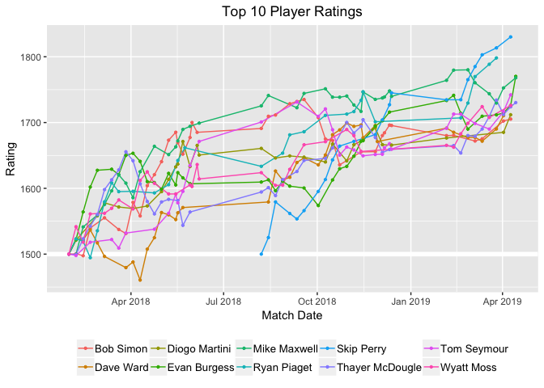
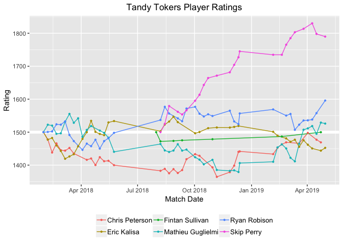
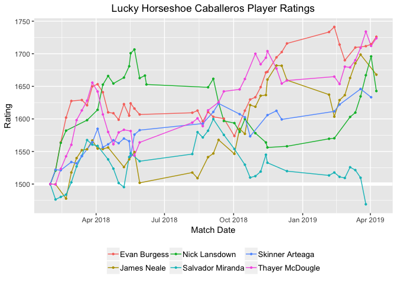
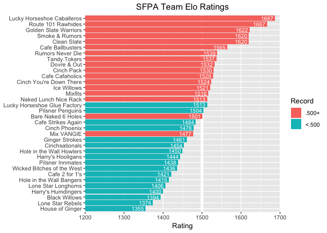
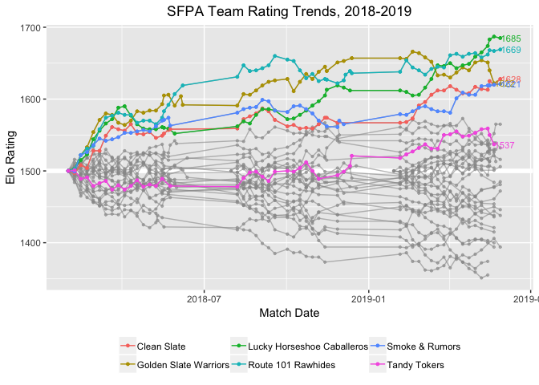
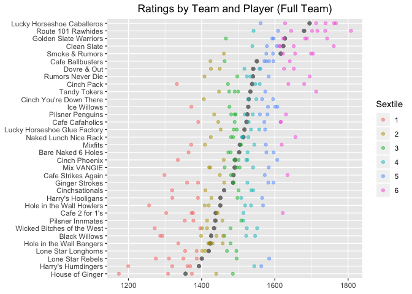

SFPA Elo Ratings
================
Skip Perry
May 2019

``` r
# Function to get a data frame of matches and real-time ratings for a particular player
player_matches_and_ratings <- function(player_of_interest) {
  df <- 
    results_no_forfeits %>% 
    filter(away == player_of_interest | home == player_of_interest) %>% 
    mutate(
      player = player_of_interest,
      opponent = case_when(
        away == player_of_interest ~ home,
        TRUE ~ away
      ),
      opponent_rating = case_when(
        away == player_of_interest ~ p1_start_rating,
        TRUE ~ p2_start_rating
      ),
      result = case_when(
        away == player_of_interest & game_winner == "away" ~ "W",
        home == player_of_interest & game_winner == "home" ~ "W",
        TRUE ~ "L"
      ),
      new_rating = case_when(
        away == player_of_interest ~ p2_end_rating,
        TRUE ~ p1_end_rating
      )
    ) %>% 
    select(match_date, player, opponent, opponent_rating, result, new_rating)
  
  row1_start_date <- df %>% pull(match_date) %>% min() - 7
  
  new_row1 <- 
    tribble(
      ~match_date, ~player, ~opponent, ~opponent_rating, ~result, ~new_rating,
      row1_start_date, player_of_interest, NA, NA, NA, 1500
    )
  
  bind_rows(new_row1, df)
}

win_loss_record <- function(player_of_interest) {
  player_matches_and_ratings(player_of_interest = player_of_interest) %>% 
    slice(-1) %>% 
    group_by(result) %>% 
    count() %>% 
    arrange(desc(result))
}

#win_loss_record(player_of_interest = "Mike Maxwell")
#player_matches_and_ratings(player_of_interest = "Mike Maxwell")

# Helper functions to get a list of all the players in a team (ever, or just now)
get_team_players <- function(team_name) {
  home_players <- 
    results_no_forfeits %>% 
    filter(home_team == team_name) %>% 
    select(home) %>% 
    distinct() %>% 
    pull()
  
  away_players <- 
    results_no_forfeits %>% 
    filter(away_team == team_name) %>% 
    select(away) %>% 
    distinct() %>% 
    pull()
  
  unique(c(home_players, away_players))
}

get_current_team_players <- function(team_name) {
  home_players <- 
    results_19_no_forfeits %>% 
    filter(home_team == team_name) %>% 
    select(home) %>% 
    distinct() %>% 
    pull()
  
  away_players <- 
    results_19_no_forfeits %>% 
    filter(away_team == team_name) %>% 
    select(away) %>% 
    distinct() %>% 
    pull()
  
  unique(c(home_players, away_players))
}

# Helper function to add team names to a data frame containing a column for player
append_team_names <- function(df) {
  df %>% 
    full_join(players_by_team_19, by = "player")
}

# Data frame of players and team names in Spring 2019 - helper for next helper function
players_by_team_19 <- 
  bind_rows(
    results_19_no_forfeits %>% transmute(player = home, team = home_team),
    results_19_no_forfeits %>% transmute(player = away, team = away_team)
  ) %>% 
  distinct() %>% 
  arrange(team, player) %>% 
  filter(!is.na(team))

# List of the top 10 players active in Spring 2019
top_players <-
  elo_ratings %>% 
  arrange(desc(rating)) %>% 
  append_team_names() %>% 
  filter(!is.na(team)) %>% 
  slice(1:10) %>% 
  pull(player)
```

``` r
# Show best players
elo_ratings %>% 
  mutate(rating = round(rating)) %>% 
  arrange(desc(rating)) %>% 
  append_team_names() %>% 
  head(25) %>% 
  knitr::kable()
```

| player          | rating | team                       |
| :-------------- | -----: | :------------------------- |
| Mike Maxwell    |   1810 | Route 101 Rawhides         |
| Evan Burgess    |   1804 | Lucky Horseshoe Caballeros |
| Hector Ortega   |   1789 | NA                         |
| Ryan Piaget     |   1785 | Clean Slate                |
| Thayer McDougle |   1763 | Lucky Horseshoe Caballeros |
| Rhys Hughes     |   1743 | Golden Slate Warriors      |
| Nick Lansdown   |   1742 | Lucky Horseshoe Caballeros |
| Bob Simon       |   1739 | Route 101 Rawhides         |
| Danny Mullan    |   1715 | Route 101 Rawhides         |
| Chris DuCoing   |   1714 | Smoke & Rumors             |
| Eugene Fan      |   1714 | Rumors Never Die           |
| Skip Perry      |   1713 | Tandy Tokers               |
| James Neale     |   1700 | Lucky Horseshoe Caballeros |
| Andy Luong      |   1697 | NA                         |
| Rene Denis      |   1694 | Smoke & Rumors             |
| Nick Callado    |   1688 | NA                         |
| Patty West      |   1688 | Golden Slate Warriors      |
| Stefano Lopez   |   1684 | NA                         |
| Diogo Martini   |   1683 | Golden Slate Warriors      |
| Tom Seymour     |   1682 | Route 101 Rawhides         |
| Bob Schnatterly |   1680 | Cinch Pack                 |
| Hugo Valseca    |   1680 | NA                         |
| Wyatt Moss      |   1656 | Naked Lunch Nice Rack      |
| Isaac Wong      |   1655 | Smoke & Rumors             |
| Jesse La Fear   |   1655 | NA                         |

``` r
# Plot player ratings over time
plot_player_ratings_by_group <- function(player_list, list_name) {
  map_dfr(player_list, player_matches_and_ratings) %>% 
    #filter(match_date > "2018-12-11") %>% 
    group_by(match_date, player) %>% 
    slice(n()) %>% 
    ggplot(aes(x = match_date, y = new_rating, group = player, color = player)) +
    geom_hline(yintercept = 1500, color = "white", size = 2) +
    geom_line() +
    geom_point(size = 0.8) +
    labs(
      x = "Match Date", y = "Rating",
      title = str_c(list_name, " Player Ratings")
    ) +
    theme(
      legend.title = element_blank(),
      plot.title = element_text(hjust = 0.5),
      legend.position = "bottom",
      legend.text = element_text(size = 10)
  )
}

plot_player_ratings_by_group(
  player_list = top_players,
  list_name = "Top 10"
)
```

<!-- -->

``` r
plot_player_ratings_by_group(
  player_list = get_current_team_players("Tandy Tokers"),
  list_name = "Tandy Tokers"
)
```

<!-- -->

``` r
plot_player_ratings_by_group(
  player_list = get_current_team_players("Lucky Horseshoe Caballeros"),
  list_name = "Lucky Horseshoe Caballeros"
)
```

<!-- -->

``` r
# Player improvement in the 2019 season 
player_names_2019 <- 
  bind_rows(
    results_19_no_forfeits %>% select(home) %>% transmute(player = home),
    results_19_no_forfeits %>% select(away) %>% transmute(player = away)
  ) %>% 
    distinct() %>% 
    arrange(player)

current_players_elo_history <-
  map_dfr(player_names_2019 %>% pull(), player_matches_and_ratings)

matches_current_season <- 
  current_players_elo_history %>% 
  filter(str_detect(match_date, "2019"))

final_pre_2019_matches <-
  current_players_elo_history %>% 
  filter(str_detect(match_date, "2018")) %>% 
  group_by(player) %>% 
  slice(n())

df <- 
  bind_rows(matches_current_season, final_pre_2019_matches) %>% 
  arrange(player, match_date)

ratings_changes <- 
  df %>% 
    group_by(player) %>% 
    slice(1, n()) %>% 
    select(player, new_rating) %>% 
    mutate(key = c("initial", "final")) %>% 
    spread(key = "key", value = "new_rating") %>% 
    mutate(diff = final - initial) %>% 
    arrange(desc(diff)) %>% 
    mutate(new_old = if_else(initial == 1500, "New player", "Old player")) %>% 
    append_team_names() %>% 
    select(player, initial, final, diff, new_old, team) %>%
    ungroup()

# Players with the biggest improvement
ratings_changes %>% 
  transmute(
    player, initial = round(initial), final = round(final), 
    diff = round(diff), team, new_old
  ) %>% 
  head(25) %>% 
  knitr::kable()
```

| player               | initial | final | diff | team                         | new\_old   |
| :------------------- | ------: | ----: | ---: | :--------------------------- | :--------- |
| Nick Lansdown        |    1558 |  1742 |  185 | Lucky Horseshoe Caballeros   | Old player |
| Rene Denis           |    1564 |  1694 |  130 | Smoke & Rumors               | Old player |
| John McNulty         |    1371 |  1499 |  127 | Lone Star Longhorns          | Old player |
| Mark Butler          |    1469 |  1593 |  124 | Golden Slate Warriors        | Old player |
| Tae Yim              |    1500 |  1622 |  122 | Cafe 2 for 1’s               | New player |
| Chris DuCoing        |    1596 |  1714 |  118 | Smoke & Rumors               | Old player |
| Alex Mendes da Costa |    1500 |  1616 |  116 | Rumors Never Die             | New player |
| Jon Williams         |    1500 |  1611 |  111 | Cafe Ballbusters             | New player |
| Thayer McDougle      |    1659 |  1763 |  104 | Lucky Horseshoe Caballeros   | Old player |
| Arthur Patterson     |    1480 |  1583 |  103 | Bare Naked 6 Holes           | Old player |
| Cloaky Jones         |    1469 |  1563 |   94 | Harry’s Humdingers           | Old player |
| Bob Schnatterly      |    1588 |  1680 |   92 | Cinch Pack                   | Old player |
| Jason Rogers         |    1512 |  1602 |   90 | Clean Slate                  | Old player |
| Evan Burgess         |    1716 |  1804 |   88 | Lucky Horseshoe Caballeros   | Old player |
| Keith Deming         |    1423 |  1510 |   87 | Naked Lunch Nice Rack        | Old player |
| Mathieu Guglielmi    |    1406 |  1490 |   85 | Tandy Tokers                 | Old player |
| Ryan Piaget          |    1701 |  1785 |   84 | Clean Slate                  | Old player |
| Greg Morgan          |    1498 |  1572 |   74 | Cafe Strikes Again           | Old player |
| Chris Kline          |    1468 |  1542 |   74 | Cinch Phoenix                | Old player |
| James Horsefall      |    1500 |  1573 |   73 | Lucky Horseshoe Glue Factory | New player |
| Danny Mullan         |    1642 |  1715 |   73 | Route 101 Rawhides           | Old player |
| Rob Cosgriff         |    1440 |  1512 |   72 | Naked Lunch Nice Rack        | Old player |
| Marcelo Aviles       |    1499 |  1571 |   72 | Clean Slate                  | Old player |
| Chris Logan          |    1508 |  1580 |   72 | Cafe Ballbusters             | Old player |
| Mike Maxwell         |    1739 |  1810 |   71 | Route 101 Rawhides           | Old player |

``` r
# Players with the biggest declines
ratings_changes %>% 
  transmute(
    player, initial = round(initial), final = round(final), 
    diff = round(diff), team, new_old
  ) %>% 
  arrange(diff) %>% 
  head(25) %>% 
  knitr::kable()
```

| player            | initial | final |  diff | team                       | new\_old   |
| :---------------- | ------: | ----: | ----: | :------------------------- | :--------- |
| Kurt Weitzmann    |    1500 |  1287 | \-213 | Black Willows              | New player |
| Dorien Lezinski   |    1500 |  1308 | \-192 | House of Ginger            | New player |
| Levon Sanossian   |    1500 |  1311 | \-189 | Lone Star Rebels           | New player |
| Keelin Ingoldsby  |    1500 |  1320 | \-180 | Harry’s Humdingers         | New player |
| Brady Ralston     |    1500 |  1355 | \-145 | Lone Star Longhorns        | New player |
| John Larkin       |    1500 |  1369 | \-131 | Harry’s Humdingers         | New player |
| Jonathen Diego    |    1500 |  1373 | \-127 | House of Ginger            | New player |
| Austin Day        |    1500 |  1376 | \-124 | Cafe 2 for 1’s             | New player |
| Sharon Yencharis  |    1500 |  1386 | \-114 | Lone Star Rebels           | New player |
| Jules Tanseco     |    1500 |  1387 | \-113 | Harry’s Hooligans          | New player |
| Savonna Hasson    |    1429 |  1320 | \-109 | Harry’s Hooligans          | Old player |
| Fran Herman       |    1600 |  1492 | \-107 | Pilsner Penguins           | Old player |
| Rick Potts        |    1423 |  1320 | \-103 | Cinch Phoenix              | Old player |
| Siedra Loeffler   |    1373 |  1272 | \-101 | Wicked Bitches of the West | Old player |
| Perry Logan       |    1571 |  1480 |  \-91 | Cafe Strikes Again         | Old player |
| Steven Chamberlin |    1408 |  1319 |  \-89 | Cinchsationals             | Old player |
| Tim Doyle         |    1452 |  1364 |  \-88 | Bare Naked 6 Holes         | Old player |
| Peter Lee         |    1508 |  1422 |  \-87 | Ginger Strokes             | Old player |
| Travis Santos     |    1500 |  1415 |  \-85 | Pilsner Innmates           | New player |
| Sheree Taft       |    1574 |  1490 |  \-84 | Cafe Cafaholics            | Old player |
| Caleb Christian   |    1500 |  1418 |  \-82 | Hole in the Wall Bangers   | New player |
| Patrick Phillips  |    1254 |  1174 |  \-80 | House of Ginger            | Old player |
| Aja Cayetano      |    1278 |  1199 |  \-79 | Harry’s Humdingers         | Old player |
| Antonio Herrera   |    1468 |  1391 |  \-77 | Cafe Cafaholics            | Old player |
| Buddy Jacques     |    1410 |  1336 |  \-74 | Hole in the Wall Bangers   | Old player |

``` r
# Data frame of all team names for all seasons
team_names <- 
  bind_rows(
    results_no_forfeits %>% transmute(team = home_team),
    results_no_forfeits %>% transmute(team = away_team)
  ) %>% 
  distinct() %>% 
  arrange(team) %>% 
  filter(!is.na(team))

# Data frame of team names in the current Spring 2019 season
team_names_2019 <- 
  bind_rows(
    results_19_no_forfeits %>% transmute(team = home_team),
    results_19_no_forfeits %>% transmute(team = away_team)
  ) %>% 
  distinct() %>% 
  arrange(team) %>% 
  filter(!is.na(team))

team_matches_and_ratings <- function(team_of_interest) {
  df <- 
    results_no_forfeits %>% 
    filter(away_team == team_of_interest | home_team == team_of_interest) %>% 
    mutate(
      team = team_of_interest,
      opponent = case_when(
        away_team == team_of_interest ~ home_team,
        TRUE ~ away_team
      ),
      opponent_rating = case_when(
        away_team == team_of_interest ~ t1_start_rating,
        TRUE ~ t2_start_rating
      ),
      result = case_when(
        away_team == team_of_interest & game_winner == "away" ~ "W",
        home_team == team_of_interest & game_winner == "home" ~ "W",
        TRUE ~ "L"
      ),
      new_rating = case_when(
        away_team == team_of_interest ~ t2_end_rating,
        TRUE ~ t1_end_rating
      )
    ) %>% 
    select(match_date, team, opponent, opponent_rating, result, new_rating)
  
  row1_start_date <- df %>% pull(match_date) %>% min() - 7
  
  new_row1 <- 
    tribble(
      ~match_date, ~team, ~opponent, ~opponent_rating, ~result, ~new_rating,
      row1_start_date, team_of_interest, NA, NA, NA, 1500
    )
  
  bind_rows(new_row1, df)
}

team_matches_and_ratings <- 
  map_dfr(team_names_2019 %>% pull(), team_matches_and_ratings)

team_matches_and_ratings_sliced <- 
  team_matches_and_ratings %>% 
  filter(!is.na(team)) %>% 
  group_by(match_date, team) %>% 
  slice(n()) %>% 
  ungroup() %>% 
  mutate(new_rating = round(new_rating))

win_pct_2019 <- 
  team_matches_and_ratings %>% 
  filter(!is.na(result), !is.na(team), match_date > "2019-01-01") %>% 
  group_by(team, result) %>% 
  count() %>% 
  ungroup() %>% 
  spread(result, n) %>% 
  transmute(
    team, 
    win_pct = W / (W + L),
    record = if_else(win_pct >= 0.5, ".500+", "<.500")
  )
```

``` r
# Plot current ratings by team with shading for winning/losing record
elo_team_ratings %>% 
  mutate(rating = round(rating)) %>% 
  inner_join(team_names_2019, by = "team") %>% 
  left_join(win_pct_2019, by = "team") %>%  
  ggplot(aes(x = reorder(team, rating), y = rating, fill = record)) +
  geom_hline(yintercept = 1500, size = 2, color = "white") +
  geom_col() + 
  geom_text(aes(label = rating, y = rating - 20), color = "white", size = 3) + 
  coord_flip(ylim = c(1200, 1700)) +
  scale_y_continuous(
    expand = c(0, 0)
  ) +
  labs(
    y = "Rating",
    title = "SFPA Team Elo Ratings",
    fill = "Record"
  ) + 
  theme(
    axis.title.y = element_blank(),
    plot.title = element_text(hjust = 0.5)
  )
```

<!-- -->

``` r
plot_teams <- function(teams_of_interest) {
  team_matches_and_ratings_sliced %>% 
    ggplot(aes(x = match_date, y = new_rating)) +
    geom_hline(yintercept = 1500, color = "white", size = 2) +
    geom_line(aes(group = team), color = "gray60", alpha = 0.6) +
    geom_point(color = "gray60", size = 0.8, alpha = 0.6) +
    geom_line(aes(color = team, group = team), data = . %>% filter(team %in% teams_of_interest)) +
    geom_point(aes(color = team, group = team), size = 1, data = . %>% filter(team %in% teams_of_interest)) +
    geom_text(
      aes(label = new_rating, color = team, x = match_date + 12), 
      size = 3, 
      data = . %>% filter(team %in% teams_of_interest) %>% group_by(team) %>% slice(n()),
      show.legend = FALSE
    ) +
    labs(
      x = "Match Date", y = "Elo Rating",
      title = "SFPA Team Rating Trends, 2018-2019"
    ) +
    theme(
      legend.title = element_blank(),
      plot.title = element_text(hjust = 0.5),
      legend.position = "bottom"
    )
}

team_list <- c(
  "Tandy Tokers", "Route 101 Rawhides", "Golden Slate Warriors", "Clean Slate",
  "Lucky Horseshoe Caballeros", "Smoke & Rumors"
)

plot_teams(team_list)
```

<!-- -->

``` r
# Show plot with ratings by team and player to see best teams 
# Includes column for the best 4 players on the team 
elo_player_team_ratings <- 
  elo_ratings %>% 
  append_team_names() %>% 
  filter(!is.na(team)) %>% 
  group_by(team) %>% 
  arrange(team, desc(rating)) %>% 
  mutate(
    team_rank = row_number(),
    top4 = team_rank < 5
  ) %>% 
  ungroup() %>% 
  mutate(qtile = as.factor(ntile(rating, 6)))

elo_player_team_ratings %>% 
  group_by(team) %>% 
  mutate(team_mean = mean(rating)) %>% 
  ggplot(aes(x = reorder(team, team_mean))) +
  geom_point(aes(y = team_mean), color = "gray50", size = 1.7, alpha = 0.5) +
  geom_point(aes(y = rating, color = qtile), alpha = 0.5) +
  coord_flip() +
  theme(
    axis.title = element_blank(),
    plot.title = element_text(hjust = 0.5)
  ) +
  labs(
    title = "Ratings by Team and Player (Full Team)",
    color = "Sextile"
  )
```

<!-- -->

``` r
elo_player_team_ratings %>% 
  filter(top4 == TRUE) %>% 
  group_by(team) %>% 
  mutate(team_mean = mean(rating)) %>% 
  ggplot(aes(x = reorder(team, team_mean))) +
  geom_point(aes(y = team_mean), color = "gray50", size = 1.7, alpha = 0.5) +
  geom_point(aes(y = rating, color = qtile), alpha = 0.5) +
  coord_flip() +
  theme(
    axis.title = element_blank(),
    plot.title = element_text(hjust = 0.5)
  ) +
  labs(
    title = "Ratings by Team and Player (Top 4 Only)",
    color = "Sextile"
  )
```

<!-- -->
