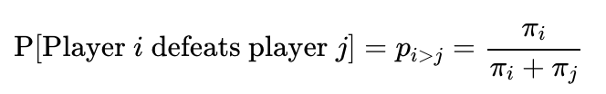
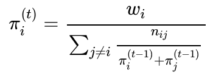
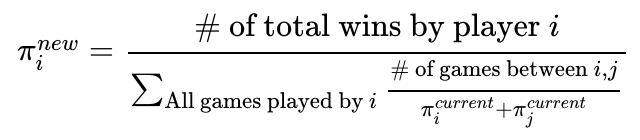
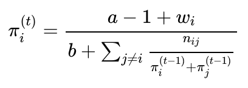
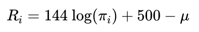
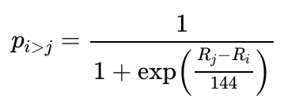
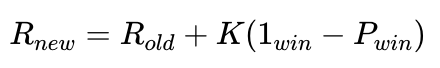

SFPA Player Ratings, v.1
================
Skip Perry
August 2019

### Questions and Answers

What do the ratings mean?

  - The first meaningful number is 500, which has been set as the global
    league average. The second important number is 100, the rating
    difference which denotes a player having a predicted 2-to-1
    advantage in a single game.

How and why does my rating go up or down?

  - Ratings can change one of two ways: Your performance, and the
    performance of your opponents:
    
      - The most important factor is your own performance. A player’s
        rating will go up after performing better than the current
        ratings predict, and it will go down after performing worse than
        the current ratings predict. Match results that track existing
        predictions will result in no change.
    
      - A secondary factor is the performance of the people a player has
        competed against. Let’s assume you have a 7-3 record against
        some previous opponent. If that opponent has a few great nights
        and his or her rating increases, you are likely to earn a couple
        additional points for having done well against that person. (The
        opposite is true if your previous opponent’s rating decreases.)

How much do ratings change over time?

  - Some players perform at a consistent level while other people have
    seen large shifts in their ratings, both positive and negative.
    Substantial changes in players’ ratings are almost always due to
    changes in their own performance, rather than changes in the
    performance of their past opponents.

Do new players have starter ratings?

  - Players begin with an implied rating of 500, but from the very
    beginning their match results start to affect their ratings. Instead
    of holding a new player to an arbitrary starter rating for some set
    period of time, we let the results follow the data even if that data
    is noisy at first. Within three games, more weight starts to be
    placed on actual match results than on the initial rating peg.

How many games are needed to indicate that a rating is trustworthy?

  - This is not a simple question. We are in the process of generating
    confidence intervals (or, more accurately, Bayesian credible
    intervals) for ratings to give an idea of how sure we may be.
    Initial exploration suggests 15 games is the time period when the
    mean and median week-to-week rating changes hit 0, but this likely
    masks substantial uncertainty in our estimates.

### The Math Behind the Ratings

These ratings are based on the Bradley-Terry model, which since the
1950s has been one of the standard methods of assessing the skill of
competitors who are repeatedly paired against one another. Considering
two players *i* and *j* with ratings *πi* and
*πj*, the model estimates that player *i* has the following
probability of defeating player
*j*:

<!-- $$\text{P[Player } i \text{ defeats player } j] = p_{i > j} = \frac{\pi_i}{\pi_i + \pi_j}$$ -->

A common place to start when trying to compute parameters like these is
maximum likelihood estimation. Under the above framework, each game’s
outcome has a specific probability of occurring: a win by player *i*
happens with probability *πi/(πi +
πj)*, while a win by player *j* happens with 1 minus that
probability. If we assume that game results are independent and
identically distributed, we get a *likelihood* of the complete data set
by multiplying together the occurrence probabilities of all contested
games. The maximum likelihood estimate, or MLE, is the collection of
player ratings *π1, …, πn* for all *n* players in
the league that maximizes the value of this likelihood function.

While there is no general analytical solution for the MLE in this case,
iterative methods can be used to find a result. Letting *πi*
be player *i*’s rating, *wi* the number of times player *i*
won a game, *nij* the number of games played between players
*i* and *j*, and *(t)* labeling the result at the *tth*
iteration, we can use the following update
formula:

<!-- $$\pi_i^{(t)} = \frac{w_i}{\sum_{j \neq i} \frac{n_{ij}}{\pi_i^{(t-1)} + \pi_j^{(t-1)}}}$$ -->

Or, in a format that may be easier to
understand:

<!-- $$\pi_i^{new} = \frac{\text{# of total wins by player } i}{\sum_{\text{All games played by } i} \frac{\text{# of games between } i, j}{\pi_i^{current} + \pi_j^{current}}}$$ -->

This adaptation of the expectation-maximization (EM) algorithm loops
through each player, updating their rating using the latest estimates of
all their opponents’ ratings. Eventually, each update will have such a
small effect on the vector of player ratings that we can stop the
process.

Maximum likelihood estimation is the single most widely used method of
parameter estimation, but it is far from perfect. While convergence is
guaranteed under certain conditions, one of those conditions deals with
having a sufficient number of connections in the data, such as you might
find in a series of round-robin games played between all teams in a
league (Hunter 2004). Additionally, the MLE can converge toward the
boundary of a parameter space when faced with extreme data, which in
this case would mean a rating of 0 for a winless player and a rating of
infinity for an undefeated one. The SFPA league data set faces both of
these issues - sparse data with many members playing only a handful of
games against a limited subset of opponents, and some examples of
players with no wins at all.

Bayesian methods allow us to avoid these problems. Instead of finding an
MLE after taking undesirable steps like omitting winless players or
mandating a minimum number of games, we calculate the maximum a priori
(MAP) estimate of ***π*** by setting a *G(a, b)* prior on *π*, where *G*
is a gamma distribution with shape and rate parameters *a* and *b*. This
prior is conjugate to the complete data likelihood function and results
in the following update
formula:

<!-- $$\pi_i^{(t)} = \frac{a - 1 + w_i}{b + \sum_{j \neq i} \frac{n_{ij}}{\pi_i^{(t-1)} + \pi_j^{(t-1)}}}$$ -->

Like the MLE, MAP estimation provides a point estimate, though in this
case it is the mode of a posterior distribution rather than the value at
which a likelihood function is maximized. (Note that for *a = 1* and *b
= 0*, the MAP and maximum likelihood estimates are equivalent; see Caron
and Doucet (2012) for more information.)

Under this setup, as in many Bayesian applications, the choice of prior
has a major impact on the model. When *a = 1*, we get the MLE; as the
value of *a* increases, the impact of actual game results decreases as
the numerator and denominator in the update formula become dominated by
the constant *a - 1* and *b* terms. Hyperparameter tuning for *a*
resulted in an optimal choice of 3 - a weakly informative prior.

The scale of these ratings is arbitrary; any set of ratings can be
multiplied by some positive constant and result in the same probability
*pi\>j* for all *i* and *j*. As a result, in the MLE context,
we would need to peg a player rating *πi* to a particular
value, or set up an additional constraint such as *Σn π\_i =
1000/n*, in order to arrive at a unique solution. In the MAP
formulation, we can make the model identifiable by setting *b = (a - 1)
/ 500* and ensure a rough average player rating of about 500 in the
process.

One issue with the system as described so far is interpretability.
Ratings are only meaningful in relation to each other; a 100-point gap
between players rated 200 and 300 (a 60% win probability for the
higher-ranked player) means something different than the same 100-point
gap between players rated 800 and 900 (a 53% win probability for the
higher-ranked player). A solution is to transform the raw rating
*πi* into a new rating *Ri*, where *µ* is the
mean logged rating across the league:

<!-- $$R_i = 144 \text{ log}(\pi_i) + 500 - \mu$$ -->

Then we get a new formula for *pi\>j*, the probability that
player *i* defeats player
*j*:

<!-- $$p_{i > j} = \frac{1}{1 + \text{exp}\Big{(}\frac{R_j - R_i}{144}\Big{)}}$$ -->

(Plugging in the formulas for *Ri* and *Rj* in the
above will demonstrate the equality of this formulation with the
original *pi\>j = πi/(πi +
πj)*.)

This transformation adds one more step to the process but leads to
ratings that are easier to understand. First, the *500 - µ* factor means
the system is explicitly centered at 500. Second, the scaling factor in
the exponential denominator results in rating comparisons having a
consistent meaning: no matter how high or low a player is ranked, an
advantage of 100 rating points means they have 2-to-1 odds to win a
game, regardless of whether the matchup in question is 200 vs. 300 or
600 vs. 700. These differences are multiplicative, meaning that a
200-point advantage predicts 4-to-1 odds, a 300-point advantage 8-to-1,
and so on. This has the follow-on effect of reducing rightward skew in
the data and providing a natural limit to players’ ratings.

Other considerations included:

  - Home-table advantage: In the past three seasons, about 52% of games
    have been won by the home team, a small but significant edge to the
    home player. There also exists a simple way to incorporate this
    factor into the ratings, letting *pi\>j =
    θπi/(θπi + πj)* where *θ \> 1* is
    the home-table advantage (or *θ \< 1* if it’s a disadvantage).
    Unfortunately, this is a noisy input: due to scheduling conflicts
    and bar remodeling, teams often play “home” games at other bars;
    most week 1 games are home games for both teams; and playoff games
    represent an uneven playing field since higher-seeded teams play at
    home while lower-seeded teams play on the road, among other factors.
    After quite a bit of experimentation in this area failed to improve
    model performance, I omitted the home-table advantage from the
    rating system.

  - Time decay: In pool, a player’s skill level can sometimes change
    over time. One approach to this phenomenon is to assume that these
    changes are the result of random noise and place equal weight on
    every game in a player’s match history; another might be to use a
    subset of a player’s most recent games, on the assumption that those
    games most accurately reflect their skill. The middle-ground
    solution used here is to place less weight on older matches. The
    current season is Fall 2019; these most recent matches are given a
    full weighting factor of 1. Each previous season is given a reduced
    weight of 5%, meaning Spring 2019 games have a weight of 0.95, Fall
    2018 games have a weight of 0.9, and so on. The exact values for
    these parameters had little impact on model performance so the
    weights were chosen arbitrarily. The end result is a rating system
    that is responsive to change but reduces the number of wild
    temporary swings, especially for players with a large number of
    games. One potential issue with this process going forward is that
    players who haven’t competed in a number of years will see their
    ratings drift toward the league average as the smaller weighting
    factors increase the impact of the prior relative to actual game
    results.

  - Robustness: In order to prevent new players with ratings based on a
    small amount of data from having an outsize impact on the ratings of
    more established players, it is also possible to introduce weighting
    factors that reduce the impact of games involving newcomers. As with
    the time decay, experimentation with different reasonable values of
    this parameter showed a negligible impact on model performance.
    Exploratory analysis of players’ ratings over time showed
    week-to-week standard deviations plateauing at 15 games - meaning
    that within only four match nights, a new player’s rating has
    reached a relative steady state. As a result, for now the ratings do
    not include a robustness penalty against new players.

### Comparison with Elo ratings

The Elo system, used in chess and many other zero-sum competitive
settings, has many similarities with the Bradley-Terry setup (Glickman
and Jones 1999). Each player has a rating which is used to estimate a
game win probability, which feeds back into the model in the form of a
new rating conditional on the eventual result. Unlike the complex
iterative method used to find a Bradley-Terry estimate, the Elo rating
update formula is simple:

<!-- $$R_{new} = R_{old} + K(1_{win} - P_{win})$$ -->

We can think of this as akin to a player putting poker chips into the
pot before each game, and receiving a reward proportional to their
likelihood of winning. The greater a player’s chance of winning, the
smaller the increase in their rating will be if they win and the larger
the decrease will be if they lose. The \(K\) term is a velocity
parameter that determines how quickly ratings change along with new
information. A higher value of \(K\) results in faster updates, but also
more noise in the model. This is a sequential process in which rating
updates are applied after each game or match, and only the ratings of
the two players involved are affected. Like all models, this has its
pluses and minuses:

Pros:

  - Less computationally intensive
  - Easy to visualize and understand changes over time
  - More recent matches are given greater weight

Cons:

  - Can be noisy
  - Can give strong players too much credit for beating weaker
    opponents, especially in the second half of the season when teams of
    similar overall skill level play against each other
  - Different values of *K* have a drastic impact on the model
  - Each game only affects two players; Bradley-Terry populates changes
    throughout the entire player population

See Aldous (2017) for a more in-depth discussion of this subject.

Experiments with Elo ratings in the current context with various *K*
formulations showed slightly weaker predictive results than the
Bradley-Terry model, probably because this data set has the triple
challenges of sparsity (most players don’t play each other and when they
do play each other it’s only once), weak connections in the data (teams
across the skill level spectrum only play each other for the first five
weeks of the season), and a high-variance input (one game of 8-ball,
where even beginners can run out with a good layout). Low or strongly
decreasing values of *K* along with number of games played resulted in
rating changes moving too slowly; higher values of *K* created too much
noise.

More importantly, it is clear from a conceptual standpoint that each
game can provide useful information about more than the two players
involved. If player A beat player B last week and player B beats player
C this week, then this week we learned something about player A even
though he or she didn’t compete. The Elo system ignores this information
while Bradley-Terry uses it to update our best guess of player A’s skill
level.

### References

Aldous, David. 2017. “Elo Ratings and the Sports Model.” *Statistical
Science* 32 (4): 616–29.
<https://www.stat.berkeley.edu/~aldous/Papers/me-Elo-SS.pdf>.

Caron, François, and Arnoud Doucet. 2012. “Efficient Bayesian Inference
for Generalized Bradley-Terry Models.” *Journal of Computational and
Graphical Statistics* 21 (1): 174–96.
<http://www.stats.ox.ac.uk/%7Edoucet/caron_doucet_bayesianbradleyterry.pdf>.

Glickman, Mark, and Albyn Jones. 1999. “Rating the Chess Rating System.”
*Chance* 12 (2): 21–28. <http://www.glicko.net/research/chance.pdf>.

Hunter, David. 2004. “ML Algorithms for Generalized Bradley-Terry
Models.” *The Annals of Statistics* 32 (1): 384–406.
<http://personal.psu.edu/drh20/papers/bt.pdf>.

