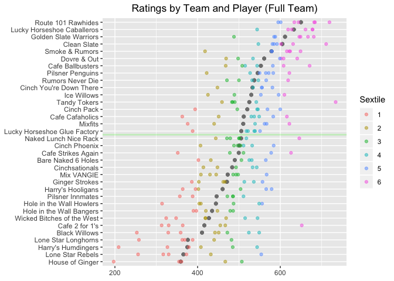
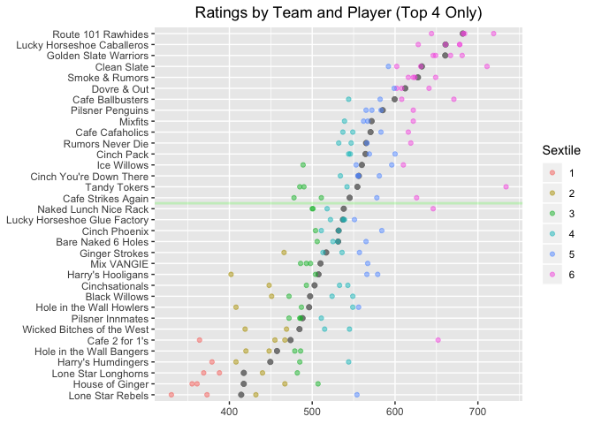

SFPA Player Ratings, v.1
================
Skip Perry
April 2019

### The Math Behind the Ratings

These ratings are based on the Bradley-Terry model, which since the
1950s has been one of the standard methods of assessing the skill of
competitors who are repeatedly paired against one another. Considering
two players \(i\) and \(j\) with ratings \(\pi_i\) and \(\pi_j\), this
framework assumes player \(i\) has the following probability of
defeating player
\(j\):

<!-- $$\text{P[Player } i \text{ defeats player } j] = p_{i > j} = \frac{\pi_i}{\pi_i + \pi_j}$$ -->

A common place to start when trying to estimate parameters like these is
maximum likelihood estimation. The general setup is that each game’s
outcome has some probability of occurring, modeled as π
\(\pi_i(\pi_i + \pi_j)^{-1}\). If we assume that the data points are
independent and identically distributed, the likelihood of all observed
games is simply the probability of all the games multiplied together.
The maximum likelihood estimate, or MLE, is the collection of player
ratings \(\pi_1, ..., \pi_n\) for all \(n\) players in the league that
maximizes this likelihood function.

While there is no general analytical solution for the MLE in this case,
iterative methods can be used to find a result. Letting \(\pi_i\) be
player \(i\)’s rating, \(w_i\) the number of times player \(i\) won a
game, \(n_{ij}\) the number of games played between players \(i\) and
\(j\), and \((t)\) labeling the result at the \(t^{th}\) iteration, we
can use the following update
formula:

<!-- $$\pi_i^{(t)} = \frac{w_i}{\sum_{j \neq i} \frac{n_{ij}}{\pi_i^{(t-1)} + \pi_j^{(t-1)}}}$$ -->

Or, in a format that may be easier to
understand:

<!-- $$\pi_i^{new} = \frac{\text{# of total wins by player } i}{\sum_{\text{All games played by } i} \frac{\text{# of games between } i, j}{\pi_i^{current} + \pi_j^{current}}}$$ -->

This adaptation of the expectation-maximization (EM) algorithm loops
through each player, updating their rating using the latest estimates of
all their opponents’ ratings. (A little experimentation with Google
Calculator or Excel will demonstrate how this formula gives players more
credit for beating higher-ranked opponents.) Eventually, each update
will have such a small effect on the vector of player ratings \(\pi\)
that we can stop the process.

Maximum likelihood estimation is the single most widely used method of
parameter estimation, but it is far from perfect. While convergence is
guaranteed under certain conditions, one of those conditions deals with
having a sufficient number of connections in the data, such as you might
find in a series of round-robin games played between all teams in a
league ([see Assumption 3
here](http://personal.psu.edu/drh20/papers/bt.pdf)). Additionally, the
MLE can converge toward the boundary of a parameter space when dealing
with extreme data, which in this case would mean a rating of 0 for a
winless player and a rating of infinity for an undefeated one. This
presents a clear problem when plugging ratings into the formula
\(\frac{\pi_i}{\pi_i + \pi_j}\). The SFPA league data set faces both of
these issues - sparse data with many members playing only a handful of
games against a limited subset of opponents, and some examples of
players with no wins at all.

Bayesian methods allow us to avoid these problems. Instead of finding an
MLE after taking undesirable steps like omitting winless players or
including only results from players with a minimum number of games, we
calculate the maximum a priori (MAP) estimate of **\(\pi\)** by setting
a \(G(a, b)\) prior on \(\pi\), where \(G\) is a gamma distribution with
parameters \(a\) and \(b\). This prior is conjugate to the complete data
likelihood function and results in the following update
formula:

\[\pi_i^{(t)} = \frac{a - 1 + w_i}{b + \sum_{j \neq i} \frac{n_{ij}}{\pi_i^{(t-1)} + \pi_j^{(t-1)}}}\]

Like the MLE, MAP estimation provides a point estimate, though in this
case it is the mode of a posterior distribution rather than the
maximization of a likelihood function. (Note that for \(a = 1\) and
\(b = 0\), the MAP and maximum likelihood estimates are equivalent; see
[here](http://www.stats.ox.ac.uk/~doucet/caron_doucet_bayesianbradleyterry.pdf)
for more information.)

Under this setup, as in many Bayesian applications, the choice of prior
has a major impact on the model. When \(a = 1\), we simply have the MLE;
as the value of \(a\) increases, the impact of actual game results
decreases as the numerator and denominator in the update formula become
dominated by the constant \(a-1\) and \(b\) terms. Hyperparameter tuning
for \(a\) resulted in an optimal choice of 3 - a weakly informative
prior.

The scale of these ratings is arbitrary; any set of ratings can be
multiplied by some positive constant and result in the same probability
\(p_{i>j}\) for all \(i\) and \(j\). As a result, in the MLE context, we
would need to peg a player rating \(\pi_i\) to a particular value, or
set up an additional constraint such as
\(1 / n * \sum_{i=1}^{n} \pi_i = 1000\), in order to arrive at a unique
solution. In the MAP formulation, we can make the model identifiable by
setting \(b = (a - 1) / 500\) and ensure a rough average player rating
of about 500 in the process.

That said, the raw ratings \(\pi\) using this system have
interpretability problems. For instance, a 100-point gap between players
rated 200 and 300 (\(p = 40\%\)) means something different between
players rated 800 and 900 (\(p = 47\%\)). A solution is to transform the
raw rating \(pi_i\) into a new rating \(R_i\), where \(\mu\) is the mean
raw rating across the league:

\[R_i = 150 \text{ log}(\pi_i) + 500 - \mu\]

Then we get a new formula for \(p_{i > j}\), the probability that player
\(i\) defeats player
\(j\):

\[p_{i > j} = \frac{1}{1 + \text{exp}\Big{(}\frac{R_j - R_i}{150}\Big{)}}\]

(Plugging in the formulas for \(R_i\) and \(R_j\) in the above will
demonstrate the equality of this formulation with the original
\(p_{i > j} = \pi_i (\pi_i + \pi_j)^{-1}\).)

This math adds one more step to the process but leads to ratings that
are easier to interpret. First, the \(500 - \mu\) factor means the
system is explicitly centered at 500; a rating of 500 represents the
average skill level in the league. Second, the scaling factor in the
exponential denominator results in rating comparisons having a
consistent meaning: no matter how high or low a player is ranked, an
advantage of 100 rating points means they have 2-to-1 odds to win a
game, regardless of whether the matchup in question is 200 vs. 300 or
600 vs. 700. These differences are multiplicative, meaning that a
200-point advantage predicts 4-to-1 odds, a 300-point advantage 8-to-1,
and so on. This has the follow-on effect of reducing rightward skew in
the data and providing a natural limit to players’ ratings.

Other considerations included:

  - Home-table advantage: In the past three seasons, about 52% of games
    have been won by the home team, a small but significant edge to the
    home player. There also exists a simple way to incorporate this
    factor into the ratings, letting
    \(p_{i>j} = \frac{\theta \pi_i}{\theta \pi_i + \pi_j}\) where
    \(\theta > 1\) is the home-table advantage (or \(\theta < 1\) if
    it’s a disadvantage). Unfortunately, this is a noisy input: due to
    scheduling conflicts and bar remodeling, teams often play “home”
    games at other bars; most week 1 games are home games for both
    teams; and playoff games represent an uneven playing field since
    higher-seeded teams play at home while lower-seeded teams play on
    the road, among other factors. After quite a bit of experimentation
    in this area failed to improve model performance, I omitted the
    home-table advantage from the rating system.

  - Time decay: In pool, a player’s skill level can sometimes change
    over time. One extreme would be to assume that these changes are the
    result of random noise and place equal weight on every game in a
    player’s match history; another would be to use a subset of a
    player’s most recent games, on the assumption that those games
    most accurately reflect their skill. The middle ground solution used
    here is to provide less weight to older matches. The current season
    is Spring 2019; these most recent matches are weighted at 1. Older
    matches in Fall 2018 and Spring 2018 have weights of 0.8 and 0.6,
    respectively. The exact values for these parameters had little
    impact on model results so these numbers were chosen arbitrarily.
    The end result is a rating system that is responsive to change but
    reduces the number of wild temporary swings, especially for players
    with more established ratings.

  - Robustness: In order to prevent new players with ratings based on a
    small amount of data from having an outsize impact on the ratings of
    more established players, it is also possible to introduce weighting
    factors that reduce the impact of games involving newcomers. As with
    the time decay, experimentation with different reasonable values of
    this parameter showed a negligible impact on model performance.
    Exploratory analysis of players’ ratings over time showed standard
    deviations plateauing at 15 games - meaning that within only four
    match nights, a new player’s rating has reached a relative steady
    state. As a result, for now the ratings do not include a robustness
    penalty against new players.

### Questions and Answers

What do the ratings mean?

  - The first meaningful number here is 500, which has been set as the
    global league average. The second meaningful number is 100, the
    rating difference which denotes a player having a predicted 2-to-1
    advantage in a single game.

How and why does my rating go up or down?

  - Ratings can change one of two ways: Your performance, and the
    performance of your opponents:
    
      - The most important factor is your own performance. A player’s
        rating will go up after performing better than the current
        ratings predict, and it will go down after performing worse than
        the current ratings predict. Match results that track existing
        predictions will result in little to no change.
    
      - A secondary, smaller factor is the performance of the people a
        player has competed against. Let’s assume you have a 7-3 record
        against some previous opponent. If that opponent has a few great
        nights and his or her rating increases, you are likely to earn a
        couple additional points for having done well against that
        person. (The opposite is true if your previous opponent’s rating
        decreases.)

How much do ratings change over time?

  - Some players perform at a consistent level over time. Other people
    have seen large shifts in their ratings, both positive and negative.
    Substantial changes in players’ ratings are almost always due to
    changes in their own performance, rather than changes in the
    performance of their past opponents.

Do new league players have starter ratings?

  - Players begin with a rating of 500, but from the very beginning
    their match results start to affect their ratings. Instead of
    holding a new player to an arbitrary starter rating for some set
    period of time, we let the results follow the data even if that data
    is noisy at first. Within three games, more weight starts to be
    placed on actual match results than on the initial rating.

How many games are needed to indicate that a rating is trustworthy?

  - This is not a simple question. We are in the process of generating
    confidence intervals (or, more accurately, Bayesian credible
    intervals) for ratings to give an idea of how sure we may be.
    Initial exploration suggests 15 games is the time period when the
    mean and median week-to-week rating changes hit 0 and the standard
    deviation approaches a relative
plateau.

### Ratings as of 2019-04-09:

| rank | player                 | current\_team                | rating | games\_in\_system |
| ---: | :--------------------- | :--------------------------- | -----: | ----------------: |
|    1 | Hector Ortega          | –                            |    739 |                46 |
|    2 | Skip Perry             | Tandy Tokers                 |    734 |                77 |
|    3 | Mike Maxwell           | Route 101 Rawhides           |    719 |               144 |
|    4 | Ryan Piaget            | Clean Slate                  |    711 |               106 |
|    5 | Tom Seymour            | Route 101 Rawhides           |    684 |               123 |
|    6 | Bob Simon              | Route 101 Rawhides           |    682 |               149 |
|    7 | Diogo Martini          | Golden Slate Warriors        |    681 |               106 |
|    8 | Evan Burgess           | Lucky Horseshoe Caballeros   |    678 |               151 |
|    9 | Thayer McDougle        | Lucky Horseshoe Caballeros   |    678 |               145 |
|   10 | Stefano Lopez          | –                            |    678 |                48 |
|   11 | Jesse La Fear          | –                            |    674 |                73 |
|   12 | Jon Williams           | Cafe Ballbusters             |    671 |                30 |
|   13 | Nick Callado           | –                            |    669 |                39 |
|   14 | Rhys Hughes            | Golden Slate Warriors        |    667 |                98 |
|   15 | Andy Luong             | –                            |    665 |                83 |
|   16 | Nick Lansdown          | Lucky Horseshoe Caballeros   |    661 |               117 |
|   17 | Matt Frisbie           | –                            |    654 |                62 |
|   18 | Tae Yim                | Cafe 2 for 1’s               |    652 |                22 |
|   19 | Hugo Valseca           | –                            |    651 |                51 |
|   20 | Rudy Guzman            | –                            |    650 |                47 |
|   21 | Ben Green              | Golden Slate Warriors        |    649 |               110 |
|   22 | Chris DuCoing          | Smoke & Rumors               |    649 |               114 |
|   23 | Wyatt Moss             | Naked Lunch Nice Rack        |    646 |               121 |
|   24 | Patty West             | Golden Slate Warriors        |    646 |               102 |
|   25 | Joshua Maldonado       | Route 101 Rawhides           |    644 |                83 |
|   26 | Alonza Bear Davis      | –                            |    642 |                12 |
|   27 | Dave Ward              | Dovre & Out                  |    641 |               135 |
|   28 | Danny Mullan           | Route 101 Rawhides           |    634 |               119 |
|   29 | Joel Talevi            | Clean Slate                  |    631 |               100 |
|   30 | James Neale            | Lucky Horseshoe Caballeros   |    628 |               136 |
|   31 | Crystal Kelem          | Cafe Strikes Again           |    626 |               125 |
|   32 | Darrell Haslip         | Smoke & Rumors               |    624 |                97 |
|   33 | Leon Waki              | –                            |    623 |                81 |
|   34 | Joina Liao             | Pilsner Penguins             |    622 |                52 |
|   35 | Buddy Giguere          | Smoke & Rumors               |    622 |                82 |
|   36 | Hugh Fountain          | Mixfits                      |    622 |                92 |
|   37 | Skinner Arteaga        | Lucky Horseshoe Caballeros   |    619 |               105 |
|   38 | Pancho Palma           | –                            |    619 |                47 |
|   39 | Eugene Fan             | Rumors Never Die             |    619 |                96 |
|   40 | Rene Denis             | Smoke & Rumors               |    616 |               131 |
|   41 | Adam Simpson           | Cafe Cafaholics              |    616 |                41 |
|   42 | Alan Lowe              | Ice Willows                  |    610 |               118 |
|   43 | Rajat Kansal           | –                            |    610 |               110 |
|   44 | Ari Cowen              | Dovre & Out                  |    608 |               155 |
|   45 | Will Chadwick          | Cafe Ballbusters             |    608 |               141 |
|   46 | Paul Krohn             | Clean Slate                  |    602 |               117 |
|   47 | Adam Moore             | Dovre & Out                  |    602 |                84 |
|   48 | Tommy Mudd             | –                            |    601 |                39 |
|   49 | Rick Mariani           | Route 101 Rawhides           |    601 |               105 |
|   50 | Bob Schnatterly        | Cinch Pack                   |    600 |               129 |
|   51 | Juan Chicho            | Dovre & Out                  |    599 |                39 |
|   52 | Tony Tully             | Ice Willows                  |    596 |               113 |
|   53 | Jerry Ball             | Route 101 Rawhides           |    595 |                68 |
|   54 | Mark Cooper            | –                            |    594 |                43 |
|   55 | Gilbert Morales        | –                            |    593 |                44 |
|   56 | Astra Sodarsono        | –                            |    592 |                36 |
|   57 | Polo Black Golde       | Clean Slate                  |    592 |               112 |
|   58 | Mark Butler            | Golden Slate Warriors        |    588 |                75 |
|   59 | Jae Bigley             | –                            |    586 |                31 |
|   60 | Martin Smidak          | Golden Slate Warriors        |    585 |               106 |
|   61 | Jason Rogers           | Clean Slate                  |    585 |                69 |
|   62 | Thom Moyer             | Cinch Phoenix                |    584 |               115 |
|   63 | Bob Rice               | Cafe Cafaholics              |    583 |                27 |
|   64 | Eric Babaki            | Pilsner Penguins             |    583 |                18 |
|   65 | Andrew Creech          | Cafe Ballbusters             |    582 |                84 |
|   66 | Robert Hoo             | –                            |    581 |                46 |
|   67 | Nima Gaadadsuren       | Cinch You’re Down There      |    581 |               144 |
|   68 | Amy Peterson           | –                            |    581 |                34 |
|   69 | Preston Hudson         | Clean Slate                  |    581 |                82 |
|   70 | Humberto HJ Gonzalez   | Smoke & Rumors               |    580 |               100 |
|   71 | Chris Beal             | –                            |    580 |                34 |
|   72 | Conor O’Neill          | –                            |    579 |                29 |
|   73 | Isaac Wong             | Smoke & Rumors               |    579 |                62 |
|   74 | Max Schroeder          | Harry’s Hooligans            |    579 |                92 |
|   75 | Perry Logan            | Cafe Strikes Again           |    578 |               125 |
|   76 | Dave Timko             | –                            |    578 |                41 |
|   77 | Rio                    | –                            |    577 |                53 |
|   78 | Cuong Vuong            | –                            |    574 |                98 |
|   79 | Rodney Zarnegar        | Pilsner Penguins             |    572 |               121 |
|   80 | Dan Nguyen             | –                            |    571 |                61 |
|   81 | Mike Kavanaugh         | –                            |    570 |                21 |
|   82 | Roberto Aguilar        | –                            |    569 |                40 |
|   83 | Paul Campbell          | –                            |    569 |                10 |
|   84 | Ben Napili             | Cinch Pack                   |    569 |                75 |
|   85 | Rene Loria             | –                            |    567 |                28 |
|   86 | Chris Forester         | Mixfits                      |    567 |                84 |
|   87 | Brian Paris            | Mix VANGIE                   |    567 |               126 |
|   88 | Alex Peralta           | Rumors Never Die             |    566 |                39 |
|   89 | Nick Radford           | Harry’s Hooligans            |    566 |                29 |
|   90 | Nithin Tharakan        | Bare Naked 6 Holes           |    565 |                88 |
|   91 | Brian Bolitho          | Pilsner Penguins             |    565 |               108 |
|   92 | Mark Thomas            | –                            |    564 |                48 |
|   93 | Justin Taylor          | Mixfits                      |    562 |                69 |
|   94 | Brendan Kendrick       | –                            |    559 |                43 |
|   95 | Matt Kwong             | –                            |    558 |                76 |
|   96 | Alex Gilbert           | Ginger Strokes               |    557 |                18 |
|   97 | Casey O’Neill          | Cinch You’re Down There      |    556 |               144 |
|   98 | Ell Jackson            | Hole in the Wall Howlers     |    556 |               110 |
|   99 | Niecy Sorrell          | –                            |    556 |                 8 |
|  100 | Ian Montbrun           | Cinch You’re Down There      |    555 |               130 |
|  101 | Nick Wells             | –                            |    554 |                88 |
|  102 | Nick Giangreco         | Lone Star Rebels             |    554 |               112 |
|  103 | Sam Khozindar          | Ice Willows                  |    553 |                79 |
|  104 | Michelle Hironimus     | –                            |    551 |                42 |
|  105 | James Horsefall        | Lucky Horseshoe Glue Factory |    551 |                26 |
|  106 | Fran Herman            | Pilsner Penguins             |    550 |               124 |
|  107 | Leif Smith             | Hole in the Wall Howlers     |    549 |               140 |
|  108 | Matt Raine             | Black Willows                |    549 |                20 |
|  109 | Roy Luo                | Cafe Cafaholics              |    549 |               129 |
|  110 | Carlos Gonzalez        | Rumors Never Die             |    547 |               114 |
|  111 | Marcelo Aviles         | Clean Slate                  |    547 |                83 |
|  112 | James Bavuso           | Cinch Pack                   |    546 |               110 |
|  113 | Mikki Paull            | Wicked Bitches of the West   |    545 |               120 |
|  114 | John Frakes            | Cinch Pack                   |    544 |                59 |
|  115 | Victor Ramos           | Cafe Ballbusters             |    544 |                59 |
|  116 | Jonathan Addy          | Harry’s Humdingers           |    544 |                68 |
|  117 | Salvador Miranda       | Lucky Horseshoe Caballeros   |    544 |               118 |
|  118 | Mika Kerr              | Cinchsationals               |    543 |               132 |
|  119 | Ryan Robison           | Tandy Tokers                 |    542 |               136 |
|  120 | JoJo Cheung            | –                            |    541 |                42 |
|  121 | Rick Bradford          | Lucky Horseshoe Glue Factory |    539 |                30 |
|  122 | Alex Yeagle            | Mixfits                      |    539 |                 4 |
|  123 | Travis Yallup          | Cafe Cafaholics              |    537 |               115 |
|  124 | Michael Romano         | Lucky Horseshoe Glue Factory |    537 |               120 |
|  125 | Isaac Lopez            | Ginger Strokes               |    536 |                72 |
|  126 | Miguel Chimas          | Cinch You’re Down There      |    534 |                27 |
|  127 | Dan Sorge              | Dovre & Out                  |    534 |               142 |
|  128 | Eric Gruttemeyer       | Cinchsationals               |    533 |               131 |
|  129 | Chris Kline            | Cinch Phoenix                |    532 |               108 |
|  130 | Jerz Zuluaga           | Rumors Never Die             |    532 |                77 |
|  131 | Dylan Scandalios       | Bare Naked 6 Holes           |    531 |               126 |
|  132 | Sheree Taft            | Cafe Cafaholics              |    530 |                72 |
|  133 | JT                     | –                            |    529 |                 8 |
|  134 | Jasper Thomas          | –                            |    529 |                44 |
|  135 | Spencer Branson        | –                            |    528 |                34 |
|  136 | Gerlie Mendoza         | Pilsner Penguins             |    527 |               111 |
|  137 | Jack O’Toole           | –                            |    526 |                42 |
|  138 | Quinn Reilly           | –                            |    525 |                74 |
|  139 | Justin Dayton          | Bare Naked 6 Holes           |    525 |               131 |
|  140 | Rohan Kurane           | Black Willows                |    524 |                29 |
|  141 | Anthony Hydron         | Lucky Horseshoe Glue Factory |    522 |                76 |
|  142 | Travis Abernathy       | –                            |    521 |                 4 |
|  143 | Fearghal McEleney      | –                            |    520 |                 4 |
|  144 | Tom Flanagan           | –                            |    518 |                52 |
|  145 | Julien Roeser          | Lucky Horseshoe Glue Factory |    518 |               118 |
|  146 | Doug Johnston          | Naked Lunch Nice Rack        |    518 |                64 |
|  147 | Monica Kicklighter     | Wicked Bitches of the West   |    515 |                65 |
|  148 | Chris Logan            | Cafe Ballbusters             |    515 |               126 |
|  149 | Mike Schlatter         | –                            |    515 |                16 |
|  150 | Jackson Kon            | –                            |    515 |                31 |
|  151 | Hakim Boukhaloua       | Ginger Strokes               |    513 |                34 |
|  152 | Clarke Curtis          | –                            |    512 |                62 |
|  153 | Sandra Davis           | Cinch Phoenix                |    511 |                87 |
|  154 | Emily Adams            | Pilsner Innmates             |    511 |                67 |
|  155 | Ben Becker             | –                            |    511 |                95 |
|  156 | Greg Morgan            | Cafe Strikes Again           |    511 |               129 |
|  157 | Gary Simmons           | –                            |    509 |                48 |
|  158 | Estelle Mays           | –                            |    509 |                32 |
|  159 | Jonathan Garcia        | –                            |    509 |                45 |
|  160 | Steven Park            | –                            |    508 |                23 |
|  161 | Spencer Smith          | –                            |    508 |                65 |
|  162 | Mark Sorensen          | Cafe Ballbusters             |    508 |               127 |
|  163 | Julia Landholt         | House of Ginger              |    507 |                36 |
|  164 | Arthur Patterson       | Bare Naked 6 Holes           |    506 |               121 |
|  165 | Andrew Keller          | –                            |    506 |                48 |
|  166 | Geoff Vessels          | –                            |    506 |                27 |
|  167 | Rob Thacher            | –                            |    504 |                28 |
|  168 | Juan Carlos Buenrostro | Harry’s Hooligans            |    504 |                34 |
|  169 | Paul McCue             | Cinch Phoenix                |    504 |                88 |
|  170 | Steven Pease           | Naked Lunch Nice Rack        |    501 |                96 |
|  171 | Charles Carr           | –                            |    500 |                 1 |
|  172 | Alex Mendes da Costa   | Rumors Never Die             |    500 |                23 |
|  173 | Huu Nguyen             | Naked Lunch Nice Rack        |    500 |               123 |
|  174 | Sean Flanagan          | –                            |    500 |                38 |
|  175 | Thomas Kleyn           | –                            |    499 |                 4 |
|  176 | Yassine Laassel        | Mix VANGIE                   |    498 |                50 |
|  177 | Elvis McElhatton       | Dovre & Out                  |    498 |                19 |
|  178 | Dallas Emmett          | –                            |    497 |                 2 |
|  179 | Marty                  | –                            |    497 |                43 |
|  180 | Julie Le               | Cinch Phoenix                |    497 |                15 |
|  181 | Monica Jacqueline      | –                            |    496 |                36 |
|  182 | Joan Pettijohn         | Cinch Pack                   |    496 |               103 |
|  183 | Dylan Hirsch-Shell     | –                            |    494 |                28 |
|  184 | Scott Marfield         | Mix VANGIE                   |    493 |                85 |
|  185 | Walt Bartas            | Cinchsationals               |    493 |               106 |
|  186 | Fintan Sullivan        | Tandy Tokers                 |    490 |                16 |
|  187 | Stern Montoya          | Ice Willows                  |    489 |               115 |
|  188 | Jaime Dizon            | Golden Slate Warriors        |    488 |                23 |
|  189 | Mark Deal              | Cinch Phoenix                |    488 |               102 |
|  190 | Bob Ponze              | –                            |    487 |                 4 |
|  191 | Thomas Messer          | Hole in the Wall Howlers     |    487 |                68 |
|  192 | Simone Manganelli      | Mix VANGIE                   |    486 |                99 |
|  193 | Greg Weed              | Hole in the Wall Bangers     |    486 |                70 |
|  194 | Patrick Picard         | Pilsner Innmates             |    486 |                30 |
|  195 | Bryan Hoff             | Pilsner Innmates             |    485 |                28 |
|  196 | Cloaky Jones           | Harry’s Humdingers           |    485 |               122 |
|  197 | Mathieu Guglielmi      | Tandy Tokers                 |    485 |               147 |
|  198 | Eric Kalisa            | Tandy Tokers                 |    483 |               121 |
|  199 | Ali Rad                | –                            |    482 |                23 |
|  200 | Adam Lucero            | Lone Star Longhorns          |    482 |                 2 |
|  201 | Patrick Hunt           | –                            |    482 |                37 |
|  202 | Lisa Filippini         | –                            |    481 |                57 |
|  203 | Keith Deming           | Naked Lunch Nice Rack        |    479 |               127 |
|  204 | John Kiltinen          | Hole in the Wall Bangers     |    479 |               131 |
|  205 | Jocelyn Angeles        | Cafe Strikes Again           |    478 |               114 |
|  206 | Justin Nicholson       | –                            |    474 |                18 |
|  207 | Rich Hatcher           | –                            |    474 |                 3 |
|  208 | Piroskki               | –                            |    473 |                 4 |
|  209 | Fernando Reyes         | –                            |    473 |                69 |
|  210 | Travis Santos          | Pilsner Innmates             |    472 |                34 |
|  211 | Robin Brun             | Black Willows                |    472 |                18 |
|  212 | Julian Ostrow          | Rumors Never Die             |    471 |               122 |
|  213 | Rob Cosgriff           | Naked Lunch Nice Rack        |    471 |                63 |
|  214 | Ana Stewart            | Wicked Bitches of the West   |    469 |                70 |
|  215 | Matt Paul              | Dovre & Out                  |    469 |               115 |
|  216 | Mike Britt             | Cafe Ballbusters             |    468 |                98 |
|  217 | David Norris           | House of Ginger              |    467 |                84 |
|  218 | Bernie Herschbein      | Cafe 2 for 1’s               |    467 |                76 |
|  219 | Vijay Alexander        | Ginger Strokes               |    466 |                63 |
|  220 | Chris Penska           | –                            |    464 |                12 |
|  221 | Peter Lee              | Ginger Strokes               |    462 |               116 |
|  222 | Anthony Vasquez        | –                            |    459 |                44 |
|  223 | Chris Peterson         | Tandy Tokers                 |    459 |               102 |
|  224 | Tone                   | –                            |    459 |                10 |
|  225 | Ben Ames               | –                            |    457 |                16 |
|  226 | Matt Morrish           | Cafe 2 for 1’s               |    455 |               130 |
|  227 | Douglas Cox            | –                            |    452 |                67 |
|  228 | Mar Ronquillo          | Black Willows                |    451 |               135 |
|  229 | Erik Proctor           | Cafe Cafaholics              |    451 |                82 |
|  230 | Josalyn Rosen          | –                            |    450 |                27 |
|  231 | Taylor PoolNarwhal M   | –                            |    448 |                33 |
|  232 | Richard Oliva          | Hole in the Wall Bangers     |    448 |                66 |
|  233 | Milan Plevnik          | Cinchsationals               |    448 |               113 |
|  234 | Cristina Urreaga       | Cinch You’re Down There      |    448 |               123 |
|  235 | Taylor Hobbs           | –                            |    446 |                67 |
|  236 | Eric Marrujo           | Mix VANGIE                   |    445 |               110 |
|  237 | Kunal Lakhan-Pa        | Naked Lunch Nice Rack        |    444 |                63 |
|  238 | CJ Simmons             | –                            |    442 |                58 |
|  239 | Kelvin Chung           | Black Willows                |    442 |                 9 |
|  240 | John McNulty           | Lone Star Longhorns          |    440 |               111 |
|  241 | JM Reasonda            | Mixfits                      |    440 |                92 |
|  242 | Rudy Torres            | –                            |    439 |                13 |
|  243 | Fiona Manzella         | –                            |    437 |                39 |
|  244 | NAPPYYBOYY             | –                            |    437 |                35 |
|  245 | Danny Joseph           | –                            |    432 |                62 |
|  246 | Shepard Gault          | Lone Star Rebels             |    432 |                14 |
|  247 | Matt Weyls             | Bare Naked 6 Holes           |    432 |                41 |
|  248 | Adam Bowley            | Mix VANGIE                   |    430 |                83 |
|  249 | John Thong             | –                            |    430 |                75 |
|  250 | Nick Weyls             | –                            |    429 |                 4 |
|  251 | Charles Montague       | –                            |    429 |                44 |
|  252 | Matt Myers             | Ice Willows                  |    425 |                59 |
|  253 | Ninad Desei            | Pilsner Penguins             |    422 |                83 |
|  254 | Troy Brunet            | Hole in the Wall Bangers     |    420 |               110 |
|  255 | Lasalete Sousa         | Wicked Bitches of the West   |    419 |                46 |
|  256 | Ari Fehrenkamp         | Wicked Bitches of the West   |    419 |                94 |
|  257 | Max Sanchez            | Smoke & Rumors               |    418 |                60 |
|  258 | Jason Valdez           | –                            |    418 |                 4 |
|  259 | Evan                   | –                            |    418 |                34 |
|  260 | Christine Concho       | –                            |    417 |                55 |
|  261 | Steven Chamberlin      | Cinchsationals               |    414 |               118 |
|  262 | Dominik Bolton         | –                            |    414 |                58 |
|  263 | Les Mullin             | –                            |    412 |                72 |
|  264 | Hajime Miyazaki        | –                            |    412 |                42 |
|  265 | Paul Landholt          | –                            |    410 |                46 |
|  266 | Michael Moreno         | Mix VANGIE                   |    408 |                97 |
|  267 | Ian Jolly              | Hole in the Wall Howlers     |    408 |                80 |
|  268 | John Larkin            | Harry’s Humdingers           |    408 |                35 |
|  269 | Zoe Hagfeldt           | –                            |    407 |                29 |
|  270 | Rick Potts             | Cinch Phoenix                |    407 |                84 |
|  271 | Gerald Borjas          | Hole in the Wall Howlers     |    404 |                87 |
|  272 | Rocel Lhai             | Ginger Strokes               |    403 |                86 |
|  273 | Tim Doyle              | Bare Naked 6 Holes           |    402 |                97 |
|  274 | Jules Tanseco          | Harry’s Hooligans            |    402 |                14 |
|  275 | Edmond                 | –                            |    400 |                22 |
|  276 | Brandi Alexandra       | –                            |    399 |                 5 |
|  277 | Caleb Christian        | Hole in the Wall Bangers     |    397 |                20 |
|  278 | Frank Augustine        | –                            |    395 |                53 |
|  279 | Savonna Hasson         | Harry’s Hooligans            |    395 |                89 |
|  280 | Violet Moyer           | –                            |    395 |                23 |
|  281 | Radley Roberts         | Cinch Pack                   |    394 |                92 |
|  282 | Buddy Jacques          | Hole in the Wall Bangers     |    390 |               117 |
|  283 | Lawrence Mortensen     | Pilsner Innmates             |    388 |               104 |
|  284 | Jonathan               | –                            |    388 |                42 |
|  285 | Carlos Rodrigues       | Lucky Horseshoe Glue Factory |    388 |                14 |
|  286 | Andy Cunningham        | Lone Star Longhorns          |    388 |               135 |
|  287 | Keith Neal             | Ginger Strokes               |    386 |                48 |
|  288 | Aaron Woodworth        | –                            |    385 |                59 |
|  289 | Jill Cheviron          | –                            |    383 |                57 |
|  290 | Charles Hancock        | Harry’s Humdingers           |    379 |                74 |
|  291 | Brenden Chadwick       | Mixfits                      |    376 |                47 |
|  292 | Sharon Yencharis       | Lone Star Rebels             |    373 |                19 |
|  293 | Sunny D                | –                            |    373 |                42 |
|  294 | Tetyana Swan           | Lone Star Longhorns          |    369 |                31 |
|  295 | Tommy Torstenson       | –                            |    368 |                69 |
|  296 | John Putnam            | Cafe 2 for 1’s               |    364 |               116 |
|  297 | Malcolm King           | Harry’s Hooligans            |    364 |                63 |
|  298 | Pujan Desei            | –                            |    364 |                32 |
|  299 | Antonio Herrera        | Cafe Cafaholics              |    363 |                19 |
|  300 | Michael Bouey          | Lone Star Longhorns          |    363 |               112 |
|  301 | Jonathen Diego         | House of Ginger              |    361 |                32 |
|  302 | Chris Grimm            | –                            |    360 |                58 |
|  303 | Chad Sloane            | Black Willows                |    359 |                 6 |
|  304 | Roy Perkel             | Pilsner Innmates             |    357 |                78 |
|  305 | Brian Martin           | –                            |    355 |                29 |
|  306 | Dorien Lezinski        | House of Ginger              |    355 |                32 |
|  307 | David Evans            | –                            |    355 |                34 |
|  308 | Jerry Ervin            | Cafe Strikes Again           |    352 |                89 |
|  309 | Jen Pearson            | Wicked Bitches of the West   |    348 |                60 |
|  310 | Riva T                 | –                            |    344 |                38 |
|  311 | Brandon Blackmon       | –                            |    336 |                10 |
|  312 | Robbie Connelly        | Lone Star Rebels             |    330 |                72 |
|  313 | Trish Gardner          | Cafe 2 for 1’s               |    330 |               125 |
|  314 | Brian Johnson          | Black Willows                |    329 |                64 |
|  315 | Keelin Ingoldsby       | Harry’s Humdingers           |    327 |                21 |
|  316 | Siedra Loeffler        | Wicked Bitches of the West   |    324 |                52 |
|  317 | Killer K               | –                            |    324 |                94 |
|  318 | Lorax                  | Lone Star Rebels             |    317 |                95 |
|  319 | Ashley Miller          | –                            |    317 |                10 |
|  320 | Zeon Kitchiner         | Hole in the Wall Howlers     |    314 |                97 |
|  321 | Austin Day             | Cafe 2 for 1’s               |    313 |                22 |
|  322 | Stefani Furness        | –                            |    312 |                39 |
|  323 | Mike Myers             | –                            |    302 |                33 |
|  324 | Jacob Messing          | –                            |    265 |                21 |
|  325 | Brady Ralston          | Lone Star Longhorns          |    258 |                22 |
|  326 | Levon Sanossian        | Lone Star Rebels             |    256 |                35 |
|  327 | Kurt Weitzmann         | Black Willows                |    253 |                28 |
|  328 | Aja Cayetano           | Harry’s Humdingers           |    209 |                64 |
|  329 | Patrick Phillips       | House of Ginger              |    197 |                69 |

<!-- --><!-- -->
