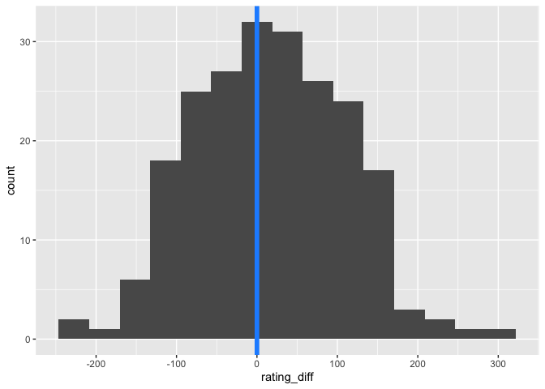
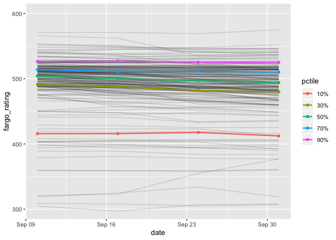

SFPA Player Ratings, v.1
================
Skip Perry
October 2019

``` r
joined_ratings %>% 
  head(10) %>% 
  mutate(sf_rating = round(sf_rating)) %>% 
  knitr::kable()
```

| date       | player         | team                         | fargo\_rating | sf\_rating |
| :--------- | :------------- | :--------------------------- | ------------: | ---------: |
| 2019-09-10 | Skip Perry     | LeftDovres                   |           634 |        702 |
| 2019-09-10 | Mike Maxwell   | Ginger Rawhides              |           571 |        737 |
| 2019-09-10 | Rajat Kansal   | Lucky Horsehoe Ballbusters   |           566 |        608 |
| 2019-09-10 | Diogo Martini  | LeftDovres                   |           553 |        686 |
| 2019-09-10 | Patty West     | LeftDovres                   |           553 |        646 |
| 2019-09-10 | James Horsfall | Lucky Horseshoe Glue Factory |           550 |        583 |
| 2019-09-10 | Nick Lansdown  | Billiard Palacade Caballeros |           548 |        691 |
| 2019-09-10 | James Neale    | Billiard Palacade Caballeros |           544 |        641 |
| 2019-09-10 | Evan Burgess   | Billiard Palacade Caballeros |           543 |        698 |
| 2019-09-10 | Rene Denis     | Smoke & Rumors               |           541 |        637 |

#### Fargo ratings are drifting downward each week

``` r
joined_ratings_tidy %>% 
  group_by(date, rating_type) %>% 
  summarize(mean_rating = mean(rating, na.rm = TRUE)) %>% 
  spread(rating_type, mean_rating) %>% 
  mutate(rating_diff = sf_rating - fargo_rating)
```

    ## # A tibble: 4 x 4
    ## # Groups:   date [4]
    ##   date       fargo_rating sf_rating rating_diff
    ##   <date>            <dbl>     <dbl>       <dbl>
    ## 1 2019-09-10         485.      499.        14.0
    ## 2 2019-09-17         483       497.        14.0
    ## 3 2019-09-24         480.      497.        16.3
    ## 4 2019-10-01         479.      496.        16.8

``` r
joined_ratings_tidy %>% 
  filter(date == max(date)) %>% 
  spread(rating_type, rating) %>% 
  mutate(rating_diff = sf_rating - fargo_rating) %>% 
  ggplot(aes(x = rating_diff)) +
  geom_histogram(bins = 15) +
  geom_vline(xintercept = 0, color = "dodgerblue", size = 2)
```

<!-- -->

``` r
joined_ratings %>% 
  filter(!is.na(sf_rating)) %>% 
  mutate(rating_diff = sf_rating - fargo_rating) %>% 
  ggplot(aes(x = rating_diff, y = date, group = date)) +
  geom_density_ridges()
```

<!-- -->

``` r
p <- c(0.1, 0.3, 0.5, 0.7, 0.9)
p_names <- map_chr(p, ~paste0(.x*100, "%"))
p_funs <- 
  map(p, ~partial(quantile, probs = .x, na.rm = TRUE)) %>% 
  set_names(nm = p_names)

quantiles_raw <-
  mikepage_df %>% 
  group_by(date) %>%
  summarize_at(vars(fargo_rating), p_funs) 

quantiles_tidy <- 
  quantiles_raw %>% 
  gather(key = pctile, value = fargo_rating, -date)

mikepage_df %>% 
  group_by(date) %>% 
  summarize(mean = mean(fargo_rating)) %>% 
  left_join(quantiles_raw, by = "date")
```

    ## # A tibble: 4 x 7
    ##   date        mean `10%` `30%` `50%` `70%` `90%`
    ##   <date>     <dbl> <dbl> <dbl> <dbl> <dbl> <dbl>
    ## 1 2019-09-10  486.  416.  491    504  514.  526.
    ## 2 2019-09-17  484.  416.  488    500  511   527.
    ## 3 2019-09-24  481.  418.  482    497  511.  525 
    ## 4 2019-10-01  480.  412.  480.   494  510   525

``` r
mikepage_df %>% 
  ggplot(aes(x = date, y = fargo_rating, group = player)) +
  geom_line(alpha = 0.15) +
  geom_line(data = quantiles_tidy, aes(group = pctile, color = pctile), size = 0.9) +
  geom_point(data = quantiles_tidy, aes(group = pctile, color = pctile)) +
  coord_cartesian(ylim = c(300, 600))
```

<!-- -->

``` r
mikepage_df %>% 
  spread(date, fargo_rating) %>% 
  arrange(desc(`2019-10-01`)) %>% 
  head(20)
```

    ##              player 2019-09-10 2019-09-17 2019-09-24 2019-10-01
    ## 1        Skip Perry        634        663        629        640
    ## 2      Mike Maxwell        571        571        569        575
    ## 3     Nick Lansdown        548        548        548        552
    ## 4      Evan Burgess        543        545        547        546
    ## 5  Joshua Maldonado        540        545        545        546
    ## 6        Patty West        553        549        546        546
    ## 7     Diogo Martini        553        551        544        544
    ## 8          Alvin Ho        539        538        542        542
    ## 9       Tom Seymour        539        536        540        541
    ## 10   James Horsfall        550        550        540        540
    ## 11     Victor Ramos         NA        533        536        540
    ## 12        Bob Simon        534        531        532        537
    ## 13      Ryan Piaget        541        538        536        537
    ## 14      James Neale        544        547        542        536
    ## 15     Rajat Kansal        566        562        535        536
    ## 16     Adam Simpson        534        534        534        534
    ## 17      Eric Babaki        533        531        531        532
    ## 18      Noah Snyder        526        528        530        532
    ## 19  Thayer McDougle        528        528        530        530
    ## 20        Ben Green        530        527        525        528

``` r
mikepage_df %>% 
  group_by(player) %>% 
  summarize(sdev = sd(fargo_rating)) %>% 
  arrange(desc(sdev)) %>% 
  head(20)
```

    ## # A tibble: 20 x 2
    ##    player             sdev
    ##    <chr>             <dbl>
    ##  1 Patrick Picard    27.0 
    ##  2 Jukers Tanseco    20.4 
    ##  3 Levon Sanossian   17.3 
    ##  4 Rajat Kansal      16.5 
    ##  5 Sharon Yencharis  15.2 
    ##  6 Skip Perry        15.0 
    ##  7 Todd Emmel        14.2 
    ##  8 Philip Romano     14.1 
    ##  9 Greg Micklas      12.3 
    ## 10 Paul Martinez     12.2 
    ## 11 Alex Peralta      11.6 
    ## 12 Zeon Kitchiner    11.6 
    ## 13 Malcolm King      11.2 
    ## 14 Austin Day        11.1 
    ## 15 Ian Jolly         10.8 
    ## 16 Michael Bouey     10.7 
    ## 17 Bernie Herschbein 10.4 
    ## 18 Savonna Hasson    10.4 
    ## 19 Perry Logan       10.3 
    ## 20 Kurt Weitzmann     9.93

#### The two leagues have similar ratings, but established Fargo players are much lower - suggesting the Fargo starter ratings are off by 100 points or more

``` r
established <- 
  c(
    "Yuko Takahashi", "Patty West", "Thayer McDougle", "Rodney Zarnegar",
    "Joina Liao", "Tom Seymour", "Nick Lansdown", "Skinner Arteaga",
    "Annabelle Cabuhat", "Michael Romano", "Marcelo Aviles", "Joel Talevi",
    "Wade Hargrove", "James Horsfall"
  )

#joined_ratings %>% 
#  filter(player %in% established) %>% 
#  ggplot(aes(x = date, y = fargo_rating, group = player, color = player)) +
#  geom_line()

joined_ratings %>% 
  filter(player %in% established) %>% 
  group_by(player) %>% 
  summarize(
    fargo_rating = mean(fargo_rating),
    sf_rating = mean(sf_rating)
  ) %>% 
  mutate(difference = sf_rating - fargo_rating)
```

    ## # A tibble: 14 x 4
    ##    player            fargo_rating sf_rating difference
    ##    <chr>                    <dbl>     <dbl>      <dbl>
    ##  1 Annabelle Cabuhat         307.      466.      158. 
    ##  2 James Horsfall            545       582.       36.8
    ##  3 Joel Talevi               488.      610.      123. 
    ##  4 Joina Liao                453.      612.      159. 
    ##  5 Marcelo Aviles            438.      565.      128. 
    ##  6 Michael Romano            386.      545.      158. 
    ##  7 Nick Lansdown             549       691.      142. 
    ##  8 Patty West                548.      646.       97.4
    ##  9 Rodney Zarnegar           445.      576.      131. 
    ## 10 Skinner Arteaga           501.      628.      127. 
    ## 11 Thayer McDougle           529       683.      154. 
    ## 12 Tom Seymour               539       678.      139. 
    ## 13 Wade Hargrove             501.      599.       97.7
    ## 14 Yuko Takahashi            396.      508.      112.

``` r
joined_ratings %>% 
  filter(player %in% established) %>% 
  summarize(difference = mean(sf_rating - fargo_rating))
```

    ##   difference
    ## 1   125.9903

#### Ratings performance
