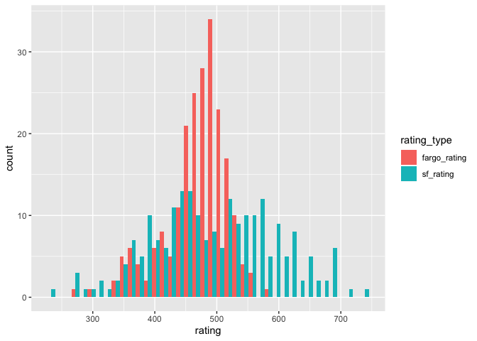
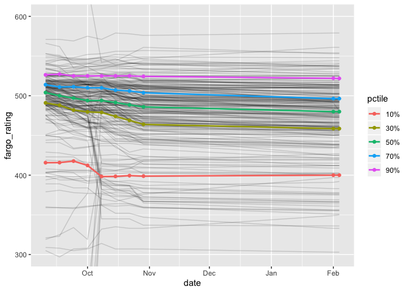

SFPA Player Ratings, v.1
================
Skip Perry
October 2019

### Fargo ratings are tightly clustered around 500

``` r
joined_ratings_tidy %>% 
  filter(date == max(date)) %>% 
  ggplot(aes(x = rating, fill = rating_type)) +
  geom_histogram(bins = 40, position = "dodge")
```

<!-- -->

### Fargo ratings are drifting downward each week… but only slightly

``` r
joined_ratings_tidy %>% 
  group_by(date, rating_type) %>% 
  summarize(mean_rating = mean(rating, na.rm = TRUE)) %>% 
  spread(rating_type, mean_rating) %>% 
  mutate(rating_diff = sf_rating - fargo_rating)
```

    ## # A tibble: 8 x 4
    ## # Groups:   date [8]
    ##   date       fargo_rating sf_rating rating_diff
    ##   <date>            <dbl>     <dbl>       <dbl>
    ## 1 2019-09-10         485.      499.        14.0
    ## 2 2019-09-17         483       497.        14.0
    ## 3 2019-09-24         480.      497.        16.3
    ## 4 2019-10-01         479.      496.        16.8
    ## 5 2019-10-08         481.      496.        15.4
    ## 6 2019-10-15         478.      496.        17.3
    ## 7 2019-10-22         476.      496.        19.8
    ## 8 2019-10-29         474.      495.        21.6

``` r
p <- c(0.1, 0.3, 0.5, 0.7, 0.9)
p_names <- map_chr(p, ~paste0(.x*100, "%"))
p_funs <- 
  map(p, ~partial(quantile, probs = .x, na.rm = TRUE)) %>% 
  set_names(nm = p_names)

quantiles_raw <-
  mikepage_df %>% 
  group_by(date) %>%
  summarize_at(vars(fargo_rating), p_funs) 

quantiles_tidy <- 
  quantiles_raw %>% 
  gather(key = pctile, value = fargo_rating, -date)

mikepage_df %>% 
  group_by(date) %>% 
  summarize(mean = mean(fargo_rating)) %>% 
  left_join(quantiles_raw, by = "date")
```

    ## # A tibble: 8 x 7
    ##   date        mean `10%` `30%` `50%` `70%` `90%`
    ##   <date>     <dbl> <dbl> <dbl> <dbl> <dbl> <dbl>
    ## 1 2019-09-10  486.  416.  491   504   514.  526.
    ## 2 2019-09-17  484.  416.  488   500   511   527.
    ## 3 2019-09-24  481.  418.  482   497   511.  525 
    ## 4 2019-10-01  480.  412.  480.  494   510   525 
    ## 5 2019-10-08  482.  398.  479   494   510   525 
    ## 6 2019-10-15  480.  398.  474   492.  507.  525 
    ## 7 2019-10-22  477.  399.  469   488.  506   525 
    ## 8 2019-10-29  475.  399.  464   486   504.  524.

``` r
mikepage_df %>% 
  ggplot(aes(x = date, y = fargo_rating, group = player)) +
  geom_line(alpha = 0.15) +
  geom_line(data = quantiles_tidy, aes(group = pctile, color = pctile), size = 0.9) +
  geom_point(data = quantiles_tidy, aes(group = pctile, color = pctile)) +
  coord_cartesian(ylim = c(300, 600))
```

<!-- -->

``` r
#mikepage_df %>% 
#  spread(date, fargo_rating) %>% 
#  arrange(desc(`2019-10-01`)) %>% 
#  head(20)

mikepage_df %>% 
  group_by(player) %>% 
  summarize(sdev = sd(fargo_rating)) %>% 
  arrange(desc(sdev)) %>% 
  head(20)
```

    ## # A tibble: 20 x 2
    ##    player             sdev
    ##    <chr>             <dbl>
    ##  1 Levon Sanossian   180. 
    ##  2 Alex Peralta      156. 
    ##  3 Tetyana Swann     135. 
    ##  4 Jukers Tanseco    126. 
    ##  5 Sharon Yencharis   95.8
    ##  6 Cindy Kim          85.6
    ##  7 Patrick Picard     85.0
    ##  8 Katrina Ariola     56.2
    ##  9 Lorax              56.1
    ## 10 LanAnh Kerr        55.0
    ## 11 Skip Perry         54.0
    ## 12 Rocel Lhai         52.9
    ## 13 Josalyn Rosen      52.8
    ## 14 Priscilla Shiells  52.8
    ## 15 Tamara Herring     51.9
    ## 16 Savonna Hasson     51.8
    ## 17 Travis Santos      51.3
    ## 18 Alice Davis        50.2
    ## 19 Jocelyn Angeles    48.5
    ## 20 John Larkin        20.8

### The two leagues have similar ratings, but established Fargo players are much lower - suggesting the Fargo starter ratings are off by 100 points or more

``` r
established <- 
  c(
    "Yuko Takahashi", "Patty West", "Thayer McDougle", "Rodney Zarnegar",
    "Joina Liao", "Tom Seymour", "Nick Lansdown", "Skinner Arteaga",
    "Annabelle Cabuhat", "Michael Romano", "Marcelo Aviles", "Joel Talevi",
    "Wade Hargrove", "James Horsfall", "Travis Yallup"
  )

#joined_ratings %>% 
#  filter(player %in% established) %>% 
#  ggplot(aes(x = date, y = fargo_rating, group = player, color = player)) +
#  geom_line()

joined_ratings %>% 
  filter(player %in% established) %>% 
  group_by(player) %>% 
  summarize(
    fargo_rating = mean(fargo_rating),
    sf_rating = mean(sf_rating)
  ) %>% 
  mutate(difference = sf_rating - fargo_rating)
```

    ## # A tibble: 15 x 4
    ##    player            fargo_rating sf_rating difference
    ##    <chr>                    <dbl>     <dbl>      <dbl>
    ##  1 Annabelle Cabuhat         308       451.      143. 
    ##  2 James Horsfall            543.      586.       43.5
    ##  3 Joel Talevi               484       611.      127. 
    ##  4 Joina Liao                448.      603.      156. 
    ##  5 Marcelo Aviles            438.      567.      128. 
    ##  6 Michael Romano            379.      541.      162. 
    ##  7 Nick Lansdown             552.      693.      140. 
    ##  8 Patty West                545       646.      101. 
    ##  9 Rodney Zarnegar           445       574.      129. 
    ## 10 Skinner Arteaga           499.      629.      129. 
    ## 11 Thayer McDougle           529.      684.      156. 
    ## 12 Tom Seymour               538.      678.      139. 
    ## 13 Travis Yallup             394.      548.      154. 
    ## 14 Wade Hargrove             503.      597.       94.1
    ## 15 Yuko Takahashi            397.      522.      125.

``` r
joined_ratings %>% 
  filter(player %in% established) %>% 
  summarize(difference = mean(sf_rating - fargo_rating))
```

    ##   difference
    ## 1   128.4758

#### Ratings performance
