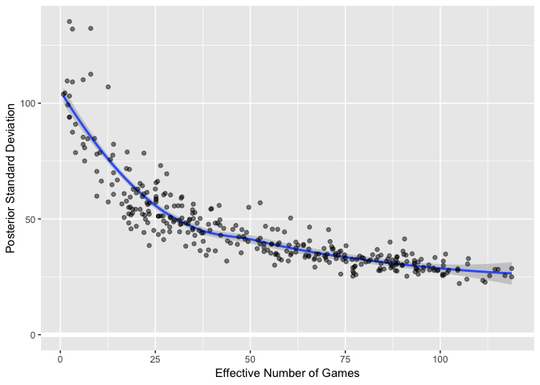

SFPA Player Ratings, v.1 - Gibbs Sampling
================
Skip Perry
April 2019

``` r
results_no_forfeits
```

    ## # A tibble: 11,333 x 9
    ##    season match_date week_number home_team away_team game_num home  away 
    ##    <chr>  <date>           <dbl> <chr>     <chr>        <dbl> <chr> <chr>
    ##  1 Sprin… 2018-02-06           1 Cinch Pa… Cinch Ph…        1 Bob … Thom…
    ##  2 Sprin… 2018-02-06           1 Cinch Pa… Cinch Ph…        2 Rob … Mark…
    ##  3 Sprin… 2018-02-06           1 Cinch Pa… Cinch Ph…        3 Este… Rick…
    ##  4 Sprin… 2018-02-06           1 Cinch Pa… Cinch Ph…        4 Ben … Fran…
    ##  5 Sprin… 2018-02-06           1 Cinch Pa… Cinch Ph…        5 Rob … Thom…
    ##  6 Sprin… 2018-02-06           1 Cinch Pa… Cinch Ph…        6 Bob … Mark…
    ##  7 Sprin… 2018-02-06           1 Cinch Pa… Cinch Ph…        7 Este… Isaa…
    ##  8 Sprin… 2018-02-06           1 Cinch Pa… Cinch Ph…        8 Rob … Rick…
    ##  9 Sprin… 2018-02-06           1 Cinch Pa… Cinch Ph…        9 Ben … Paul…
    ## 10 Sprin… 2018-02-06           1 Cinch Pa… Cinch Ph…       10 Bob … Isaa…
    ## # … with 11,323 more rows, and 1 more variable: game_winner <chr>

``` r
player_list <- 
  fargo_df %>% 
  pull(player)
```

``` r
player_win_loss_vs_opponents <- function(player_of_interest) {
  df <- 
    results_no_forfeits %>% 
    filter(away == player_of_interest | home == player_of_interest) %>% 
    mutate(
      player = player_of_interest,
      opponent = case_when(
        away == player_of_interest ~ home,
        TRUE ~ away
      ),
      result = case_when(
        away == player_of_interest & game_winner == "away" ~ "W",
        home == player_of_interest & game_winner == "home" ~ "W",
        TRUE ~ "L"
      )
    ) %>% 
    select(season, match_date, player, opponent, result) %>% 
    mutate(
      wt = case_when(
        season == "Spring 2018" ~ 0.6,
        season == "Fall 2018" ~ 0.8,
        season == "Spring 2019" ~ 1
      ),
      win_wt = if_else(result == "W", wt, 0),
      loss_wt = if_else(result == "L", wt, 0),
      game_wt = wt
    ) %>% 
    group_by(player, opponent) %>% 
    summarize(
      wins = sum(win_wt),
      losses = sum(loss_wt),
      games_vs = sum(game_wt)
    ) %>% 
    ungroup()
    #arrange(desc(result)) %>% 
    #ungroup() %>% 
    #spread(result, n)
  
  if (!("wins" %in% colnames(df))) { df <- df %>% mutate(wins = 0) }
  if (!("losses" %in% colnames(df))) { df <- df %>% mutate(losses = 0) }
  
  df %>% 
    transmute(player, opponent, wins, losses, games_vs)
}  
```

``` r
player_win_loss_vs_opponents(player_of_interest = "Mike Maxwell")
```

    ## # A tibble: 82 x 5
    ##    player       opponent          wins losses games_vs
    ##    <chr>        <chr>            <dbl>  <dbl>    <dbl>
    ##  1 Mike Maxwell Aja Cayetano       0.6    0        0.6
    ##  2 Mike Maxwell Alan Lowe          0.8    0        0.8
    ##  3 Mike Maxwell Ana Stewart        0.6    0        0.6
    ##  4 Mike Maxwell Andrew Creech      3.2    0        3.2
    ##  5 Mike Maxwell Anthony Hydron     0.8    0        0.8
    ##  6 Mike Maxwell Ben Green          0.8    1.6      2.4
    ##  7 Mike Maxwell Bob Schnatterly    1      0        1  
    ##  8 Mike Maxwell Bob Simon          0.6    0.6      1.2
    ##  9 Mike Maxwell Brendan Kendrick   0.6    0.6      1.2
    ## 10 Mike Maxwell Casey O'Neill      0.6    0        0.6
    ## # … with 72 more rows

``` r
full_win_loss_summary <- 
  map_dfr(player_list, player_win_loss_vs_opponents)
```

``` r
full_win_loss_summary
```

    ## # A tibble: 18,194 x 5
    ##    player          opponent          wins losses games_vs
    ##    <chr>           <chr>            <dbl>  <dbl>    <dbl>
    ##  1 Aaron Woodworth Andrew Keller      0.6    0        0.6
    ##  2 Aaron Woodworth Andy Cunningham    1.2    0.6      1.8
    ##  3 Aaron Woodworth Arthur Patterson   0      0.6      0.6
    ##  4 Aaron Woodworth Brian Bolitho      0.6    0        0.6
    ##  5 Aaron Woodworth Buddy Jacques      1.2    0        1.2
    ##  6 Aaron Woodworth Chris Grimm        0.6    0        0.6
    ##  7 Aaron Woodworth Chris Peterson     0      0.6      0.6
    ##  8 Aaron Woodworth CJ Simmons         0      0.6      0.6
    ##  9 Aaron Woodworth Dan Sorge          0      0.6      0.6
    ## 10 Aaron Woodworth Dave Ward          0      0.6      0.6
    ## # … with 18,184 more rows

``` r
a <- 3
b <- (a - 1) / 500

sample_rating <- function(player_of_interest) {
  full_win_loss_summary %>% 
    filter(player == player_of_interest) %>% 
    left_join(gibbs_df %>% transmute(player, player_rating = raw_rating), by = "player") %>% 
    left_join(gibbs_df %>% transmute(opponent = player, opponent_rating = raw_rating), by = "opponent") %>% 
    mutate(
      Z = rgamma(nrow(.), shape = games_vs, rate = player_rating + opponent_rating)
    ) %>% 
    summarize(
      shape_param = (a - 1) + sum(wins),
      rate_param = b + sum(Z)
    ) %>% 
    mutate(
      new_rating = rgamma(1, shape = shape_param, rate = rate_param)
    ) %>% 
    transmute(player = player_of_interest, raw_rating = new_rating)
}
```

``` r
set.seed(13)

gibbs_df <-
  fargo_df %>% 
  transmute(player, raw_rating)
  
gibbs_samples <- 
  gibbs_df %>% 
  mutate(niter = 0)

for (i in 1:100) {
  if (i %% 10 == 0) { print(str_c("Starting iteration ", i)) }
  gibbs_temp <-
    map_dfr(player_list, sample_rating) %>% 
    mutate(niter = i)
  
  gibbs_samples <-
    bind_rows(
      gibbs_samples,
      gibbs_temp
    )
  
  gibbs_df <-
    gibbs_temp %>% 
    select(player, raw_rating)
}
```

    ## [1] "Starting iteration 10"
    ## [1] "Starting iteration 20"
    ## [1] "Starting iteration 30"
    ## [1] "Starting iteration 40"
    ## [1] "Starting iteration 50"
    ## [1] "Starting iteration 60"
    ## [1] "Starting iteration 70"
    ## [1] "Starting iteration 80"
    ## [1] "Starting iteration 90"
    ## [1] "Starting iteration 100"

``` r
game_totals <- 
  full_win_loss_summary %>% 
  group_by(player) %>% 
  summarize(wins = sum(wins), losses = sum(losses)) %>% 
  transmute(player, games = wins + losses)
```

``` r
gibbs_summary <- 
  gibbs_samples  %>% 
  group_by(niter) %>% 
  mutate(
    rating = log(raw_rating) * 144,
    rating = rating - mean(rating) + 500
  ) %>% 
  ungroup() %>% 
  group_by(player) %>% 
  summarize(
    med = median(rating),
    mean = mean(rating),
    lo = quantile(rating, 0.05),
    hi = quantile(rating, 0.95),
    sdev = sd(rating)
  ) %>% 
  left_join(fargo_df, by = "player") %>% 
  left_join(game_totals, by = "player") %>% 
  transmute(player, lo, rating, hi, sdev, eff_games = games) %>% 
  arrange(desc(eff_games))
```

``` r
gibbs_summary %>% 
  ggplot(aes(x = eff_games, y = sdev)) +
  geom_hline(yintercept = 0, color = "white", size = 2) +
  geom_smooth(method = "loess") +
  geom_point(alpha = 0.5) +
  labs(
    x = "Effective Number of Games",
    y = "Posterior Standard Deviation"
  )
```

<!-- -->

``` r
gibbs_summary %>% 
  arrange(desc(rating)) %>% 
  mutate_at(vars(lo:sdev), round) %>% 
  knitr::kable()
```

| player                 |  lo | rating |  hi | sdev | eff\_games |
| :--------------------- | --: | -----: | --: | ---: | ---------: |
| Hector Ortega          | 685 |    730 | 794 |   36 |       36.8 |
| Skip Perry             | 681 |    725 | 781 |   29 |       67.0 |
| Mike Maxwell           | 682 |    712 | 766 |   26 |      117.0 |
| Ryan Piaget            | 663 |    703 | 760 |   30 |       79.2 |
| Evan Burgess           | 646 |    681 | 739 |   25 |      118.8 |
| Tom Seymour            | 637 |    677 | 723 |   28 |       95.4 |
| Bob Simon              | 651 |    675 | 719 |   23 |      111.2 |
| Diogo Martini          | 630 |    675 | 724 |   27 |       77.2 |
| Thayer McDougle        | 635 |    673 | 736 |   28 |      115.2 |
| Stefano Lopez          | 613 |    671 | 737 |   34 |       38.4 |
| Jesse La Fear          | 608 |    667 | 718 |   32 |       43.8 |
| Nick Callado           | 601 |    662 | 728 |   39 |       23.4 |
| Rhys Hughes            | 627 |    660 | 716 |   26 |       73.8 |
| Andy Luong             | 610 |    658 | 704 |   30 |       56.4 |
| Nick Lansdown          | 607 |    655 | 707 |   32 |       88.4 |
| Jon Williams           | 584 |    652 | 711 |   38 |       33.0 |
| Matt Frisbie           | 614 |    649 | 742 |   44 |       37.2 |
| Tae Yim                | 591 |    647 | 733 |   44 |       22.0 |
| Hugo Valseca           | 586 |    645 | 695 |   36 |       40.8 |
| Rudy Guzman            | 571 |    645 | 703 |   44 |       37.6 |
| Ben Green              | 610 |    643 | 708 |   28 |       84.2 |
| Chris DuCoing          | 588 |    643 | 692 |   29 |       87.6 |
| Wyatt Moss             | 605 |    641 | 700 |   30 |       90.0 |
| Patty West             | 593 |    640 | 680 |   25 |       77.0 |
| Alonza Bear Davis      | 531 |    637 | 729 |   60 |        9.6 |
| Dave Ward              | 584 |    636 | 674 |   27 |      101.8 |
| Joshua Maldonado       | 565 |    635 | 683 |   32 |       68.2 |
| Danny Mullan           | 590 |    629 | 688 |   28 |       85.2 |
| Joel Talevi            | 582 |    626 | 687 |   32 |       74.4 |
| James Neale            | 569 |    621 | 663 |   31 |      107.2 |
| Darrell Haslip         | 576 |    619 | 684 |   33 |       75.0 |
| Leon Waki              | 564 |    618 | 668 |   35 |       56.8 |
| Joina Liao             | 547 |    618 | 679 |   40 |       44.8 |
| Buddy Giguere          | 565 |    617 | 693 |   39 |       62.6 |
| Hugh Fountain          | 559 |    617 | 665 |   31 |       80.4 |
| Skinner Arteaga        | 558 |    616 | 659 |   33 |       79.8 |
| Pancho Palma           | 540 |    615 | 678 |   40 |       37.6 |
| Eugene Fan             | 576 |    614 | 692 |   36 |       73.4 |
| Crystal Kelem          | 575 |    613 | 659 |   28 |       99.4 |
| Rene Denis             | 575 |    611 | 652 |   26 |      101.0 |
| Adam Simpson           | 535 |    611 | 683 |   46 |       34.8 |
| Alan Lowe              | 557 |    606 | 657 |   28 |       88.6 |
| Rajat Kansal           | 559 |    605 | 661 |   33 |       78.0 |
| Ari Cowen              | 567 |    604 | 657 |   29 |      118.8 |
| Will Chadwick          | 588 |    604 | 653 |   22 |      105.0 |
| Paul Krohn             | 560 |    598 | 644 |   28 |       88.2 |
| Tommy Mudd             | 515 |    598 | 677 |   52 |       23.4 |
| Adam Moore             | 545 |    597 | 672 |   37 |       65.4 |
| Rick Mariani           | 545 |    597 | 646 |   33 |       79.4 |
| Bob Schnatterly        | 554 |    596 | 638 |   26 |      100.6 |
| Juan Chicho            | 515 |    595 | 667 |   44 |       33.6 |
| Tony Tully             | 537 |    592 | 674 |   40 |       86.8 |
| Jerry Ball             | 543 |    591 | 670 |   37 |       51.8 |
| Mark Cooper            | 535 |    591 | 669 |   43 |       25.8 |
| Andrew Creech          | 541 |    590 | 643 |   32 |       66.8 |
| Gilbert Morales        | 530 |    589 | 654 |   39 |       35.2 |
| Astra Sodarsono        | 500 |    589 | 666 |   52 |       21.6 |
| Polo Black Golde       | 546 |    588 | 635 |   29 |       84.2 |
| Mark Butler            | 522 |    585 | 638 |   35 |       55.4 |
| Jae Bigley             | 498 |    583 | 654 |   52 |       18.6 |
| Martin Smidak          | 550 |    582 | 650 |   32 |       81.6 |
| Jason Rogers           | 513 |    582 | 647 |   39 |       52.6 |
| Thom Moyer             | 524 |    581 | 631 |   32 |       91.2 |
| Bob Rice               | 509 |    580 | 656 |   45 |       27.0 |
| Eric Babaki            | 519 |    580 | 662 |   48 |       18.0 |
| Robert Hoo             | 498 |    578 | 671 |   48 |       31.6 |
| Amy Peterson           | 524 |    578 | 658 |   41 |       27.2 |
| Nima Gaadadsuren       | 542 |    578 | 617 |   23 |      111.8 |
| Preston Hudson         | 518 |    578 | 637 |   35 |       60.8 |
| Humberto HJ Gonzalez   | 530 |    578 | 634 |   34 |       72.4 |
| Chris Beal             | 511 |    577 | 678 |   53 |       23.2 |
| Conor O’Neill          | 452 |    576 | 653 |   58 |       17.4 |
| Isaac Wong             | 518 |    576 | 657 |   39 |       46.6 |
| Max Schroeder          | 532 |    576 | 650 |   37 |       69.4 |
| Dave Timko             | 507 |    575 | 656 |   45 |       24.6 |
| Perry Logan            | 525 |    575 | 626 |   29 |       95.6 |
| Rio                    | 514 |    574 | 657 |   48 |       31.8 |
| Cuong Vuong            | 518 |    571 | 632 |   32 |       70.0 |
| Rodney Zarnegar        | 529 |    570 | 637 |   36 |       90.2 |
| Dan Nguyen             | 492 |    569 | 641 |   45 |       36.6 |
| Roberto Aguilar        | 461 |    567 | 626 |   50 |       32.0 |
| Mike Kavanaugh         | 459 |    567 | 649 |   57 |       12.6 |
| Paul Campbell          | 401 |    566 | 669 |   82 |        6.0 |
| Ben Napili             | 501 |    566 | 606 |   35 |       56.6 |
| Rene Loria             | 498 |    565 | 644 |   50 |       22.4 |
| Chris Forester         | 520 |    564 | 636 |   34 |       73.2 |
| Alex Peralta           | 500 |    564 | 612 |   37 |       39.0 |
| Nick Radford           | 481 |    564 | 641 |   50 |       29.0 |
| Brian Paris            | 527 |    564 | 629 |   30 |       97.0 |
| Brian Bolitho          | 525 |    562 | 611 |   26 |       77.8 |
| Mark Thomas            | 511 |    562 | 643 |   44 |       28.8 |
| Justin Taylor          | 512 |    559 | 634 |   39 |       60.2 |
| Brendan Kendrick       | 475 |    557 | 650 |   51 |       25.8 |
| James Horsefall        | 501 |    556 | 662 |   49 |       30.0 |
| Matt Kwong             | 497 |    556 | 618 |   37 |       54.6 |
| Nithin Tharakan        | 500 |    556 | 615 |   34 |       78.8 |
| Casey O’Neill          | 520 |    554 | 599 |   26 |      113.0 |
| Alex Gilbert           | 483 |    554 | 646 |   52 |       18.0 |
| Niecy Sorrell          | 437 |    554 | 679 |   75 |        6.4 |
| Ian Montbrun           | 517 |    552 | 613 |   30 |      100.8 |
| Nick Wells             | 505 |    552 | 628 |   36 |       59.6 |
| Nick Giangreco         | 504 |    552 | 592 |   29 |       87.0 |
| Sam Khozindar          | 504 |    551 | 600 |   31 |       70.8 |
| Ell Jackson            | 504 |    549 | 606 |   31 |       84.4 |
| Michelle Hironimus     | 471 |    549 | 661 |   59 |       25.2 |
| Fran Herman            | 506 |    548 | 593 |   28 |       93.8 |
| Matt Raine             | 485 |    547 | 638 |   47 |       20.0 |
| Leif Smith             | 494 |    547 | 598 |   33 |      107.4 |
| Roy Luo                | 510 |    547 | 595 |   28 |       99.2 |
| Carlos Gonzalez        | 497 |    545 | 593 |   30 |       87.2 |
| Marcelo Aviles         | 496 |    545 | 608 |   34 |       64.6 |
| Salvador Miranda       | 512 |    545 | 596 |   27 |       93.4 |
| James Bavuso           | 487 |    544 | 595 |   34 |       84.4 |
| Mikki Paull            | 486 |    544 | 599 |   34 |       91.0 |
| John Frakes            | 475 |    543 | 599 |   40 |       49.4 |
| Jonathan Addy          | 500 |    542 | 610 |   34 |       60.6 |
| Victor Ramos           | 500 |    542 | 604 |   35 |       47.6 |
| Mika Kerr              | 505 |    542 | 592 |   26 |      100.6 |
| JoJo Cheung            | 441 |    540 | 643 |   58 |       25.2 |
| Ryan Robison           | 495 |    540 | 584 |   28 |      104.6 |
| Alex Yeagle            | 385 |    537 | 621 |   79 |        4.0 |
| Travis Yallup          | 491 |    536 | 621 |   41 |       90.6 |
| Michael Romano         | 488 |    535 | 584 |   29 |       93.6 |
| Rick Bradford          | 473 |    534 | 622 |   48 |       33.0 |
| Isaac Lopez            | 502 |    534 | 602 |   33 |       64.4 |
| Miguel Chimas          | 456 |    533 | 631 |   51 |       27.0 |
| Dan Sorge              | 498 |    532 | 584 |   24 |      107.0 |
| Eric Gruttemeyer       | 484 |    532 | 598 |   35 |      101.4 |
| Chris Kline            | 492 |    531 | 579 |   27 |       77.0 |
| Jerz Zuluaga           | 468 |    531 | 578 |   32 |       58.2 |
| Dylan Scandalios       | 479 |    530 | 579 |   32 |       93.2 |
| Sheree Taft            | 476 |    529 | 581 |   33 |       57.6 |
| JT                     | 387 |    528 | 642 |   81 |        6.4 |
| Jasper Thomas          | 456 |    527 | 617 |   51 |       26.4 |
| Spencer Branson        | 452 |    527 | 594 |   49 |       27.2 |
| Gerlie Mendoza         | 491 |    527 | 585 |   28 |       83.8 |
| Jack O’Toole           | 440 |    525 | 609 |   57 |       25.2 |
| Quinn Reilly           | 473 |    525 | 595 |   41 |       52.0 |
| Justin Dayton          | 483 |    524 | 571 |   29 |       98.2 |
| Rohan Kurane           | 430 |    523 | 643 |   60 |       29.0 |
| Travis Abernathy       | 320 |    521 | 633 |   94 |        2.4 |
| Anthony Hydron         | 461 |    521 | 573 |   37 |       62.0 |
| Fearghal McEleney      | 372 |    520 | 660 |   94 |        2.4 |
| Julien Roeser          | 473 |    518 | 576 |   30 |       90.0 |
| Tom Flanagan           | 442 |    518 | 594 |   49 |       31.2 |
| Doug Johnston          | 450 |    517 | 578 |   39 |       55.6 |
| Monica Kicklighter     | 465 |    514 | 598 |   40 |       57.6 |
| Chris Logan            | 472 |    514 | 572 |   31 |       94.2 |
| Mike Schlatter         | 368 |    514 | 640 |   78 |        9.6 |
| Jackson Kon            | 446 |    514 | 593 |   46 |       18.6 |
| Hakim Boukhaloua       | 440 |    512 | 621 |   59 |       31.8 |
| Clarke Curtis          | 459 |    511 | 612 |   50 |       42.0 |
| Sandra Davis           | 464 |    510 | 563 |   33 |       67.0 |
| Emily Adams            | 474 |    510 | 572 |   32 |       60.0 |
| Ben Becker             | 456 |    510 | 602 |   41 |       65.6 |
| Greg Morgan            | 463 |    510 | 569 |   33 |       98.6 |
| Gary Simmons           | 421 |    509 | 579 |   46 |       28.8 |
| Estelle Mays           | 391 |    509 | 576 |   63 |       19.2 |
| Jonathan Garcia        | 437 |    509 | 589 |   44 |       31.4 |
| Spencer Smith          | 428 |    508 | 572 |   48 |       39.0 |
| Steven Park            | 402 |    508 | 577 |   55 |       18.4 |
| Mark Sorensen          | 468 |    507 | 546 |   26 |       94.2 |
| Julia Landholt         | 421 |    507 | 574 |   48 |       36.0 |
| Arthur Patterson       | 459 |    506 | 566 |   32 |       87.4 |
| Geoff Vessels          | 411 |    506 | 592 |   56 |       16.2 |
| Andrew Keller          | 423 |    505 | 577 |   49 |       29.8 |
| Juan Carlos Buenrostro | 429 |    504 | 579 |   50 |       34.0 |
| Rob Thacher            | 404 |    504 | 596 |   61 |       16.8 |
| Paul McCue             | 442 |    503 | 558 |   35 |       68.0 |
| Steven Pease           | 445 |    501 | 544 |   32 |       75.2 |
| Alex Mendes da Costa   | 406 |    500 | 598 |   56 |       23.0 |
| Charles Carr           | 343 |    500 | 647 |  104 |        0.8 |
| Huu Nguyen             | 455 |    500 | 563 |   34 |       88.6 |
| Sean Flanagan          | 409 |    500 | 582 |   57 |       22.8 |
| Thomas Kleyn           | 313 |    500 | 632 |  103 |        2.4 |
| Elvis McElhatton       | 424 |    498 | 582 |   53 |       19.0 |
| Yassine Laassel        | 433 |    498 | 570 |   40 |       44.0 |
| Marty                  | 417 |    497 | 576 |   51 |       25.8 |
| Julie Le               | 375 |    497 | 571 |   67 |       15.0 |
| Dallas Emmett          | 260 |    497 | 614 |  104 |        1.2 |
| Monica Jacqueline      | 389 |    496 | 587 |   60 |       21.6 |
| Dylan Hirsch-Shell     | 398 |    494 | 558 |   51 |       16.8 |
| Scott Marfield         | 441 |    494 | 540 |   34 |       65.4 |
| Walt Bartas            | 446 |    493 | 559 |   32 |       83.2 |
| Joan Pettijohn         | 431 |    492 | 545 |   35 |       82.2 |
| Fintan Sullivan        | 383 |    490 | 580 |   65 |       13.6 |
| Stern Montoya          | 444 |    489 | 544 |   30 |       88.4 |
| Jaime Dizon            | 412 |    489 | 561 |   48 |       23.0 |
| Mark Deal              | 442 |    489 | 551 |   32 |       76.8 |
| Bob Ponze              | 349 |    488 | 626 |   87 |        3.2 |
| Thomas Messer          | 432 |    487 | 546 |   36 |       53.6 |
| Simone Manganelli      | 441 |    487 | 540 |   29 |       77.0 |
| Greg Weed              | 425 |    486 | 540 |   36 |       62.0 |
| Patrick Picard         | 393 |    486 | 588 |   56 |       30.0 |
| Bryan Hoff             | 392 |    486 | 549 |   48 |       28.0 |
| Cloaky Jones           | 432 |    486 | 530 |   30 |       93.2 |
| Mathieu Guglielmi      | 457 |    485 | 537 |   28 |      114.4 |
| Eric Kalisa            | 440 |    483 | 536 |   31 |       93.2 |
| Adam Lucero            | 330 |    483 | 626 |   99 |        2.0 |
| Ali Rad                | 392 |    483 | 572 |   59 |       18.4 |
| Patrick Hunt           | 409 |    482 | 586 |   52 |       22.2 |
| Lisa Filippini         | 411 |    481 | 564 |   48 |       40.8 |
| Keith Deming           | 435 |    480 | 541 |   33 |       95.0 |
| John Kiltinen          | 435 |    479 | 538 |   32 |      100.8 |
| Jocelyn Angeles        | 436 |    479 | 540 |   34 |       88.6 |
| Justin Nicholson       | 364 |    476 | 581 |   66 |       10.8 |
| Rich Hatcher           | 259 |    475 | 617 |  110 |        1.8 |
| Piroskki               | 141 |    475 | 612 |  135 |        2.4 |
| Fernando Reyes         | 402 |    474 | 546 |   45 |       47.8 |
| Robin Brun             | 356 |    473 | 541 |   55 |       18.0 |
| Travis Santos          | 392 |    473 | 569 |   49 |       34.0 |
| Julian Ostrow          | 433 |    473 | 529 |   28 |       97.2 |
| Rob Cosgriff           | 399 |    472 | 551 |   42 |       48.2 |
| Ana Stewart            | 414 |    470 | 544 |   39 |       53.6 |
| Matt Paul              | 414 |    470 | 507 |   31 |       88.2 |
| Mike Britt             | 413 |    470 | 526 |   35 |       70.2 |
| David Norris           | 408 |    468 | 518 |   36 |       73.8 |
| Bernie Herschbein      | 409 |    468 | 517 |   35 |       67.4 |
| Vijay Alexander        | 392 |    467 | 525 |   39 |       55.6 |
| Chris Penska           | 308 |    466 | 564 |   85 |        7.2 |
| Peter Lee              | 407 |    463 | 512 |   32 |       85.8 |
| Anthony Vasquez        | 368 |    461 | 552 |   55 |       28.0 |
| Tone                   | 326 |    461 | 592 |   85 |        6.0 |
| Chris Peterson         | 410 |    460 | 504 |   29 |       77.4 |
| Ben Ames               | 358 |    459 | 559 |   71 |        9.6 |
| Matt Morrish           | 414 |    457 | 499 |   28 |       98.4 |
| Douglas Cox            | 389 |    454 | 514 |   43 |       42.2 |
| Erik Proctor           | 401 |    453 | 521 |   39 |       64.0 |
| Mar Ronquillo          | 414 |    453 | 499 |   28 |      102.2 |
| Josalyn Rosen          | 349 |    452 | 563 |   64 |       21.6 |
| Milan Plevnik          | 397 |    450 | 515 |   35 |       90.4 |
| Taylor PoolNarwhal M   | 364 |    450 | 560 |   54 |       19.8 |
| Richard Oliva          | 394 |    450 | 515 |   39 |       57.2 |
| Cristina Urreaga       | 421 |    450 | 505 |   28 |       94.2 |
| Taylor Hobbs           | 368 |    448 | 519 |   45 |       45.4 |
| Eric Marrujo           | 394 |    447 | 498 |   34 |       83.6 |
| Kunal Lakhan-Pa        | 373 |    446 | 509 |   42 |       47.0 |
| CJ Simmons             | 377 |    444 | 529 |   45 |       34.8 |
| Kelvin Chung           | 298 |    444 | 544 |   85 |        9.0 |
| John McNulty           | 401 |    442 | 503 |   31 |       88.8 |
| JM Reasonda            | 399 |    442 | 507 |   32 |       81.2 |
| Rudy Torres            | 307 |    441 | 545 |   79 |       10.4 |
| Fiona Manzella         | 342 |    440 | 531 |   57 |       23.4 |
| NAPPYYBOYY             | 361 |    439 | 523 |   54 |       21.0 |
| Shepard Gault          | 329 |    435 | 524 |   61 |       14.0 |
| Danny Joseph           | 355 |    435 | 495 |   46 |       43.0 |
| Matt Weyls             | 357 |    434 | 484 |   43 |       35.4 |
| Adam Bowley            | 366 |    433 | 492 |   40 |       62.0 |
| John Thong             | 374 |    433 | 513 |   42 |       52.6 |
| Nick Weyls             | 215 |    432 | 595 |  132 |        3.2 |
| Charles Montague       | 349 |    432 | 519 |   51 |       29.0 |
| Matt Myers             | 383 |    428 | 506 |   38 |       53.6 |
| Ninad Desei            | 383 |    426 | 496 |   35 |       72.4 |
| Troy Brunet            | 356 |    423 | 477 |   37 |       83.4 |
| Ari Fehrenkamp         | 358 |    422 | 483 |   37 |       71.8 |
| Lasalete Sousa         | 332 |    422 | 494 |   47 |       42.0 |
| Max Sanchez            | 336 |    421 | 479 |   44 |       49.0 |
| Jason Valdez           | 214 |    421 | 548 |  109 |        3.2 |
| Evan                   | 308 |    421 | 516 |   63 |       20.4 |
| Christine Concho       | 361 |    420 | 499 |   45 |       39.4 |
| Steven Chamberlin      | 374 |    418 | 453 |   25 |       91.2 |
| Dominik Bolton         | 329 |    417 | 493 |   54 |       34.8 |
| Les Mullin             | 337 |    415 | 478 |   41 |       48.6 |
| Hajime Miyazaki        | 355 |    415 | 508 |   48 |       33.6 |
| Paul Landholt          | 304 |    414 | 505 |   61 |       27.6 |
| Michael Moreno         | 346 |    412 | 460 |   38 |       71.4 |
| Ian Jolly              | 363 |    411 | 468 |   33 |       69.8 |
| John Larkin            | 323 |    411 | 484 |   50 |       35.0 |
| Zoe Hagfeldt           | 290 |    411 | 528 |   72 |       17.4 |
| Rick Potts             | 362 |    410 | 471 |   34 |       65.4 |
| Gerald Borjas          | 344 |    408 | 467 |   34 |       69.6 |
| Rocel Lhai             | 346 |    406 | 474 |   39 |       64.0 |
| Tim Doyle              | 353 |    406 | 480 |   35 |       74.8 |
| Jules Tanseco          | 300 |    405 | 546 |   82 |       14.0 |
| Edmond                 | 306 |    404 | 540 |   76 |       13.2 |
| Brandi Alexandra       | 239 |    402 | 520 |   91 |        4.0 |
| Caleb Christian        | 261 |    402 | 456 |   61 |       20.0 |
| Frank Augustine        | 296 |    400 | 465 |   50 |       36.8 |
| Savonna Hasson         | 337 |    400 | 447 |   37 |       71.6 |
| Violet Moyer           | 255 |    399 | 485 |   78 |       13.8 |
| Radley Roberts         | 342 |    398 | 473 |   40 |       71.0 |
| Buddy Jacques          | 331 |    395 | 437 |   34 |       86.6 |
| Lawrence Mortensen     | 349 |    393 | 438 |   30 |       77.6 |
| Jonathan               | 283 |    392 | 468 |   60 |       25.2 |
| Andy Cunningham        | 340 |    392 | 437 |   28 |      104.6 |
| Carlos Rodrigues       | 264 |    392 | 488 |   70 |       14.0 |
| Keith Neal             | 282 |    391 | 458 |   56 |       41.8 |
| Aaron Woodworth        | 296 |    390 | 462 |   53 |       35.4 |
| Jill Cheviron          | 299 |    388 | 476 |   54 |       39.6 |
| Charles Hancock        | 314 |    384 | 418 |   34 |       57.2 |
| Brenden Chadwick       | 310 |    381 | 482 |   48 |       41.4 |
| Sharon Yencharis       | 282 |    378 | 456 |   54 |       19.0 |
| Sunny D                | 258 |    378 | 450 |   66 |       25.2 |
| Tetyana Swan           | 284 |    374 | 455 |   56 |       31.0 |
| Tommy Torstenson       | 293 |    373 | 441 |   47 |       46.2 |
| John Putnam            | 310 |    370 | 413 |   33 |       86.2 |
| Pujan Desei            | 245 |    369 | 443 |   66 |       25.6 |
| Malcolm King           | 280 |    369 | 423 |   46 |       57.2 |
| Antonio Herrera        | 265 |    368 | 479 |   71 |       18.2 |
| Michael Bouey          | 314 |    368 | 408 |   31 |       86.8 |
| Jonathen Diego         | 281 |    367 | 462 |   60 |       32.0 |
| Chris Grimm            | 272 |    365 | 443 |   52 |       34.8 |
| Chad Sloane            | 141 |    365 | 518 |  110 |        6.0 |
| Roy Perkel             | 293 |    363 | 442 |   44 |       59.0 |
| Brian Martin           | 229 |    361 | 461 |   79 |       17.6 |
| Dorien Lezinski        | 259 |    360 | 444 |   56 |       32.0 |
| David Evans            | 255 |    360 | 448 |   60 |       27.2 |
| Jerry Ervin            | 280 |    358 | 437 |   45 |       70.6 |
| Jen Pearson            | 270 |    355 | 420 |   47 |       54.0 |
| Riva T                 | 240 |    350 | 428 |   61 |       22.8 |
| Brandon Blackmon       | 139 |    343 | 511 |  113 |        8.0 |
| Robbie Connelly        | 257 |    337 | 413 |   46 |       55.8 |
| Trish Gardner          | 277 |    337 | 385 |   35 |       92.6 |
| Brian Johnson          | 248 |    336 | 422 |   55 |       49.6 |
| Keelin Ingoldsby       | 235 |    333 | 439 |   65 |       21.0 |
| Siedra Loeffler        | 243 |    332 | 425 |   54 |       39.8 |
| Killer K               | 247 |    330 | 407 |   46 |       65.6 |
| Lorax                  | 244 |    324 | 360 |   38 |       75.2 |
| Ashley Miller          |  74 |    324 | 465 |  132 |        8.0 |
| Zeon Kitchiner         | 269 |    321 | 370 |   33 |       72.6 |
| Austin Day             | 213 |    321 | 415 |   61 |       22.0 |
| Stefani Furness        | 212 |    319 | 412 |   63 |       25.0 |
| Mike Myers             | 195 |    310 | 414 |   73 |       26.4 |
| Jacob Messing          |  33 |    275 | 403 |  107 |       12.6 |
| Brady Ralston          | 149 |    268 | 365 |   78 |       22.0 |
| Levon Sanossian        | 157 |    266 | 340 |   56 |       35.0 |
| Kurt Weitzmann         | 122 |    263 | 360 |   69 |       28.0 |
| Aja Cayetano           | 113 |    221 | 316 |   57 |       52.6 |
| Patrick Phillips       | 117 |    209 | 271 |   50 |       60.6 |
